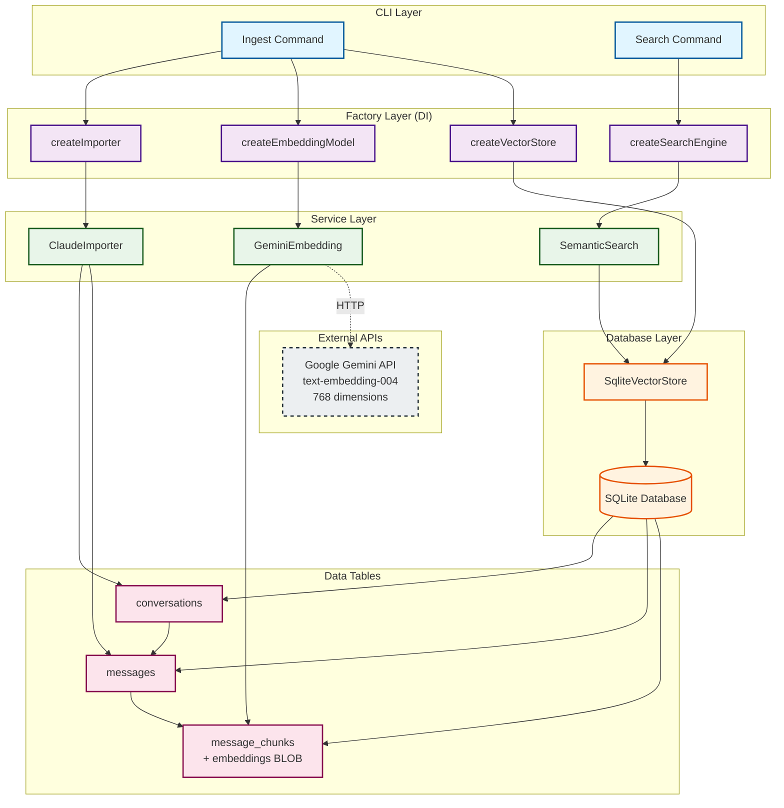
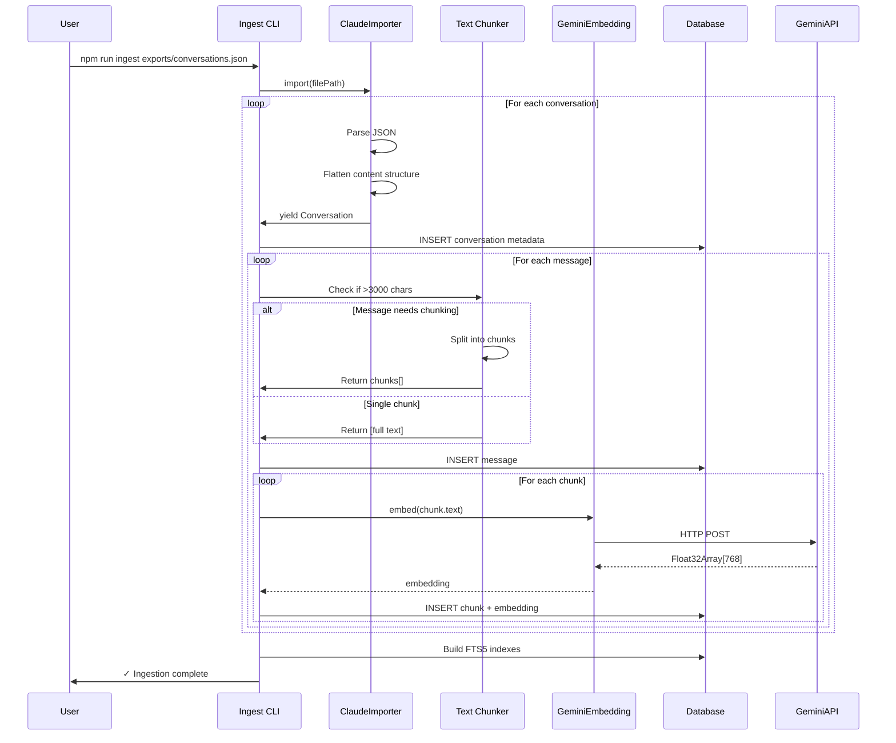
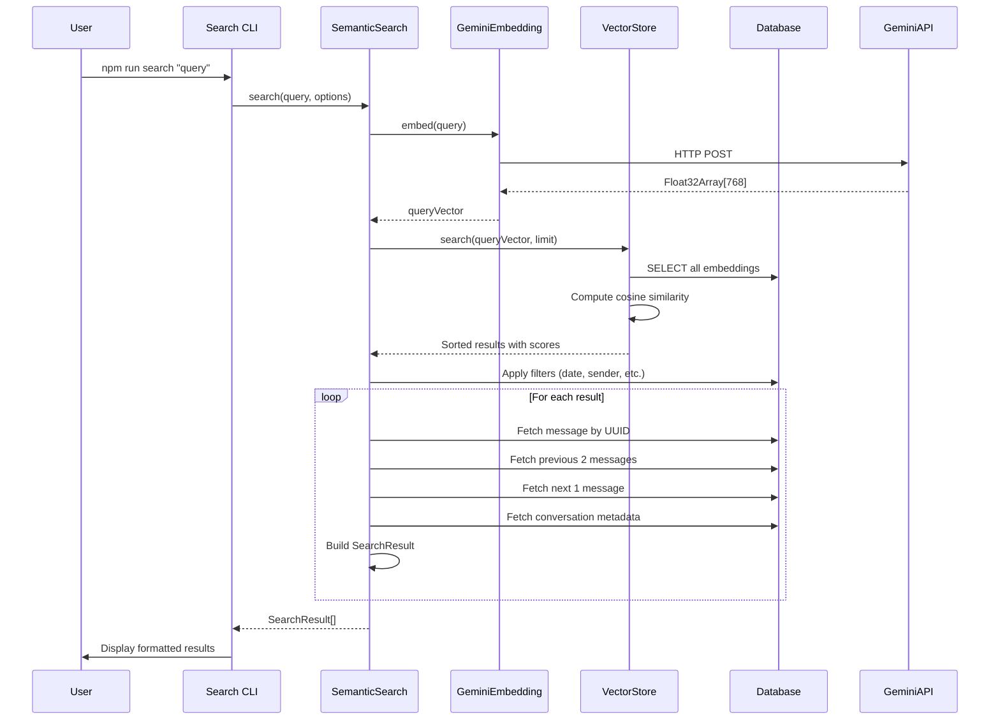
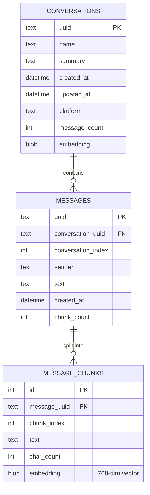

# LLM Archive: Implementation Plan & Architecture

## Overview

Local conversation archive with semantic search for LLM conversations (Claude, with future support for OpenAI/others). Uses TypeScript, SQLite with vector embeddings, and factory pattern + constructor injection for clean architecture.

## System Architecture



### Data Flow: Ingestion



### Data Flow: Search



### Database Schema Relationships



**Key Design Notes:**
- Every message has ≥1 chunk (chunk_index starts at 0)
- Messages >3000 chars automatically chunked
- All embeddings stored in `message_chunks` table
- Vector search operates at chunk level, results aggregated to messages

## Tech Stack

- **TypeScript** - Type safety and clear interfaces
- **SQLite** - Local database with better-sqlite3 (sync bindings)
- **sqlite-vec** - Vector extension for similarity search
- **Google Gemini API** - 768-dim embeddings (free tier friendly)
- **FTS5** - Full-text search for hybrid search capability

## Architecture Principles

1. **Factory Pattern + Constructor Injection** - Manual DI without framework
2. **Interface-Heavy Design** - All providers/importers behind interfaces
3. **Embedding Provider as Source of Truth** - Dimensions propagate from embedding model
4. **Flatten Complex Content** - Extract searchable text from structured content
5. **Transparent Message Chunking** - Large messages chunked for embedding, all embeddings stored at chunk level
6. **Future-Ready Schema** - Support learnings extraction and multi-platform from day one

---

## Core Interfaces

### 1. Embedding Model

```typescript
/**
 * Generates vector embeddings for text using an external API.
 * Implementations: GeminiEmbedding, (future: OpenAIEmbedding)
 */
interface EmbeddingModel {
  /**
   * Generate embedding for a single text string.
   * @param text - Input text to embed
   * @returns Float32Array of embedding vector
   */
  embed(text: string): Promise<Float32Array>

  /**
   * Generate embeddings for multiple texts in a batch.
   * More efficient for bulk processing.
   * @param texts - Array of input texts
   * @returns Array of embedding vectors
   */
  embedBatch(texts: string[]): Promise<Float32Array[]>

  /**
   * Number of dimensions in the embedding vectors.
   * This is the source of truth for vector dimensionality.
   */
  readonly dimensions: number
}
```

### 2. Vector Store

```typescript
/**
 * Stores and searches vector embeddings using SQLite with sqlite-vec.
 * Dimension-agnostic until initialized by embedding provider.
 */
interface VectorStore {
  /**
   * Initialize the vector store with specific dimensions.
   * Must be called before insert/search operations.
   * @param dimensions - Vector dimensionality (e.g., 768)
   */
  initialize(dimensions: number): void

  /**
   * Get current dimensions, or null if not initialized.
   */
  getDimensions(): number | null

  /**
   * Insert a vector into the store.
   * @param id - Unique identifier (message UUID)
   * @param vector - Embedding vector (must match initialized dimensions)
   */
  insert(id: string, vector: Float32Array): void

  /**
   * Search for similar vectors using cosine similarity.
   * @param query - Query vector (must match initialized dimensions)
   * @param limit - Maximum number of results to return
   * @returns Array of search results with IDs and similarity scores
   */
  search(query: Float32Array, limit: number): VectorSearchResult[]
}

interface VectorSearchResult {
  id: string          // Message UUID
  score: number       // Similarity score (0-1, higher = more similar)
  distance: number    // Vector distance
}
```

### 3. Conversation Importer

```typescript
/**
 * Imports conversations from platform-specific export formats.
 * Normalizes to a common format for storage.
 * Implementations: ClaudeImporter, (future: OpenAIImporter)
 */
interface ConversationImporter {
  /**
   * Platform identifier (e.g., "claude", "openai")
   */
  readonly platform: string

  /**
   * Import conversations from an export file.
   * Uses async generator for streaming large files.
   * @param filePath - Path to export file (e.g., conversations.json)
   * @yields Normalized conversations one at a time
   */
  import(filePath: string): AsyncGenerator<Conversation>
}
```

### 4. Search Engine

```typescript
/**
 * Orchestrates semantic search by coordinating embedding and vector search.
 * Enriches results with conversation context.
 */
interface SearchEngine {
  /**
   * Search for conversations/messages matching a query.
   * @param query - Natural language search query
   * @param options - Search options (filters, limits, etc.)
   * @returns Array of search results with context
   */
  search(query: string, options: SearchOptions): Promise<SearchResult[]>
}

interface SearchOptions {
  /**
   * Maximum number of results to return (default: 20)
   */
  limit?: number

  /**
   * Filter by date range
   */
  dateRange?: {
    start: Date
    end: Date
  }

  /**
   * Filter by sender (human or assistant)
   */
  sender?: 'human' | 'assistant'

  /**
   * Filter by conversation UUIDs
   */
  conversationUuids?: string[]
}
```

---

## Data Structures

### Conversation

```typescript
/**
 * Platform-agnostic representation of a conversation.
 * All importers must convert to this format.
 */
interface Conversation {
  uuid: string
  title: string
  summary?: string                // Platform-generated summary
  platform: string                // "claude", "openai", etc.
  messages: Message[]
  createdAt: Date
  updatedAt: Date
  metadata: Record<string, any>   // Platform-specific fields
}
```

### Message

```typescript
/**
 * Platform-agnostic representation of a message.
 * Complex content structures are flattened to searchable text.
 */
interface Message {
  uuid: string
  conversationUuid: string
  conversationIndex: number       // Position in conversation (0-indexed)
  sender: 'human' | 'assistant'
  text: string                    // Flattened, searchable text content
  createdAt: Date
  metadata: Record<string, any>   // Platform-specific fields
}
```

### Search Result

```typescript
/**
 * Search result with conversation context.
 * Includes surrounding messages for multi-turn understanding.
 */
interface SearchResult {
  message: Message                // The matched message
  conversation: {                 // Parent conversation metadata
    uuid: string
    title: string
    summary?: string
    createdAt: Date
    platform: string
  }
  score: number                   // Relevance score (0-1)

  // Context: surrounding messages
  previousMessages: Message[]     // Messages before match in conversation
  nextMessages: Message[]         // Messages after match
}
```

---

## Database Schema

### conversations
```sql
CREATE TABLE conversations (
  uuid TEXT PRIMARY KEY,
  name TEXT NOT NULL,
  summary TEXT,
  created_at DATETIME NOT NULL,
  updated_at DATETIME NOT NULL,
  platform TEXT NOT NULL DEFAULT 'claude',
  message_count INTEGER DEFAULT 0,
  embedding BLOB  -- For summary-level search (future)
);

CREATE INDEX idx_conversations_created ON conversations(created_at);
CREATE INDEX idx_conversations_updated ON conversations(updated_at);
CREATE INDEX idx_conversations_platform ON conversations(platform);
```

### messages
```sql
CREATE TABLE messages (
  uuid TEXT PRIMARY KEY,
  conversation_uuid TEXT NOT NULL,
  conversation_index INTEGER NOT NULL,
  sender TEXT NOT NULL CHECK(sender IN ('human', 'assistant')),
  text TEXT NOT NULL,
  created_at DATETIME NOT NULL,
  chunk_count INTEGER DEFAULT 1,  -- 1 for single-chunk messages, 2+ for chunked

  FOREIGN KEY (conversation_uuid) REFERENCES conversations(uuid) ON DELETE CASCADE,
  UNIQUE(conversation_uuid, conversation_index)
);

CREATE INDEX idx_messages_conversation ON messages(conversation_uuid);
CREATE INDEX idx_messages_sender ON messages(sender);
CREATE INDEX idx_messages_created ON messages(created_at);
```

**Note**: All embeddings are stored in `message_chunks` table. `chunk_count` defaults to 1 for messages ≤3000 chars, 2+ for larger messages.

### message_chunks
```sql
CREATE TABLE message_chunks (
  id INTEGER PRIMARY KEY AUTOINCREMENT,
  message_uuid TEXT NOT NULL,
  chunk_index INTEGER NOT NULL,  -- 0-based: 0 for all messages, 0,1,2... for chunked
  text TEXT NOT NULL,
  char_count INTEGER NOT NULL,
  embedding BLOB,  -- vec0 format, 768 dimensions

  FOREIGN KEY (message_uuid) REFERENCES messages(uuid) ON DELETE CASCADE,
  UNIQUE(message_uuid, chunk_index)
);

CREATE INDEX idx_chunks_message ON message_chunks(message_uuid);
```

**Design**: Every message has at least one chunk (chunk_index=0). Messages >3000 chars automatically create additional chunks (chunk_index=1, 2, 3...). All embeddings stored here.

### learnings (Future)
```sql
CREATE TABLE learnings (
  id INTEGER PRIMARY KEY AUTOINCREMENT,
  title TEXT NOT NULL,
  content TEXT NOT NULL,
  category TEXT,
  confidence_score REAL,
  created_at DATETIME NOT NULL,
  updated_at DATETIME,
  embedding BLOB
);

CREATE TABLE learning_sources (
  learning_id INTEGER NOT NULL,
  conversation_uuid TEXT,
  message_uuid TEXT,

  FOREIGN KEY (learning_id) REFERENCES learnings(id) ON DELETE CASCADE,
  FOREIGN KEY (conversation_uuid) REFERENCES conversations(uuid) ON DELETE CASCADE,
  FOREIGN KEY (message_uuid) REFERENCES messages(uuid) ON DELETE CASCADE
);
```

### FTS5 Tables
```sql
-- FTS5 operates on full message text for keyword search
-- Vector embeddings are stored in message_chunks table
CREATE VIRTUAL TABLE conversations_fts USING fts5(
  uuid UNINDEXED,
  name,
  summary,
  content=conversations,
  content_rowid=rowid
);

CREATE VIRTUAL TABLE messages_fts USING fts5(
  uuid UNINDEXED,
  text,
  content=messages,
  content_rowid=rowid
);
```

---

## Implementation Classes

### 1. GeminiEmbedding

```typescript
/**
 * Gemini API implementation of EmbeddingModel.
 * Uses text-embedding-004 model with 768 dimensions.
 */
class GeminiEmbedding implements EmbeddingModel {
  readonly dimensions = 768
  readonly model = 'text-embedding-004'

  constructor(private config: GeminiConfig) {
    // Initialize Google Generative AI client
  }

  async embed(text: string): Promise<Float32Array> {
    // Call Gemini API
    // Handle rate limiting with exponential backoff
    // Return Float32Array
  }

  async embedBatch(texts: string[]): Promise<Float32Array[]> {
    // Batch processing (up to 100 texts per request)
    // Rate limiting between batches
  }
}

interface GeminiConfig {
  apiKey: string
  batchSize?: number          // Default: 100
  rateLimitDelayMs?: number   // Default: 100ms between batches
}
```

### 2. SqliteVectorStore

```typescript
/**
 * SQLite implementation of VectorStore.
 * All embeddings stored in message_chunks table (1+ chunks per message).
 * Messages >3000 chars automatically split into multiple chunks.
 */
class SqliteVectorStore implements VectorStore {
  private dimensions: number | null = null

  constructor(private db: Database) {}

  initialize(dimensions: number): void {
    // Validate dimensions not already set differently
    // Store dimensions
    // Ensure vec0 table exists with correct dimensions
  }

  getDimensions(): number | null {
    return this.dimensions
  }

  insert(id: string, vector: Float32Array): void {
    // Validate dimensions match
    // Convert Float32Array to vec0 BLOB format
    // Update messages table with embedding
  }

  search(query: Float32Array, limit: number): VectorSearchResult[] {
    // Validate dimensions match
    // Use sqlite-vec for cosine similarity search
    // Return sorted results
  }
}
```

### 3. ClaudeImporter

```typescript
/**
 * Imports Claude conversations from export format.
 * Handles content flattening from complex structure to searchable text.
 */
class ClaudeImporter implements ConversationImporter {
  readonly platform = 'claude'

  async *import(filePath: string): AsyncGenerator<Conversation> {
    // Stream parse conversations.json
    // For each conversation:
    //   - Extract basic metadata (uuid, name, summary, timestamps)
    //   - Process messages:
    //     - Flatten content array to text
    //     - Handle empty text fields (78 cases)
    //     - Extract attachment extracted_content
    //     - Normalize sender (human/assistant)
    //   - Yield Conversation
  }

  private flattenContent(message: ClaudeMessage): string {
    // Priority: message.text field
    // Fallback: flatten message.content array
    // Extract all items with type="text"
    // Append attachment extracted_content if present
    // Return combined searchable text
  }
}
```

### 4. SemanticSearch

```typescript
/**
 * Semantic search engine that coordinates embedding and vector search.
 * Searches message_chunks table and aggregates results back to parent messages.
 * Enriches results with conversation context.
 */
class SemanticSearch implements SearchEngine {
  constructor(
    private embedder: EmbeddingModel,
    private vectorStore: VectorStore,
    private db: Database
  ) {
    // Initialize vector store with embedding dimensions
    vectorStore.initialize(embedder.dimensions)
  }

  async search(query: string, options: SearchOptions): Promise<SearchResult[]> {
    // 1. Generate query embedding
    const queryVector = await this.embedder.embed(query)

    // 2. Vector similarity search
    const vectorResults = this.vectorStore.search(
      queryVector,
      options.limit || 20
    )

    // 3. Apply filters (date range, sender, etc.)
    const filtered = this.applyFilters(vectorResults, options)

    // 4. Enrich with context (previous/next messages)
    const enriched = await this.enrichWithContext(filtered)

    // 5. Return results
    return enriched
  }

  private applyFilters(
    results: VectorSearchResult[],
    options: SearchOptions
  ): VectorSearchResult[] {
    // Apply WHERE clauses for filters
    // Date range, sender, conversation UUIDs
  }

  private async enrichWithContext(
    results: VectorSearchResult[]
  ): Promise<SearchResult[]> {
    // For each result:
    //   - Fetch the matched message
    //   - Fetch 2 previous messages (by conversation_index)
    //   - Fetch 1 next message
    //   - Fetch conversation metadata
    //   - Build SearchResult object
  }
}
```

---

## Factory Functions

### createEmbeddingModel

```typescript
/**
 * Factory for creating embedding models based on config.
 */
function createEmbeddingModel(config: Config): EmbeddingModel {
  switch (config.embedding.provider) {
    case 'gemini':
      return new GeminiEmbedding({
        apiKey: config.embedding.apiKey,
        batchSize: config.embedding.batchSize,
        rateLimitDelayMs: config.embedding.rateLimitDelayMs
      })

    // Future:
    // case 'openai':
    //   return new OpenAIEmbedding(config.embedding)

    default:
      throw new Error(`Unknown embedding provider: ${config.embedding.provider}`)
  }
}
```

### createVectorStore

```typescript
/**
 * Factory for creating vector store with database connection.
 */
function createVectorStore(config: Config): VectorStore {
  const db = new Database(config.db.path)

  // Load sqlite-vec extension
  db.loadExtension('vec0')

  return new SqliteVectorStore(db)
}
```

### createSearchEngine

```typescript
/**
 * Factory for creating fully-wired search engine.
 * Coordinates embedding model and vector store dimensions.
 */
function createSearchEngine(config: Config): SearchEngine {
  const embedder = createEmbeddingModel(config)
  const vectorStore = createVectorStore(config)
  const db = new Database(config.db.path)

  return new SemanticSearch(embedder, vectorStore, db)
}
```

### createImporter

```typescript
/**
 * Factory for creating conversation importers.
 */
function createImporter(platform: string): ConversationImporter {
  switch (platform) {
    case 'claude':
      return new ClaudeImporter()

    // Future:
    // case 'openai':
    //   return new OpenAIImporter()

    default:
      throw new Error(`Unknown platform: ${platform}`)
  }
}
```

---

## Configuration

### config.json
```json
{
  "embedding": {
    "provider": "gemini",
    "apiKey": "YOUR_GEMINI_API_KEY",
    "model": "text-embedding-004",
    "dimensions": 768,
    "batchSize": 100,
    "rateLimitDelayMs": 100
  },
  "db": {
    "path": "./data/conversations.db"
  },
  "search": {
    "defaultLimit": 20,
    "contextWindow": {
      "before": 2,
      "after": 1
    }
  },
  "ingestion": {
    "batchSize": 50,
    "progressLogging": true
  }
}
```

### Config Types
```typescript
interface Config {
  embedding: EmbeddingConfig
  db: DatabaseConfig
  search: SearchConfig
  ingestion: IngestionConfig
}

interface EmbeddingConfig {
  provider: 'gemini' | 'openai'
  apiKey: string
  model: string
  dimensions: number
  batchSize?: number
  rateLimitDelayMs?: number
}

interface DatabaseConfig {
  path: string
}

interface SearchConfig {
  defaultLimit: number
  contextWindow: {
    before: number
    after: number
  }
}

interface IngestionConfig {
  batchSize: number
  progressLogging: boolean
}
```

---

## CLI Commands

### npm run ingest

```typescript
/**
 * Ingestion CLI command.
 * Imports conversations, generates embeddings, stores in database.
 */
async function ingestCommand(args: IngestArgs): Promise<void> {
  const config = loadConfig()

  // 1. Create importer and embedder
  const importer = createImporter('claude')
  const embedder = createEmbeddingModel(config)
  const db = new Database(config.db.path)
  const vectorStore = createVectorStore(config)
  vectorStore.initialize(embedder.dimensions)

  // 2. Initialize database schema
  await initializeSchema(db)

  // 3. Stream import conversations
  let messageCount = 0
  let conversationCount = 0

  for await (const conversation of importer.import(args.filePath)) {
    // Store conversation
    db.run(INSERT_CONVERSATION_SQL, {
      uuid: conversation.uuid,
      name: conversation.title,
      summary: conversation.summary,
      created_at: conversation.createdAt.toISOString(),
      updated_at: conversation.updatedAt.toISOString(),
      platform: conversation.platform,
      message_count: conversation.messages.length
    })

    // Process messages in batches
    const messages = conversation.messages
    for (let i = 0; i < messages.length; i += config.ingestion.batchSize) {
      const batch = messages.slice(i, i + config.ingestion.batchSize)

      // Generate embeddings for batch
      const texts = batch.map(m => m.text)
      const embeddings = await embedder.embedBatch(texts)

      // Store messages with embeddings
      for (let j = 0; j < batch.length; j++) {
        const message = batch[j]
        const embedding = embeddings[j]

        db.run(INSERT_MESSAGE_SQL, {
          uuid: message.uuid,
          conversation_uuid: message.conversationUuid,
          conversation_index: message.conversationIndex,
          sender: message.sender,
          text: message.text,
          created_at: message.createdAt.toISOString()
        })

        vectorStore.insert(message.uuid, embedding)
      }

      messageCount += batch.length

      // Progress logging
      if (config.ingestion.progressLogging) {
        console.log(`Processed ${messageCount} messages...`)
      }
    }

    conversationCount++
  }

  // 4. Build FTS5 indexes
  db.run(REBUILD_FTS_SQL)

  console.log(`✓ Imported ${conversationCount} conversations, ${messageCount} messages`)
}

interface IngestArgs {
  filePath: string      // Path to conversations.json
  resume?: boolean      // Resume interrupted ingestion
}
```

### npm run search

```typescript
/**
 * Search CLI command.
 * Performs semantic search and displays results with context.
 */
async function searchCommand(args: SearchArgs): Promise<void> {
  const config = loadConfig()

  // Create search engine
  const search = createSearchEngine(config)

  // Execute search
  const results = await search.search(args.query, {
    limit: args.limit || config.search.defaultLimit,
    dateRange: args.dateRange,
    sender: args.sender,
    conversationUuids: args.conversationUuids
  })

  // Display results
  for (const result of results) {
    console.log(`\n${'='.repeat(80)}`)
    console.log(`Conversation: "${result.conversation.title}"`)
    console.log(`Date: ${result.conversation.createdAt.toISOString()}`)
    console.log(`Score: ${(result.score * 100).toFixed(1)}%`)
    console.log(`${'='.repeat(80)}\n`)

    // Show context
    for (const msg of result.previousMessages) {
      console.log(`[${msg.sender.toUpperCase()}]: ${msg.text.substring(0, 200)}...`)
      console.log()
    }

    // Highlight matched message
    console.log(`>>> [${result.message.sender.toUpperCase()}]: ${result.message.text}`)
    console.log()

    for (const msg of result.nextMessages) {
      console.log(`[${msg.sender.toUpperCase()}]: ${msg.text.substring(0, 200)}...`)
      console.log()
    }
  }
}

interface SearchArgs {
  query: string
  limit?: number
  dateRange?: { start: Date; end: Date }
  sender?: 'human' | 'assistant'
  conversationUuids?: string[]
}
```

---

## File Structure

```
llm-archive/
├── src/
│   ├── core/
│   │   └── types.ts              # All interfaces and data structures
│   │
│   ├── embeddings/
│   │   └── gemini.ts             # GeminiEmbedding implementation
│   │
│   ├── db/
│   │   ├── schema.ts             # SQL schema definitions
│   │   ├── database.ts           # Database initialization
│   │   └── vector-store.ts       # SqliteVectorStore implementation
│   │
│   ├── importers/
│   │   └── claude.ts             # ClaudeImporter implementation
│   │
│   ├── search/
│   │   └── semantic.ts           # SemanticSearch implementation
│   │
│   ├── factories/
│   │   └── index.ts              # All factory functions
│   │
│   ├── cli/
│   │   ├── ingest.ts             # Ingestion command
│   │   └── search.ts             # Search command
│   │
│   └── config.ts                 # Configuration loading and validation
│
├── exports/
│   └── conversations.json        # Claude export (user-provided)
│
├── data/
│   └── conversations.db          # SQLite database (created by ingest)
│
├── config.json                   # User configuration
├── package.json
├── tsconfig.json
└── README.md
```

---

## Implementation Order

### Phase 1: Foundation
1. Initialize TypeScript project (package.json, tsconfig.json)
2. Create `src/core/types.ts` with all interfaces
3. Create `src/config.ts` with configuration loading
4. Create `config.json` template

### Phase 2: Database
1. Create `src/db/schema.ts` with SQL DDL
2. Create `src/db/database.ts` with initialization
3. Create `src/db/vector-store.ts` implementing VectorStore

### Phase 3: Embeddings
1. Create `src/embeddings/gemini.ts` implementing EmbeddingModel
2. Test embedding generation and batch processing

### Phase 4: Import
1. Create `src/importers/claude.ts` implementing ConversationImporter
2. Implement content flattening logic
3. Test with actual conversations.json

### Phase 5: Search
1. Create `src/search/semantic.ts` implementing SearchEngine
2. Implement context enrichment
3. Test search with mock data

### Phase 6: CLI
1. Create `src/cli/ingest.ts` with ingestion command
2. Create `src/cli/search.ts` with search command
3. Create `src/factories/index.ts` with factory functions
4. Wire everything together

### Phase 7: Testing
1. Test full ingestion pipeline
2. Test search quality
3. Refine and optimize

---

## Key Design Decisions

1. **768-dim embeddings** - Full Gemini dimensions for best quality
2. **Factory pattern** - Creates and wires implementations
3. **Constructor injection** - All dependencies passed to constructors
4. **Interfaces first** - All contracts defined before implementation
5. **Embedding model is source of truth** - Dimensions propagate from model
6. **Stream parsing** - Handle large exports without memory issues
7. **Batch processing** - Efficient embedding generation with rate limiting
8. **Context enrichment** - Return surrounding messages for understanding
9. **Future-ready schema** - Supports learnings and multi-platform

---

## Testing Strategy

### Unit Tests
- Mock EmbeddingModel for search tests
- Test content flattening with edge cases
- Test dimension validation in VectorStore

### Integration Tests
- Full ingestion on real export data
- Search quality validation
- Context window correctness

### Edge Cases to Handle
- Empty text messages (78 cases in export)
- Tool-heavy conversations
- Attachments with extracted_content
- Re-importing same export (UPSERT logic)
- API failures during ingestion (resume capability)

---

## Future Enhancements

### Short-term
- OpenAI importer
- Hybrid search (vector + FTS5)
- Export search results
- Interactive search mode

### Long-term
- Learnings extraction using LLM
- Topic clustering
- Temporal analysis
- Conversation graph (related discussions)
- Simple localhost API for integration with other tools

---

## Estimated Effort

- **Phase 1-2 (Foundation + Database):** 2 hours
- **Phase 3 (Embeddings):** 1-2 hours
- **Phase 4 (Import):** 2-3 hours
- **Phase 5 (Search):** 2 hours
- **Phase 6 (CLI):** 1 hour
- **Phase 7 (Testing):** 2 hours

**Total:** 10-12 hours for complete implementation
