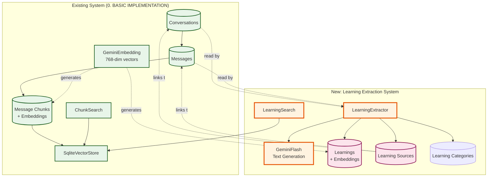
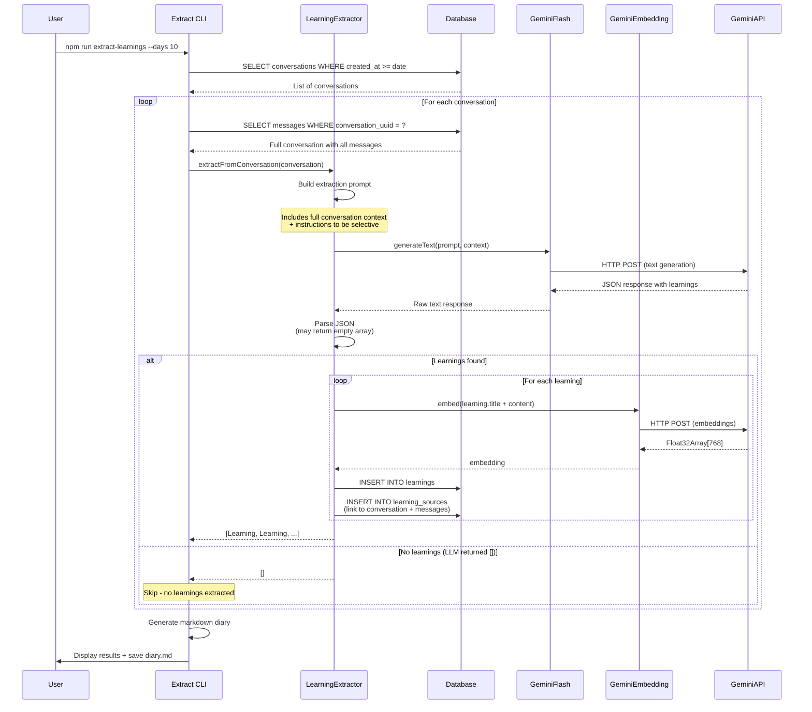
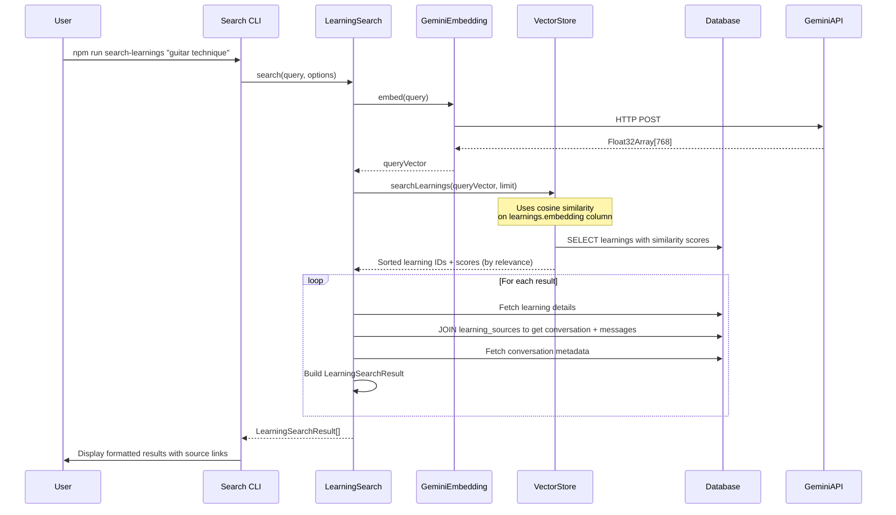
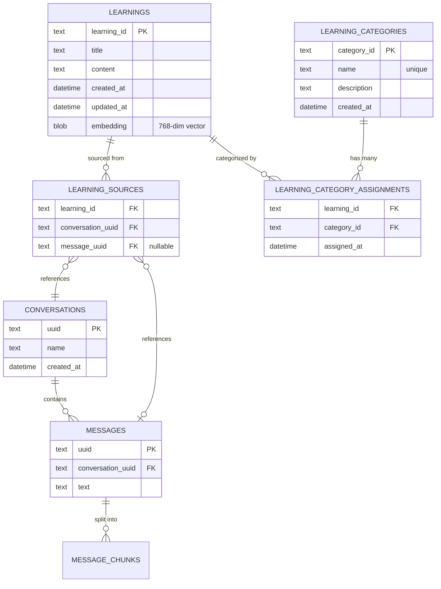

# Learning Extraction: Architecture & Implementation

## Overview

The Learning Extraction feature extends the LLM Archive to automatically identify and extract distilled insights from conversations. Rather than just storing raw conversations, we analyze them using a smaller LLM to identify genuine learnings - concepts internalized, methodologies understood, music recommendations with clear reasoning, etc.

**Key Extension Points:**
- Reuses existing conversation & message storage
- Adds new `learnings`, `learning_categories`, and `learning_sources` tables
- Introduces LLM text generation service (separate from embeddings)
- Extends CLI with extraction and learning search commands
- Extends existing `VectorStore` interface for learning-specific search
- Leverages existing embedding and vector search infrastructure

## How Learnings Extend the System



**Integration Strategy:**
- **Read-only on existing data:** Learning extraction reads conversations/messages without modification
- **Reuse embeddings service:** Learnings get embedded using existing GeminiEmbedding (768-dim)
- **Reuse VectorStore:** No changes needed - works with string IDs universally
- **Dynamic categories:** User-defined categories stored in database, can evolve over time
- **New LLM service:** GeminiFlash for text generation (distinct from embeddings)
- **Two search spaces:** ChunkSearch (messages) and LearningSearch (learnings) are distinct

---

## Learning Extraction Data Flow



**Key Design Choices:**
1. **LLM returns empty array if not confident** - No artificial confidence scoring, LLM decides what's substantial
2. **Full conversation context** - Send entire conversation to LLM for holistic analysis
3. **Batch processing** - Process conversations sequentially (respect rate limits)
4. **Embeddings reuse** - Use same GeminiEmbedding service for consistency

---

## Learning Search Data Flow



**Search Features:**
- Semantic search over learning titles + content (distinct from ChunkSearch)
- Results include source conversation and message references
- Uses existing VectorStore infrastructure with string IDs
- Optional filters: date range, category
- **Preserves relevance ordering** from vector similarity scores

---

## New Interfaces

### LLMModel

```typescript
/**
 * Interface for text generation using LLM APIs.
 * Used for learning extraction (not embeddings).
 *
 * Implementations: GeminiFlash, (future: GPT-4o-mini, Claude Haiku)
 */
interface LLMModel {
  /**
   * Generate text based on a prompt.
   * @param prompt - The instruction prompt
   * @param context - Optional context (e.g., full conversation)
   * @returns Generated text (typically JSON)
   */
  generateText(prompt: string, context?: string): Promise<string>

  /**
   * Model identifier (e.g., "gemini-1.5-flash")
   */
  readonly model: string
}
```

### LearningExtractor

```typescript
/**
 * Extracts distilled learnings from conversations using LLM.
 * Stores learnings with embeddings and source references.
 */
interface LearningExtractor {
  /**
   * Extract learnings from a single conversation.
   * @param conversation - Full conversation with messages
   * @returns Array of extracted learnings (empty if none found)
   */
  extractFromConversation(conversation: Conversation): Promise<Learning[]>
}

/**
 * A distilled learning extracted from conversations.
 */
interface Learning {
  learningId: string             // Unique learning ID (string for consistency)
  title: string                  // Brief title (max 100 chars)
  content: string                // Detailed explanation (2-3 sentences)
  categories: Category[]         // Dynamic categories (many-to-many)
  createdAt: Date
  sources: LearningSource[]      // Link to source conversations/messages
}

interface LearningSource {
  conversationUuid: string
  messageUuids?: string[]        // Specific messages if identifiable
}

/**
 * Dynamic category - user-defined and evolvable.
 */
interface Category {
  categoryId: string             // Category ID (string for consistency)
  name: string                   // Category name (e.g., "software-architecture")
  description?: string           // Optional description
  createdAt: Date
}
```

### VectorStore Interface (Unchanged)

```typescript
/**
 * VectorStore interface - simple and universal.
 * Works with any entity that has embeddings (messages, learnings, etc.)
 */
interface VectorStore {
  initialize(dimensions: number): void
  getDimensions(): number | null

  /**
   * Insert a vector with a string ID.
   * @param id - Entity ID (message UUID, learning ID, etc.)
   * @param vector - Embedding vector
   */
  insert(id: string, vector: Float32Array): void

  /**
   * Search for similar vectors.
   * @param query - Query embedding vector
   * @param limit - Maximum results to return
   * @returns Array of results sorted by similarity
   */
  search(query: Float32Array, limit: number): VectorSearchResult[]
}

interface VectorSearchResult {
  id: string                    // Entity ID (always string)
  score: number                 // Similarity score (0-1, higher = more similar)
  distance: number              // Vector distance
}
```

**Design Benefits:**
- **Universal:** Same methods for messages, learnings, any future entities
- **Simple:** String IDs everywhere, no type confusion
- **Flexible:** Callers decide how to interpret IDs (messages vs learnings)
- **No coupling:** VectorStore doesn't know about domain entities

### LearningSearch

```typescript
/**
 * Semantic search over learnings.
 * Uses VectorStore for core search, enriches with domain-specific data.
 */
interface LearningSearch {
  /**
   * Search for learnings matching a query.
   * @param query - Natural language search query
   * @param options - Search options
   * @returns Array of search results with source context
   */
  search(query: string, options: LearningSearchOptions): Promise<LearningSearchResult[]>
}

interface LearningSearchOptions {
  limit?: number                 // Default: 20
  dateRange?: {                  // Filter by learning creation date
    start: Date
    end: Date
  }
  categoryIds?: number[]         // Filter by category IDs
  categoryNames?: string[]       // Filter by category names
}

interface LearningSearchResult {
  learning: Learning             // The matched learning
  score: number                  // Similarity score (0-1)
  sourceConversations: {         // Source conversation metadata
    uuid: string
    title: string
    createdAt: Date
  }[]
}
```

---

## Database Schema Extension

The schema includes these tables (see `0. BASIC IMPLEMENTATION.md` for full schema):



**Key Relationships:**
- `learnings.embedding`: Uses same 768-dim vectors as message chunks
- `learning_sources`: Many-to-many linking learnings to conversations/messages
- `learning_categories`: User-defined categories (can add/remove/edit)
- `learning_category_assignments`: Many-to-many linking learnings to categories
- Each learning can have multiple categories
- Each category can be used by multiple learnings
- Cascade deletes: Deleting a learning removes its sources and category assignments

**New Table Definitions:**

```sql
-- Learning categories table (dynamic, user-defined)
CREATE TABLE learning_categories (
  category_id TEXT PRIMARY KEY,    -- UUID or generated ID
  name TEXT UNIQUE NOT NULL,
  description TEXT,
  created_at DATETIME NOT NULL DEFAULT (datetime('now'))
);

CREATE INDEX idx_learning_categories_name ON learning_categories(name);

-- Learnings table with string IDs
CREATE TABLE learnings (
  learning_id TEXT PRIMARY KEY,    -- UUID or generated ID
  title TEXT NOT NULL,
  content TEXT NOT NULL,
  created_at DATETIME NOT NULL DEFAULT (datetime('now')),
  updated_at DATETIME,
  embedding BLOB  -- 768-dim vector
);

CREATE INDEX idx_learnings_created ON learnings(created_at);

-- Many-to-many assignment table
CREATE TABLE learning_category_assignments (
  learning_id TEXT NOT NULL,
  category_id TEXT NOT NULL,
  assigned_at DATETIME NOT NULL DEFAULT (datetime('now')),

  PRIMARY KEY (learning_id, category_id),
  FOREIGN KEY (learning_id) REFERENCES learnings(learning_id) ON DELETE CASCADE,
  FOREIGN KEY (category_id) REFERENCES learning_categories(category_id) ON DELETE CASCADE
);

CREATE INDEX idx_lca_learning ON learning_category_assignments(learning_id);
CREATE INDEX idx_lca_category ON learning_category_assignments(category_id);

-- Learning sources table
CREATE TABLE learning_sources (
  learning_id TEXT NOT NULL,
  conversation_uuid TEXT,
  message_uuid TEXT,

  FOREIGN KEY (learning_id) REFERENCES learnings(learning_id) ON DELETE CASCADE,
  FOREIGN KEY (conversation_uuid) REFERENCES conversations(uuid) ON DELETE CASCADE,
  FOREIGN KEY (message_uuid) REFERENCES messages(uuid) ON DELETE CASCADE
);

CREATE INDEX idx_learning_sources_learning ON learning_sources(learning_id);
CREATE INDEX idx_learning_sources_conv ON learning_sources(conversation_uuid);
```

**New Queries Needed:**

```sql
-- Get conversations from date range for extraction
SELECT * FROM conversations
WHERE created_at >= datetime('now', '-10 days')
ORDER BY created_at DESC;

-- Get full conversation with messages
SELECT c.*, m.*
FROM conversations c
JOIN messages m ON c.uuid = m.conversation_uuid
WHERE c.uuid = ?
ORDER BY m.conversation_index ASC;

-- Insert category with generated ID (idempotent)
INSERT INTO learning_categories (category_id, name, description)
VALUES (?, ?, ?)
ON CONFLICT(name) DO NOTHING;

-- Get category by name (works whether we created it or it existed)
SELECT category_id, name, description, created_at
FROM learning_categories
WHERE name = ?;

-- Insert learning with UUID and embedding
INSERT INTO learnings (learning_id, title, content, created_at, embedding)
VALUES (?, ?, ?, datetime('now'), ?);

-- Assign categories to learning
INSERT INTO learning_category_assignments (learning_id, category_id)
VALUES (?, ?);

-- Link learning to sources
INSERT INTO learning_sources (learning_id, conversation_uuid, message_uuid)
VALUES (?, ?, ?);

-- Search learnings by vector similarity (via VectorStore.search)
-- Note: VectorStore returns learning_ids as strings
SELECT learning_id, title, content, created_at,
       vec_distance_cosine(embedding, ?) as distance,
       (1 - vec_distance_cosine(embedding, ?)) as score
FROM learnings
WHERE embedding IS NOT NULL
ORDER BY distance ASC
LIMIT ?;

-- Get learning with categories and sources
SELECT
  l.*,
  lc.category_id, lc.name as cat_name, lc.description as cat_desc,
  c.uuid as conv_uuid, c.name as conv_title, c.created_at as conv_date
FROM learnings l
LEFT JOIN learning_category_assignments lca ON l.learning_id = lca.learning_id
LEFT JOIN learning_categories lc ON lca.category_id = lc.category_id
LEFT JOIN learning_sources ls ON l.learning_id = ls.learning_id
LEFT JOIN conversations c ON ls.conversation_uuid = c.uuid
WHERE l.learning_id = ?;

-- Filter learnings by category names
SELECT DISTINCT l.*
FROM learnings l
JOIN learning_category_assignments lca ON l.learning_id = lca.learning_id
JOIN learning_categories lc ON lca.category_id = lc.category_id
WHERE lc.name IN (?, ?, ...);

-- Get all categories with learning counts
SELECT lc.*, COUNT(lca.learning_id) as learning_count
FROM learning_categories lc
LEFT JOIN learning_category_assignments lca ON lc.category_id = lca.category_id
GROUP BY lc.category_id
ORDER BY learning_count DESC;
```

---

## Implementation Classes

### GeminiFlash

```typescript
import { GoogleGenerativeAI } from '@google/generative-ai'
import { LLMModel } from '../core/types'

/**
 * Gemini Flash implementation for fast, cost-effective text generation.
 * Used for learning extraction (separate from embeddings).
 */
class GeminiFlash implements LLMModel {
  readonly model: string
  private client: GoogleGenerativeAI
  private generationConfig: GenerationConfig
  private rateLimitDelayMs: number

  constructor(config: GeminiFlashConfig) {
    this.client = new GoogleGenerativeAI(config.apiKey)
    this.model = config.model || 'gemini-1.5-flash'
    this.rateLimitDelayMs = config.rateLimitDelayMs ?? 1000
    this.generationConfig = {
      temperature: config.temperature ?? 0.7,
      maxOutputTokens: config.maxTokens ?? 2000,
    }
  }

  async generateText(prompt: string, context?: string): Promise<string> {
    const model = this.client.getGenerativeModel({
      model: this.model,
      generationConfig: this.generationConfig
    })

    // Combine context and prompt
    const fullPrompt = context
      ? `${context}\n\n${prompt}`
      : prompt

    try {
      const result = await model.generateContent(fullPrompt)

      // Rate limiting between calls
      await this.delay(this.rateLimitDelayMs)

      return result.response.text()
    } catch (error) {
      // Handle rate limiting, API errors
      throw new Error(`Gemini Flash generation failed: ${error.message}`)
    }
  }

  private delay(ms: number): Promise<void> {
    return new Promise(resolve => setTimeout(resolve, ms))
  }
}

interface GeminiFlashConfig {
  apiKey: string
  model?: string              // Default: gemini-1.5-flash
  temperature?: number        // Default: 0.7
  maxTokens?: number          // Default: 2000
  rateLimitDelayMs?: number   // Default: 1000ms between calls
}
```

**Design Notes:**
- Separate from GeminiEmbedding (different API, different purpose)
- Uses Gemini's text generation endpoint (not embeddings)
- Can reuse same API key from config
- Configurable temperature for controlled/creative extraction

### LearningExtractorImpl

```typescript
/**
 * Service for extracting learnings from conversations.
 * Uses LLM to analyze full conversation context.
 */
class LearningExtractorImpl implements LearningExtractor {
  constructor(
    private llm: LLMModel,
    private embedder: EmbeddingModel,
    private vectorStore: VectorStore,
    private db: Database
  ) {}

  /**
   * Serialize embedding vector to Buffer for database storage.
   */
  private serializeEmbedding(embedding: Float32Array): Buffer {
    return Buffer.from(embedding.buffer)
  }

  async extractFromConversation(conversation: Conversation): Promise<Learning[]> {
    // 1. Fetch existing categories to provide as context
    const existingCategories = this.db.prepare(`
      SELECT category_id, name, description, created_at
      FROM learning_categories
      ORDER BY name ASC
    `).all() as Category[]

    // 2. Build conversation context
    const context = this.buildConversationContext(conversation)

    // 3. Generate learnings using LLM with category context
    const prompt = buildLearningExtractionPrompt(existingCategories)
    const response = await this.llm.generateText(prompt, context)

    // 4. Parse JSON response
    let learnings: LearningJSON[]
    try {
      learnings = JSON.parse(response)
    } catch (error) {
      console.warn(`Failed to parse learnings for ${conversation.uuid}:`, error)
      return []
    }

    // 5. Batch generate embeddings for all learnings (efficient!)
    const embeddingTexts = learnings.map(l => `${l.title}\n\n${l.content}`)
    const embeddings = await this.embedder.embedBatch(embeddingTexts)

    // 6. Store all learnings in a transaction (ensures atomicity)
    const insertLearnings = this.db.transaction((learningsToInsert: LearningJSON[], embeddingsToInsert: Float32Array[]) => {
      const results: Learning[] = []

      for (let i = 0; i < learningsToInsert.length; i++) {
        const learning = learningsToInsert[i]
        const embedding = embeddingsToInsert[i]

        // Generate UUID for learning
        const learningId = this.generateUUID()

        // Insert learning with UUID
        this.db.prepare(`
          INSERT INTO learnings (learning_id, title, content, created_at, embedding)
          VALUES (?, ?, ?, datetime('now'), ?)
        `).run(
          learningId,
          learning.title,
          learning.content,
          this.serializeEmbedding(embedding)
        )

        // Validate embedding with vector store
        this.vectorStore.insert(learningId, embedding)

        // Link to source conversation
        this.db.prepare(`
          INSERT INTO learning_sources (learning_id, conversation_uuid)
          VALUES (?, ?)
        `).run(learningId, conversation.uuid)

        // Handle categories (proper upsert pattern)
        const categories: Category[] = []
        if (learning.categories && learning.categories.length > 0) {
          for (const categoryName of learning.categories) {
            // Try to find existing category
            let category = existingCategories.find(c => c.name === categoryName)

            if (!category) {
              // Generate UUID for category
              const categoryId = this.generateUUID()

              // Idempotent insert (no-op if exists)
              this.db.prepare(`
                INSERT INTO learning_categories (category_id, name, created_at)
                VALUES (?, ?, datetime('now'))
                ON CONFLICT(name) DO NOTHING
              `).run(categoryId, categoryName)

              // Fetch the category (works whether we created it or it existed)
              category = this.db.prepare(`
                SELECT category_id, name, description, created_at
                FROM learning_categories
                WHERE name = ?
              `).get(categoryName) as Category

              existingCategories.push(category)  // Cache for subsequent learnings
            }

            // Assign category to learning
            this.db.prepare(`
              INSERT INTO learning_category_assignments (learning_id, category_id)
              VALUES (?, ?)
            `).run(learningId, category.categoryId)

            categories.push(category)
          }
        }

        results.push({
          learningId,
          title: learning.title,
          content: learning.content,
          categories,
          createdAt: new Date(),
          sources: [{ conversationUuid: conversation.uuid }]
        })
      }

      return results
    })

    // Execute transaction atomically
    return insertLearnings(learnings, embeddings)
  }

  private buildConversationContext(conversation: Conversation): string {
    const messages = conversation.messages
      .map(m => `[${m.sender.toUpperCase()}]: ${m.text}`)
      .join('\n\n')

    return `Conversation: "${conversation.title}"\nDate: ${conversation.createdAt.toISOString()}\n\n${messages}`
  }

  private generateUUID(): string {
    // Generate RFC4122 v4 UUID
    return 'xxxxxxxx-xxxx-4xxx-yxxx-xxxxxxxxxxxx'.replace(/[xy]/g, (c) => {
      const r = Math.random() * 16 | 0
      const v = c === 'x' ? r : (r & 0x3 | 0x8)
      return v.toString(16)
    })
  }
}

/**
 * Build learning extraction prompt with existing categories as context.
 * Provides categories for reference without biasing toward them.
 */
function buildLearningExtractionPrompt(existingCategories: Category[]): string {
  const categoryContext = existingCategories.length > 0
    ? `\n\nFor reference, these categories already exist in the system:\n${existingCategories.map(c => `- ${c.name}${c.description ? `: ${c.description}` : ''}`).join('\n')}\n\nYou may use these if they fit well, or create new ones as needed.`
    : '\n\nNo categories exist yet - create relevant ones using lowercase-with-hyphens format.'

  return `
Analyze this conversation and extract distilled learnings. Focus on:

1. **Technical concepts or methodologies** that were genuinely internalized (not just mentioned)
2. **Personal discoveries** in taste, preferences, or understanding (books, music, art, food, design, etc.) with specific reasoning
3. **Key insights or realizations** that demonstrate new understanding or perspective shifts
4. **Patterns or approaches** worth remembering for future reference

**Critical guideline:** Only include learnings where the conversation shows genuine engagement, understanding, or internalization. Casual mentions are NOT learnings.

Return a JSON array of learnings. **If there are no substantial learnings, return an empty array [].**

Each learning must have:
- title: Brief, descriptive title (max 100 chars)
- content: Detailed explanation of what was learned (2-3 sentences)
- categories: Array of category names (use lowercase-with-hyphens format, e.g., "distributed-systems", "jazz-fusion")
${categoryContext}

Examples (only if applicable):
[
  {
    "title": "Event-Driven Architecture Benefits for Microservices",
    "content": "Learned that event sourcing provides natural audit trails and time-travel debugging capabilities. The pattern of storing events rather than state makes it easier to reconstruct system state at any point in time, which is invaluable for debugging production issues in distributed systems.",
    "categories": ["software-architecture", "distributed-systems"]
  },
  {
    "title": "Sourdough Fermentation Temperature Control",
    "content": "Discovered that bulk fermentation at 78°F (25°C) produces tangier bread compared to 68°F (20°C). The warmer temperature accelerates lactobacillus activity relative to yeast, changing the acid profile. This explains why my winter loaves were consistently milder - ambient temperature matters more than I realized.",
    "categories": ["cooking", "baking-science"]
  }
]

If nothing substantial was learned, return: []

Conversation:
`.trim()
}

interface LearningJSON {
  title: string
  content: string
  categories?: string[]  // Free-form category names
}
```

**Design Highlights:**
- **Single responsibility:** Only extracts from one conversation - CLI handles batching
- **Selective by design:** Prompt explicitly instructs LLM to return `[]` if no learnings
- **Full context:** Entire conversation sent to LLM for holistic analysis
- **Category context (not bias):** Existing categories provided for reference, not preference
- **Dynamic category system:** LLM creates new categories freely as system evolves
- **Atomic transactions:** All DB writes wrapped in transaction for data consistency
- **Batch embedding generation:** Generate embeddings for all learnings at once (efficient!)
- **Proper category upsert:** Handles concurrent category creation safely with UUIDs
- **Category caching:** Existing categories cached per extraction session to avoid repeated DB queries
- **String IDs:** Uses UUIDs for learnings and categories (consistent with messages/conversations)
- **Source tracking:** Links each learning to its conversation via learning_sources

### SqliteVectorStore (Unchanged)

```typescript
/**
 * SqliteVectorStore - universal vector storage.
 * Works with any entity: messages, learnings, future entities.
 */
class SqliteVectorStore implements VectorStore {
  private dimensions: number | null = null

  constructor(private db: Database) {}

  initialize(dimensions: number): void {
    if (this.dimensions !== null && this.dimensions !== dimensions) {
      throw new Error(
        `VectorStore already initialized with ${this.dimensions} dimensions, ` +
        `cannot reinitialize with ${dimensions} dimensions`
      )
    }
    this.dimensions = dimensions
    // Ensure vec0 extension is loaded
  }

  getDimensions(): number | null {
    return this.dimensions
  }

  insert(id: string, vector: Float32Array): void {
    if (!this.dimensions || vector.length !== this.dimensions) {
      throw new Error(`Vector dimensions mismatch: expected ${this.dimensions}, got ${vector.length}`)
    }
    // Note: Actual DB insert happens in domain logic (message chunks or learnings table)
    // This method primarily validates dimensions
    // Implementation could also update a dedicated vec0 table if needed
  }

  /**
   * Search a specific table for similar vectors.
   * @param tableName - Table to search ('message_chunks' or 'learnings')
   * @param idColumn - ID column name ('message_uuid' or 'learning_id')
   */
  searchTable(
    tableName: string,
    idColumn: string,
    query: Float32Array,
    limit: number
  ): VectorSearchResult[] {
    if (!this.dimensions) {
      throw new Error('VectorStore not initialized')
    }

    const stmt = this.db.prepare(`
      SELECT
        ${idColumn} as id,
        vec_distance_cosine(embedding, ?) as distance,
        (1 - vec_distance_cosine(embedding, ?)) as score
      FROM ${tableName}
      WHERE embedding IS NOT NULL
      ORDER BY distance ASC
      LIMIT ?
    `)

    return stmt.all(
      this.serializeVector(query),
      this.serializeVector(query),
      limit
    ) as VectorSearchResult[]
  }

  private serializeVector(vector: Float32Array): Buffer {
    return Buffer.from(vector.buffer)
  }
}
```

**Key Design:**
- **Universal:** Same interface for all entities with embeddings
- **String IDs:** No type confusion, works with UUIDs or generated IDs
- **Domain-agnostic:** Doesn't know about messages vs learnings
- **Table-specific search:** ChunkSearch and LearningSearch implement actual SQL queries

### LearningSearchImpl

```typescript
/**
 * Semantic search over learnings.
 * Uses VectorStore for core search logic.
 */
class LearningSearchImpl implements LearningSearch {
  constructor(
    private embedder: EmbeddingModel,
    private vectorStore: VectorStore,
    private db: Database
  ) {}

  async search(query: string, options: LearningSearchOptions): Promise<LearningSearchResult[]> {
    // 1. Generate query embedding
    const queryVector = await this.embedder.embed(query)

    // 2. Vector similarity search on learnings table
    const vectorResults = this.vectorStore.searchTable(
      'learnings',
      'learning_id',
      queryVector,
      options.limit || 20
    )

    if (vectorResults.length === 0) {
      return []
    }

    // 3. Create temp table with scores to preserve relevance ordering
    this.db.exec('CREATE TEMP TABLE IF NOT EXISTS temp_learning_scores (id INTEGER PRIMARY KEY, score REAL)')
    this.db.exec('DELETE FROM temp_learning_scores')  // Clear previous search

    const insertScore = this.db.prepare('INSERT INTO temp_learning_scores VALUES (?, ?)')
    const insertScores = this.db.transaction((results: LearningVectorResult[]) => {
      for (const result of results) {
        insertScore.run(result.id, result.score)
      }
    })
    insertScores(vectorResults)

    // 4. Build query with filters, preserving relevance order
    let sql = `
      SELECT DISTINCT
        l.*,
        tls.score,
        lc.id as cat_id, lc.name as cat_name,
        ls.conversation_uuid, c.name as conv_title, c.created_at as conv_date
      FROM learnings l
      JOIN temp_learning_scores tls ON l.id = tls.id
      LEFT JOIN learning_category_assignments lca ON l.id = lca.learning_id
      LEFT JOIN learning_categories lc ON lca.category_id = lc.id
      LEFT JOIN learning_sources ls ON l.id = ls.learning_id
      LEFT JOIN conversations c ON ls.conversation_uuid = c.uuid
      WHERE 1=1
    `

    const params: any[] = []

    // Apply date filter
    if (options.dateRange) {
      sql += ` AND l.created_at >= ? AND l.created_at <= ?`
      params.push(options.dateRange.start.toISOString(), options.dateRange.end.toISOString())
    }

    // Apply category filter
    if (options.categoryNames && options.categoryNames.length > 0) {
      const placeholders = options.categoryNames.map(() => '?').join(',')
      sql += ` AND lc.name IN (${placeholders})`
      params.push(...options.categoryNames)
    }

    // IMPORTANT: Preserve relevance order from vector search
    sql += ` ORDER BY tls.score DESC`

    const rows = this.db.prepare(sql).all(...params)

    // 5. Group results by learning
    const learningMap = new Map<number, LearningSearchResult>()

    for (const row of rows) {
      if (!learningMap.has(row.learning_id)) {
        learningMap.set(row.learning_id, {
          learning: {
            learningId: row.learning_id,
            title: row.title,
            content: row.content,
            categories: [],
            createdAt: new Date(row.created_at),
            sources: []
          },
          score: row.score,  // Score now comes from JOIN with temp table
          sourceConversations: []
        })
      }

      const result = learningMap.get(row.learning_id)!

      // Add category if present and not duplicate
      if (row.category_id && !result.learning.categories.some(c => c.categoryId === row.category_id)) {
        result.learning.categories.push({
          categoryId: row.category_id,
          name: row.cat_name,
          createdAt: new Date(row.created_at)
        })
      }

      // Add source conversation if not duplicate
      if (row.conversation_uuid &&
          !result.sourceConversations.some(c => c.uuid === row.conversation_uuid)) {
        result.sourceConversations.push({
          uuid: row.conversation_uuid,
          title: row.conv_title,
          createdAt: new Date(row.conv_date)
        })
      }
    }

    return Array.from(learningMap.values())
  }
}
```

**Integration Notes:**
- **Uses existing VectorStore:** Calls `searchTable('learnings', 'learning_id', ...)`
- **Preserves relevance ordering:** Temp table with scores maintains vector similarity order
- **Table-specific enrichment:** Adds categories and source conversations
- **Efficient filtering:** SQL filters applied after vector search

---

## Factory Extensions

### New Factory: createLLMModel

```typescript
/**
 * Factory for creating LLM models for text generation.
 * Separate from createEmbeddingModel (different purpose).
 */
function createLLMModel(config: Config): LLMModel {
  switch (config.llm.provider) {
    case 'gemini':
      return new GeminiFlash({
        apiKey: config.llm.apiKey,
        model: config.llm.model,
        temperature: config.llm.temperature,
        maxTokens: config.llm.maxTokens
      })

    // Future:
    // case 'openai':
    //   return new GPT4oMini(config.llm)
    // case 'anthropic':
    //   return new ClaudeHaiku(config.llm)

    default:
      throw new Error(`Unknown LLM provider: ${config.llm.provider}`)
  }
}
```

### New Factory: createLearningExtractor

```typescript
/**
 * Factory for creating fully-wired learning extractor.
 * Coordinates LLM, embedder, vector store, and database.
 */
function createLearningExtractor(config: Config): LearningExtractor {
  const llm = createLLMModel(config)
  const embedder = createEmbeddingModel(config)
  const vectorStore = createVectorStore(config)
  const db = new Database(config.db.path)

  // Initialize vector store with embedding dimensions
  vectorStore.initialize(embedder.dimensions)

  return new LearningExtractorImpl(llm, embedder, vectorStore, db)
}
```

### New Factory: createLearningSearch

```typescript
/**
 * Factory for creating learning search engine.
 * Reuses existing VectorStore infrastructure.
 */
function createLearningSearch(config: Config): LearningSearch {
  const embedder = createEmbeddingModel(config)
  const vectorStore = createVectorStore(config)
  const db = new Database(config.db.path)

  // Initialize vector store with embedding dimensions
  vectorStore.initialize(embedder.dimensions)

  return new LearningSearchImpl(embedder, vectorStore, db)
}
```

**Factory Philosophy:** Same pattern as existing factories - create dependencies, inject into implementations, return interface. Reuses existing `createVectorStore()` factory without introducing new abstractions.

---

## New CLI Commands

### extract-learnings

```typescript
/**
 * CLI command to extract learnings from conversations.
 *
 * Usage:
 *   npm run extract-learnings                    # Last 10 days (default)
 *   npm run extract-learnings -- --days 30       # Last 30 days
 *   npm run extract-learnings -- --all           # All conversations
 *   npm run extract-learnings -- --start-date 2024-01-01 --end-date 2024-12-31
 */
async function extractLearningsCommand(args: ExtractLearningsArgs): Promise<void> {
  try {
    const config = loadConfig()
    const extractor = createLearningExtractor(config)
    const db = new Database(config.db.path)

    // Determine date range
    let start: Date
    let end: Date = new Date()

    if (args.all) {
      start = new Date(0)  // Beginning of time
    } else if (args.startDate && args.endDate) {
      start = new Date(args.startDate)
      end = new Date(args.endDate)
    } else {
      const days = args.days || 10
      start = new Date(Date.now() - days * 24 * 60 * 60 * 1000)
    }

    console.log(`Extracting learnings from ${start.toISOString()} to ${end.toISOString()}...`)

    // Fetch conversations in date range
    const conversations = db.prepare(`
      SELECT * FROM conversations
      WHERE created_at >= ? AND created_at <= ?
      ORDER BY created_at DESC
    `).all(start.toISOString(), end.toISOString()) as Conversation[]

    const total = conversations.length
    console.log(`\nProcessing ${total} conversations...`)

    // Extract learnings from each conversation
    const allLearnings: Learning[] = []
    for (let i = 0; i < conversations.length; i++) {
      const conv = conversations[i]

      // Fetch full conversation with messages
      const messages = db.prepare(`
        SELECT * FROM messages
        WHERE conversation_uuid = ?
        ORDER BY conversation_index ASC
      `).all(conv.uuid) as Message[]

      const fullConv = { ...conv, messages }
      const learnings = await extractor.extractFromConversation(fullConv)
      allLearnings.push(...learnings)

      // Progress logging with counter
      console.log(`[${i + 1}/${total}] Extracted ${learnings.length} learnings from "${conv.name}"`)
    }

    const learnings = allLearnings

    console.log(`\n✓ Extracted ${learnings.length} learnings`)

    // Generate markdown diary
    const diary = generateMarkdownDiary(learnings, start, end)
    const diaryPath = './data/learning-diary.md'
    fs.writeFileSync(diaryPath, diary)

    console.log(`\n✓ Diary saved to ${diaryPath}`)
    console.log('\nSample learnings:')

    // Show first 3 learnings
    for (const learning of learnings.slice(0, 3)) {
      const categoryNames = learning.categories.map(c => c.name).join(', ')
      console.log(`\n[${categoryNames}] ${learning.title}`)
      console.log(learning.content)
    }
  } catch (error) {
    console.error(`❌ Learning extraction failed: ${error.message}`)
    console.error(`\nTroubleshooting:`)
    console.error(`  - Check your API keys in config.json`)
    console.error(`  - Ensure database exists: ${config.db.path}`)
    console.error(`  - Verify LLM model is available (${config.llm.model})`)
    console.error(`  - Check rate limits on Gemini API`)
    process.exit(1)
  }
}

interface ExtractLearningsArgs {
  days?: number
  all?: boolean
  startDate?: string
  endDate?: string
}

/**
 * Generate markdown diary grouped by date.
 */
function generateMarkdownDiary(learnings: Learning[], start: Date, end: Date): string {
  // Group learnings by date
  const byDate = new Map<string, Learning[]>()

  for (const learning of learnings) {
    const dateKey = learning.createdAt.toISOString().split('T')[0]
    if (!byDate.has(dateKey)) {
      byDate.set(dateKey, [])
    }
    byDate.get(dateKey)!.push(learning)
  }

  // Sort dates descending
  const sortedDates = Array.from(byDate.keys()).sort().reverse()

  // Build markdown
  let md = `# Learning Diary\n\n`
  md += `**Period:** ${start.toISOString().split('T')[0]} to ${end.toISOString().split('T')[0]}\n`
  md += `**Total Learnings:** ${learnings.length}\n\n`
  md += `---\n\n`

  for (const date of sortedDates) {
    const dateLearnings = byDate.get(date)!
    md += `## ${date}\n\n`

    for (const learning of dateLearnings) {
      md += `### ${learning.title}\n\n`

      // Handle multiple categories
      if (learning.categories.length > 0) {
        const categoryNames = learning.categories.map(c => c.name).join(', ')
        md += `**Categories:** ${categoryNames}\n\n`
      }

      md += `${learning.content}\n\n`

      // Add source links
      if (learning.sources.length > 0) {
        md += `**Sources:**\n`
        for (const source of learning.sources) {
          md += `- Conversation: \`${source.conversationUuid}\`\n`
        }
        md += `\n`
      }

      md += `---\n\n`
    }
  }

  return md
}
```

### search-learnings

```typescript
/**
 * CLI command to search learnings semantically.
 *
 * Usage:
 *   npm run search-learnings "guitar techniques"
 *   npm run search-learnings "database design patterns" -- --limit 5
 *   npm run search-learnings "music" -- --category music_recommendation
 */
async function searchLearningsCommand(args: SearchLearningsArgs): Promise<void> {
  try {
    const config = loadConfig()
    const search = createLearningSearch(config)

    console.log(`Searching learnings for: "${args.query}"...`)

    // Execute search
    const results = await search.search(args.query, {
      limit: args.limit || 20,
      categoryNames: args.categoryNames,
      dateRange: args.dateRange
    })

    console.log(`\nFound ${results.length} learnings:\n`)

    // Display results
    for (const result of results) {
      const categoryNames = result.learning.categories.map(c => c.name).join(', ')

      console.log(`${'='.repeat(80)}`)
      console.log(`[${categoryNames}] ${result.learning.title}`)
      console.log(`Score: ${(result.score * 100).toFixed(1)}% | Date: ${result.learning.createdAt.toISOString().split('T')[0]}`)
      console.log(`${'='.repeat(80)}`)
      console.log()
      console.log(result.learning.content)
      console.log()

      // Show source conversations
      console.log('Sources:')
      for (const conv of result.sourceConversations) {
        console.log(`  - "${conv.title}" (${conv.createdAt.toISOString().split('T')[0]})`)
      }
      console.log()
    }
  } catch (error) {
    console.error(`❌ Learning search failed: ${error.message}`)
    console.error(`\nTroubleshooting:`)
    console.error(`  - Check your API key in config.json`)
    console.error(`  - Ensure database exists: ${config.db.path}`)
    console.error(`  - Verify embeddings are generated for learnings`)
    process.exit(1)
  }
}

interface SearchLearningsArgs {
  query: string
  limit?: number
  categoryNames?: string[]      // Filter by category names
  dateRange?: { start: Date; end: Date }
}
```

---

## Configuration Extension

Extend `config.json` to include LLM and learning extraction settings:

```json
{
  "embedding": {
    "provider": "gemini",
    "apiKey": "YOUR_GEMINI_API_KEY",
    "model": "text-embedding-004",
    "dimensions": 768
  },
  "llm": {
    "provider": "gemini",
    "apiKey": "YOUR_GEMINI_API_KEY",
    "model": "gemini-1.5-flash",
    "temperature": 0.7,
    "maxTokens": 2000,
    "rateLimitDelayMs": 1000
  },
  "db": {
    "path": "./data/conversations.db"
  },
  "search": {
    "defaultLimit": 20,
    "contextWindow": {
      "before": 2,
      "after": 1
    }
  }
}
```

**Config Types Extension:**

```typescript
interface Config {
  embedding: EmbeddingConfig
  llm: LLMConfig                      // NEW
  db: DatabaseConfig
  search: SearchConfig
}

interface LLMConfig {
  provider: 'gemini' | 'openai' | 'anthropic'
  apiKey: string
  model: string
  temperature?: number
  maxTokens?: number
  rateLimitDelayMs?: number     // Delay between LLM calls (default: 1000ms)
}
```

---

## Integration Summary

### What We Reuse (No Changes)
- ✅ GeminiEmbedding for generating learning embeddings
- ✅ SqliteVectorStore - works with string IDs (no changes needed!)
- ✅ Database connection and schema
- ✅ Factory pattern for dependency injection
- ✅ Config loading system

### What We Add (New)
- ➕ GeminiFlash for LLM text generation with rate limiting
- ➕ LearningExtractor service - single method, CLI handles batching
- ➕ LearningSearch service with relevance-preserving search
- ➕ extract-learnings CLI command with date range logic
- ➕ search-learnings CLI command with error handling
- ➕ LLM config section
- ➕ Dynamic category system (UUID-based, user-defined, no lock-in)
- ➕ Markdown diary generation with multiple categories
- ➕ Transaction boundaries for atomic learning insertion
- ➕ Batch embedding generation for performance
- ➕ UUID generation for learnings and categories

### Extension Points
1. **VectorStore:** Add `searchTable()` method for table-specific searches
2. **Factory Layer:** Add `createLLMModel()`, `createLearningExtractor()`, `createLearningSearch()`
3. **Type System:** Add `LLMModel`, `LearningExtractor`, `LearningSearch`, `Category` interfaces
4. **Database:** Add three new tables with TEXT primary keys
5. **CLI:** Add two new commands to package.json scripts
6. **Rename:** SemanticSearch → ChunkSearch (clarify two search spaces)

---

## File Structure Additions

```
llm-archive/
├── src/
│   ├── core/
│   │   └── types.ts              # Add LLM interfaces, extend VectorStore interface
│   │
│   ├── llm/                      # NEW directory
│   │   └── gemini-flash.ts       # Text generation with rate limiting
│   │
│   ├── db/
│   │   └── vector-store.ts       # EXTEND with insertLearning/searchLearnings
│   │
│   ├── search/                   # EXTEND existing
│   │   ├── semantic.ts           # Existing message search
│   │   └── learning-search.ts    # NEW: Learning search
│   │
│   ├── services/                 # NEW directory
│   │   └── learning-extractor.ts # Learning extraction + category management
│   │
│   ├── cli/
│   │   ├── ingest.ts
│   │   ├── search.ts
│   │   ├── extract-learnings.ts  # NEW (with error handling)
│   │   └── search-learnings.ts   # NEW (with error handling)
│   │
│   └── factories/
│       └── index.ts              # Extend with new factories
│
├── data/
│   ├── conversations.db          # Existing
│   └── learning-diary.md         # Generated by extract-learnings
│
└── docs/
    ├── 0. BASIC IMPLEMENTATION.md
    └── 1. LEARNINGS.md           # This document
```

---

## Implementation Checklist

- [ ] **Phase 1: Database Schema (30 min)**
  - [ ] Add `learning_categories` table
  - [ ] Add `learning_category_assignments` table
  - [ ] Update `learnings` table (remove static category column)
  - [ ] Add indexes

- [ ] **Phase 2: Types & Interfaces (30 min)**
  - [ ] Add `LLMModel`, `MessageVectorResult`, `LearningVectorResult` interfaces to `src/core/types.ts`
  - [ ] Extend `VectorStore` interface with `insertLearning()` and `searchLearnings()` methods
  - [ ] Add `LearningExtractor`, `LearningSearch`, `Category` interfaces
  - [ ] Extend Config types with `LLMConfig`

- [ ] **Phase 3: Extend VectorStore (45 min)**
  - [ ] Extend `src/db/vector-store.ts` with learning methods
  - [ ] Implement `insertLearning()` and `searchLearnings()`
  - [ ] Add proper type safety with separate result types

- [ ] **Phase 4: LLM Service (1 hour)**
  - [ ] Create `src/llm/gemini-flash.ts`
  - [ ] Implement text generation with rate limiting
  - [ ] Add error handling for API failures
  - [ ] Test with simple prompts

- [ ] **Phase 5: Learning Extractor (2 hours)**
  - [ ] Create `src/services/learning-extractor.ts`
  - [ ] Implement extraction logic with dynamic category support
  - [ ] Add proper category upsert (INSERT ... ON CONFLICT DO NOTHING + SELECT)
  - [ ] Implement prompt engineering (unbiased category selection)
  - [ ] Add JSON parsing with error handling
  - [ ] Wrap all DB writes in transactions (atomicity)
  - [ ] Implement batch embedding generation
  - [ ] Add progress logging

- [ ] **Phase 6: Learning Search (1 hour)**
  - [ ] Create `src/search/learning-search.ts`
  - [ ] Use VectorStore.searchLearnings() method
  - [ ] Implement temp table pattern for relevance ordering
  - [ ] Add category and source conversation enrichment
  - [ ] Support category filtering

- [ ] **Phase 7: CLI Commands (1.5 hours)**
  - [ ] Create `src/cli/extract-learnings.ts` with comprehensive error handling
  - [ ] Create `src/cli/search-learnings.ts` with comprehensive error handling
  - [ ] Add markdown diary generation with multiple categories support
  - [ ] Fix category display (use plural `categories` array)
  - [ ] Update package.json scripts

- [ ] **Phase 8: Factory Wiring (30 min)**
  - [ ] Add `createLLMModel()` to `src/factories/index.ts`
  - [ ] Add `createLearningExtractor()` with vectorStore injection
  - [ ] Add `createLearningSearch()` with vectorStore injection
  - [ ] Ensure vectorStore.initialize() is called with embedder.dimensions

- [ ] **Phase 9: Testing (1 hour)**
  - [ ] Test extraction on last 10 days
  - [ ] Review learning quality and categories
  - [ ] Test search functionality with category filters
  - [ ] Generate and review diary

**Estimated Total:** 8-9 hours

---

## Prompt Engineering Notes

The extraction prompt is critical. Key guidelines:

1. **Be explicit about selectivity:** "Only include if conversation shows genuine internalization"
2. **Allow empty results:** "Return [] if nothing substantial"
3. **Provide concrete examples:** Show what good learnings look like
4. **Define categories clearly:** List valid categories with descriptions
5. **Request structured output:** Specify exact JSON format

The prompt should be **refined iteratively** based on output quality. Consider:
- If too many trivial learnings → strengthen "genuine engagement" criteria
- If too few learnings → relax criteria slightly
- If wrong categories → add category descriptions in prompt

---

## Future Enhancements

### Short-term
- **Learning editing:** CLI command to edit/delete learnings
- **Category management:** Add/remove custom categories
- **Batch processing:** Process multiple date ranges in parallel
- **Progress indicators:** Show extraction progress with loading bars

### Long-term
- **Temporal analysis:** Track how learnings evolve over time
- **Learning connections:** Graph of related learnings
- **Spaced repetition:** Resurface learnings at intervals
- **Export formats:** PDF, Notion, Obsidian integration
- **Multi-LLM support:** Compare extractions from different models
