# 3. CI/CD Pipeline

## Overview

This document describes the Continuous Integration and Continuous Deployment (CI/CD) pipeline for the LLM Archive project. The pipeline ensures code quality by automatically running tests and build verification on every commit and pull request.

---

## Why CI/CD for This Project?

### Current State

- 226 comprehensive tests across unit, integration, and E2E categories
- 80% code coverage threshold enforced
- TypeScript compilation required before deployment
- All external APIs (Gemini) are mocked in tests

### Benefits of CI/CD

1. **Catch bugs early** - Tests run on every push/PR before code is merged
2. **Prevent breaking changes** - Build verification ensures TypeScript compiles
3. **No manual testing overhead** - Automated test runs save developer time
4. **Safe collaboration** - PRs are validated before review
5. **No secrets management complexity** - Mock architecture eliminates API key needs

---

## Architecture Decision: GitHub Actions

### Why GitHub Actions?

✅ **Native integration** - Built into GitHub, no external services
✅ **Free for public repos** - Unlimited minutes for open source
✅ **Simple configuration** - YAML-based workflow files
✅ **Good caching** - Fast dependency installation
✅ **Parallel jobs** - Test and build run simultaneously
✅ **No account setup** - Works immediately in any GitHub repo

### Alternatives Considered

- **GitLab CI**: Good, but requires GitLab hosting
- **CircleCI**: Powerful, but requires separate account
- **Travis CI**: Declining ecosystem support
- **Jenkins**: Over-engineered for this project size

---

## High-Level Workflow Architecture

```mermaid
flowchart TB
    subgraph Triggers
        A[Push to Branch]
        B[Pull Request to Main]
        C[Manual Dispatch]
    end

    subgraph "CI Workflow (Parallel)"
        D[Test Job]
        E[Build Job]
    end

    subgraph "Test Job Steps"
        F[Checkout Code]
        G[Setup Node.js 20.x]
        H[Cache node_modules]
        I[npm ci]
        J[npm test]
    end

    subgraph "Build Job Steps"
        K[Checkout Code]
        L[Setup Node.js 20.x]
        M[Cache node_modules]
        N[npm ci]
        O[npm run build]
    end

    A --> D
    A --> E
    B --> D
    B --> E
    C --> D
    C --> E

    D --> F --> G --> H --> I --> J
    E --> K --> L --> M --> N --> O

    J --> P{Tests Pass?}
    O --> Q{Build Success?}

    P -->|Yes| R[✓ Job Complete]
    P -->|No| S[✗ Job Failed]
    Q -->|Yes| T[✓ Job Complete]
    Q -->|No| U[✗ Job Failed]
```



---

## Workflow Configuration

### File Location

`.github/workflows/ci.yml`

### Triggers

1. **Push to any branch**

   ```yaml
   on:
     push:
       branches: ["**"]
   ```

   - Runs on every commit to any branch
   - Provides immediate feedback to developers

2. **Pull requests to main**

   ```yaml
   on:
     pull_request:
       branches: [main]
   ```

   - Validates PRs before merge
   - Prevents broken code from reaching main

3. **Manual dispatch**
   ```yaml
   on:
     workflow_dispatch:
   ```
   - Allows manual triggering from GitHub UI
   - Useful for debugging or re-running failed builds

### Runtime Environment

**Platform:** Ubuntu Latest

- Stable, widely supported
- Fast startup times
- Good caching performance

**Node.js Version:** 20.x

- Current LTS version
- Matches development environment
- Good TypeScript support

**Rationale for Single Version:**

- Project is an application (not a library)
- We control the deployment environment
- Faster CI feedback (no matrix builds)
- Simpler configuration

---

## Job Definitions

### Job 1: Test

**Purpose:** Run the complete test suite to catch regressions

**Steps:**

1. **Checkout code** - `actions/checkout@v4`
2. **Setup Node.js** - `actions/setup-node@v4` with Node 20.x
3. **Cache dependencies** - Cache node_modules based on package-lock.json hash
4. **Install dependencies** - `npm ci` (clean install, uses lockfile)
5. **Run tests** - `npm test` (runs all 226 tests)

**Test Coverage:**

- Unit tests: Fast, mocked dependencies
- Integration tests: Real SQLite, mocked APIs
- E2E tests: Full CLI workflows (~50 seconds)

**Expected Runtime:** ~60 seconds total

- Dependency install: ~10s (cached) or ~30s (cold)
- Test execution: ~51s (includes E2E)

**No API Keys Required:**

- All tests use mock implementations from `tests/mocks/`
- `MockLLMModel` simulates Gemini Flash
- `MockEmbeddingModel` simulates Gemini embeddings
- `MockVectorStore` simulates vector database

### Job 2: Build

**Purpose:** Verify TypeScript compilation succeeds

**Steps:**

1. **Checkout code** - `actions/checkout@v4`
2. **Setup Node.js** - `actions/setup-node@v4` with Node 20.x
3. **Cache dependencies** - Cache node_modules
4. **Install dependencies** - `npm ci`
5. **Build project** - `npm run build` (TypeScript compilation)

**Build Verification:**

- Ensures no TypeScript type errors
- Catches missing imports or declarations
- Validates tsconfig.json configuration
- Produces `dist/` output (ES2022 modules)

**Expected Runtime:** ~30 seconds

- Dependency install: ~10s (cached)
- TypeScript compilation: ~5-10s

**Why Separate from Test Job:**

- Runs in parallel for faster feedback
- Build can fail independently of tests
- Clear separation of concerns

---

## Performance Optimizations

### 1. Dependency Caching

```yaml
- uses: actions/cache@v4
  with:
    path: ~/.npm
    key: ${{ runner.os }}-node-${{ hashFiles('**/package-lock.json') }}
```

**Benefits:**

- 3-5x faster dependency installation
- Cache invalidates when package-lock.json changes
- Shared across jobs

### 2. Parallel Job Execution

Both jobs run simultaneously:

- Total pipeline time = max(test_time, build_time)
- ~60 seconds total (not 90 seconds sequential)

### 3. Fail Fast

Default GitHub Actions behavior:

- Pipeline stops immediately if any job fails
- No wasted compute time on dependent jobs

### 4. Efficient Test Strategy

**Current:** Run all tests every time

- Most reliable approach
- Total runtime acceptable (~51s)
- E2E tests are necessary for confidence

**Future Optimization (if needed):**

- Split E2E tests to separate workflow
- Run E2E only on main branch
- Faster PR feedback (~1-5s for unit+integration)

---

## Integration with Existing Project

### npm Scripts Used

From `package.json`:

1. **`npm test`** - Test job

   ```json
   "test": "vitest run"
   ```

   - Runs all tests in `tests/` directory
   - Uses Vitest v2.1.0
   - Includes unit, integration, and E2E tests

2. **`npm run build`** - Build job
   ```json
   "build": "tsc"
   ```
   - Compiles TypeScript to JavaScript
   - Target: ES2022
   - Module: ES6
   - Output: `dist/` directory

### Test Configuration

From `vitest.config.ts`:

- Coverage threshold: 80% lines/functions/statements, 75% branches
- Test environment: Node
- Coverage provider: v8
- Test timeout: 10s (sufficient for E2E)

**No Changes Required:**

- Existing test configuration works perfectly in CI
- No special CI-specific configuration needed

### Database Handling

Tests create temporary SQLite databases:

- Unit tests: Use `:memory:` databases
- Integration tests: Create temp files in `tests/tmp/`
- E2E tests: Create isolated test databases
- Cleanup: Handled by test teardown

**CI Implications:**

- No external database service needed
- SQLite runs natively on Ubuntu runners
- `better-sqlite3` compiles automatically during `npm ci`

---

## Workflow File Structure

```yaml
name: CI

on:
  push:
    branches: ["**"]
  pull_request:
    branches: [main]
  workflow_dispatch:

jobs:
  test:
    runs-on: ubuntu-latest
    steps:
      - checkout
      - setup node
      - cache dependencies
      - install dependencies
      - run tests

  build:
    runs-on: ubuntu-latest
    steps:
      - checkout
      - setup node
      - cache dependencies
      - install dependencies
      - run build
```

---

## Expected Behavior

### On Every Push

1. Workflow triggers automatically
2. GitHub shows yellow dot (in progress)
3. Test and build jobs run in parallel
4. ~60 seconds later: green checkmark (success) or red X (failure)

### On Pull Requests

1. Workflow runs before PR can be merged
2. PR shows "Checks pending" status
3. Reviewers can see test/build results
4. Merge button enables only after checks pass

### On Failures

**Test failures:**

- Review test output in GitHub Actions logs
- Failed test names and error messages visible
- Fix tests locally, push to trigger re-run

**Build failures:**

- TypeScript compilation errors shown
- Line numbers and file locations provided
- Fix type errors, push to re-run

---

## Security Considerations

### Why This Pipeline Is Secure

✅ **No secrets required** - All tests use mocks
✅ **Safe for PRs from forks** - No API key exposure
✅ **Read-only operations** - CI only runs tests/build
✅ **No deployment** - No write access to external systems

### What We're NOT Doing (Yet)

- ❌ Publishing to npm (would require `NPM_TOKEN`)
- ❌ Deploying to servers (would require credentials)
- ❌ Accessing external APIs (all mocked)

**If we add these later:**

- Use GitHub Secrets for sensitive values
- Restrict secret access to protected branches
- Use environment protection rules

---

## Future Enhancements

### 1. Code Coverage Reporting

**Goal:** Track coverage trends over time

**Implementation:**

- Add `npm run test:coverage` to test job
- Upload coverage reports to Codecov or Coveralls
- Add coverage badge to README

**Effort:** Low (1-2 hours)

### 2. Automated Releases

**Goal:** Auto-publish to npm on version tags

**Implementation:**

- Create `.github/workflows/release.yml`
- Trigger on tags matching `v*.*.*`
- Run tests → build → npm publish

**Requires:** NPM_TOKEN secret

**Effort:** Medium (2-4 hours)

### 3. Dependabot

**Goal:** Automated dependency updates

**Implementation:**

- Create `.github/dependabot.yml`
- Auto-create PRs for dependency updates
- CI validates updates automatically

**Effort:** Low (30 minutes)

### 4. Branch Protection Rules

**Goal:** Enforce CI before merge

**Implementation:**

- GitHub repo settings → Branches → Add rule
- Require "Test" and "Build" checks to pass
- Require up-to-date branches

**Effort:** Low (5 minutes)

### 5. Matrix Testing (Multiple Node Versions)

**Goal:** Test against Node 18.x, 20.x, 22.x

**Implementation:**

```yaml
strategy:
  matrix:
    node-version: [18.x, 20.x, 22.x]
```

**Trade-off:** 3x longer CI time
**When to add:** If publishing as library or supporting multiple runtimes

---

## Troubleshooting

### Common Issues

**1. SQLite Compilation Fails**

```
Error: Cannot find module 'better-sqlite3'
```

**Solution:** Already handled by `npm ci` which compiles native modules

**2. Tests Timeout in CI**

```
Error: Test timed out after 10000ms
```

**Solution:** Increase Vitest timeout in `vitest.config.ts` (currently 10s is sufficient)

**3. Build Fails Locally But Passes in CI**

```
Error: Cannot find module '@types/node'
```

**Solution:** Run `npm ci` locally to match CI environment

**4. Caching Issues**

```
Tests fail with stale dependencies
```

**Solution:**

- Clear cache in GitHub Actions UI
- Update cache key if package-lock.json corrupted

---

## Monitoring and Maintenance

### What to Watch

**1. Test Duration**

- Currently: ~51 seconds
- Warning threshold: > 2 minutes
- Action: Optimize slow E2E tests or split them

**2. Build Duration**

- Currently: ~5-10 seconds
- Warning threshold: > 30 seconds
- Action: Check for circular dependencies or large imports

**3. Cache Hit Rate**

- Expected: > 90% for routine commits
- If low: Check cache key configuration

**4. Failure Rate**

- Expected: < 5% (mostly from legitimate bugs)
- If high: Investigate flaky tests or environment issues

### Maintenance Schedule

**Weekly:**

- Review failed workflow runs
- Check for slow tests (> 10s each)

**Monthly:**

- Review dependency cache efficiency
- Consider adding new optimization strategies

**Quarterly:**

- Evaluate if E2E tests should be split
- Review GitHub Actions minutes usage (if private repo)
- Update Node.js version if LTS changes

---

## Success Metrics

### How to Know CI/CD Is Working

✅ **All PRs run checks automatically**
✅ **Checks complete in < 2 minutes**
✅ **No API key issues in CI logs**
✅ **Tests pass consistently (> 95% success rate)**
✅ **Developers trust CI results**

### Red Flags

❌ Tests frequently fail for non-code reasons (flaky tests)
❌ CI takes > 5 minutes to complete
❌ Developers bypass CI checks ("we'll fix it later")
❌ Secrets exposed in logs
❌ Cache never hits (slow dependency installs)

---

## Integration Summary

### What's Reused

- ✅ Existing npm scripts (`test`, `build`)
- ✅ Existing test infrastructure (Vitest, mocks)
- ✅ Existing database setup (SQLite, better-sqlite3)
- ✅ Existing TypeScript configuration

### What's New

- 🆕 `.github/workflows/ci.yml` - Workflow definition
- 🆕 GitHub Actions integration
- 🆕 Automated test/build triggers
- 🆕 Dependency caching strategy

### What's NOT Changed

- ✅ No code changes required
- ✅ No test changes required
- ✅ No build configuration changes
- ✅ No database schema changes

---

## File Structure

```
.github/
└── workflows/
    └── ci.yml              # GitHub Actions workflow definition

docs/
└── 3. CI_CD PIPELINE.md   # This document

tests/                      # No changes
├── unit/
├── integration/
├── e2e/
└── mocks/                  # Mock implementations used by CI

package.json                # No changes (existing scripts reused)
vitest.config.ts           # No changes (CI uses existing config)
tsconfig.json              # No changes (CI uses existing config)
```

---

## Conclusion

This CI/CD pipeline provides:

- **Automated quality checks** on every commit
- **Fast feedback** (~60 seconds)
- **Simple configuration** (single YAML file)
- **No secrets management** (thanks to mock architecture)
- **Easy maintenance** (built on npm scripts)

The pipeline is production-ready and can be enhanced incrementally with coverage reporting, automated releases, and branch protection rules as the project matures.
