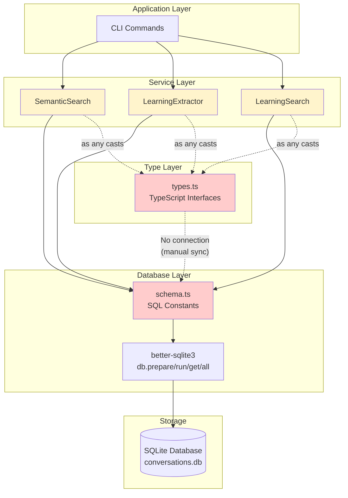
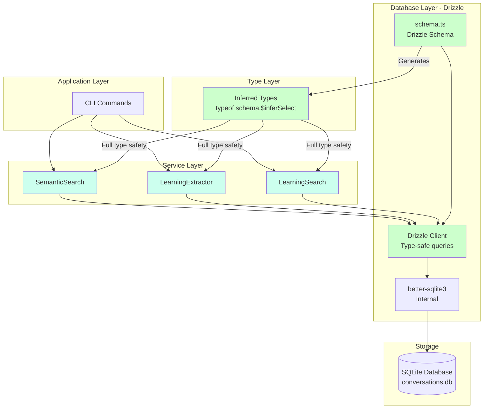

# 4. Drizzle ORM Migration

## Overview

This document outlines the migration from raw SQL with better-sqlite3 to Drizzle ORM, a lightweight TypeScript-first ORM that provides compile-time type safety while maintaining close-to-SQL query patterns.

### Why Migrate?

**Current Pain Points:**

1. **Type Safety Gap:** 7 instances of `as any` casts in database operations
2. **Manual Mapping:** 20+ instances of manual snake_case → camelCase conversions
3. **JSON Handling:** 15+ manual `JSON.parse()`/`JSON.stringify()` calls scattered across files
4. **No Compile-Time Validation:** SQL typos only caught at runtime
5. **Three Sources of Truth:** Migrations (SQL), schema.ts (SQL constants), types.ts (TypeScript interfaces)
6. **Migration Management:** Manual SQL file creation, no automated tooling

**Violates Architectural Principles:**
Our CLAUDE.md explicitly states: _"We don't like the any type. Really try to avoid using // eslint-disable-next-line @typescript-eslint/no-explicit-any"_

Yet every database interaction requires `as any` casts. This contradiction will only worsen as the schema grows.

### What Drizzle Provides

1. **Full Type Safety:** Eliminate all `as any` casts with inference from schema
2. **Automatic Field Mapping:** No more manual snake_case ↔ camelCase conversion
3. **JSON Column Support:** Type-safe JSON with automatic serialization
4. **Compile-Time Query Validation:** Typos caught by TypeScript, not at runtime
5. **Single Source of Truth:** Schema definition generates both SQL and TypeScript types
6. **Automated Migrations:** Generate migrations from schema changes via drizzle-kit
7. **Query Builder:** Type-safe queries with IDE autocomplete
8. **Better DX:** Less boilerplate, faster development, safer refactoring

### Migration Approach

**Incremental, Data-Preserving Migration:**

- Phase 1: Install Drizzle, define schema (no code changes)
- Phase 2: Update infrastructure (factories, vector store)
- Phase 3: Migrate services (learning extractor, search)
- Phase 4: Update CLI and tests
- Phase 5: Remove deprecated code

**Key Principles:**

- Preserve all existing data (zero data loss)
- Maintain existing interfaces (services keep same API)
- Gradual migration (can deploy after each phase)
- Test-driven (tests pass after each phase)
- Backward compatible (can roll back if needed)

### Integration with Existing System

**What Changes:**

- `src/db/schema.ts` - Rewritten in Drizzle syntax
- All 16 files with database operations - Use Drizzle queries
- Factory pattern - Returns typed Drizzle client
- Tests - Use Drizzle for setup

**What Stays the Same:**

- Database file location (`./data/conversations.db`)
- Service interfaces (EmbeddingModel, SearchEngine, etc.)
- Configuration structure (config.json)
- CLI command signatures
- Vector similarity algorithm (custom cosine calculation)
- FTS5 full-text search (SQLite native feature)

---

## Current State Analysis

### Database Schema Overview

**Tables (9 total):**

```
conversations (core)
├── uuid TEXT PRIMARY KEY
├── name TEXT
├── summary TEXT
├── created_at DATETIME
├── updated_at DATETIME
├── platform TEXT DEFAULT 'claude'
├── message_count INTEGER DEFAULT 0
└── embedding BLOB

messages (core)
├── uuid TEXT PRIMARY KEY
├── conversation_uuid TEXT FK → conversations(uuid)
├── conversation_index INTEGER
├── sender TEXT ('human' | 'assistant')
├── text TEXT
├── created_at DATETIME
└── chunk_count INTEGER DEFAULT 0

message_chunks (core)
├── id INTEGER PRIMARY KEY AUTOINCREMENT
├── message_uuid TEXT FK → messages(uuid)
├── chunk_index INTEGER
├── text TEXT
├── char_count INTEGER
└── embedding BLOB

learnings (feature: advanced schema)
├── learning_id TEXT PRIMARY KEY
├── title TEXT
├── context TEXT
├── insight TEXT
├── why TEXT
├── implications TEXT
├── tags TEXT (JSON: string[])
├── abstraction TEXT (JSON: Abstraction)
├── understanding TEXT (JSON: Understanding)
├── effort TEXT (JSON: Effort)
├── resonance TEXT (JSON: Resonance)
├── learning_type TEXT ('technical' | 'conceptual' | 'strategic')
├── source_credit TEXT
├── conversation_uuid TEXT FK → conversations(uuid)
├── embedding BLOB
└── created_at DATETIME

conversations_fts (FTS5 virtual table)
messages_fts (FTS5 virtual table)

_archived_* tables (4 deprecated tables from old schema)
```

**Indexes (12 total):**

- conversations: idx_conversations_created, idx_conversations_updated, idx_conversations_platform
- messages: idx_messages_conversation, idx_messages_created, idx_messages_sender
- message_chunks: idx_message_chunks_message
- learnings: idx_learnings_conversation, idx_learnings_created, idx_learnings_type

### Current Database Layer Architecture

```
┌─────────────────────────────────────────────────────────────┐
│                     APPLICATION LAYER                        │
│  CLI Commands (ingest, search, extract-learnings)           │
└────────────────────┬────────────────────────────────────────┘
                     │
┌────────────────────▼────────────────────────────────────────┐
│                     SERVICE LAYER                            │
│  ┌─────────────────────────────────────────────────────┐   │
│  │ SemanticSearch                                       │   │
│  │ - search(query) → Message[]                          │   │
│  │ - Uses: db.prepare(SQL.GET_MESSAGE).get(uuid)       │   │
│  │ - Manual mapping: row.conversation_uuid → camelCase │   │
│  └─────────────────────────────────────────────────────┘   │
│                                                              │
│  ┌─────────────────────────────────────────────────────┐   │
│  │ LearningExtractorImpl                                │   │
│  │ - extractFromConversation(conv) → Learning[]         │   │
│  │ - Uses: db.prepare(SQL.INSERT_LEARNING).run(...)    │   │
│  │ - Manual JSON: JSON.stringify(learning.tags)        │   │
│  └─────────────────────────────────────────────────────┘   │
│                                                              │
│  ┌─────────────────────────────────────────────────────┐   │
│  │ LearningSearchImpl                                   │   │
│  │ - search(query, opts) → Learning[]                   │   │
│  │ - Dynamic SQL: if (dateRange) sql += " AND ..."     │   │
│  │ - Manual JSON: JSON.parse(row.tags) as string[]     │   │
│  └─────────────────────────────────────────────────────┘   │
└────────────────────┬────────────────────────────────────────┘
                     │
┌────────────────────▼────────────────────────────────────────┐
│                   DATABASE LAYER                             │
│  ┌─────────────────────────────────────────────────────┐   │
│  │ src/db/schema.ts (384 lines)                         │   │
│  │                                                       │   │
│  │ export const DDL_* = `CREATE TABLE...`               │   │
│  │ export const SQL = {                                 │   │
│  │   INSERT_CONVERSATION: `INSERT INTO...`,             │   │
│  │   GET_MESSAGE: `SELECT * FROM messages WHERE...`     │   │
│  │ }                                                     │   │
│  │                                                       │   │
│  │ export function initializeSchema(db: Database) {     │   │
│  │   db.exec(DDL_CONVERSATIONS)                         │   │
│  │   db.exec(DDL_MESSAGES)                              │   │
│  │   // ... more tables                                 │   │
│  │ }                                                     │   │
│  └─────────────────────────────────────────────────────┘   │
│                                                              │
│  ┌─────────────────────────────────────────────────────┐   │
│  │ better-sqlite3 (Database)                            │   │
│  │                                                       │   │
│  │ db.prepare(sql).run/get/all(params)                  │   │
│  │ - Returns: any (no type safety)                      │   │
│  │ - Manual casting: result as any                      │   │
│  └─────────────────────────────────────────────────────┘   │
└──────────────────────────────────────────────────────────────┘
```

### Type Safety Issues

**src/search/semantic.ts (165 lines):**

```typescript
// Line 116: getMessage()
private getMessage(uuid: string): Message {
  const stmt = this.db.prepare(SQL.GET_MESSAGE)
  const row = stmt.get(uuid) as any  // ❌ Unsafe cast

  return {
    uuid: row.uuid,
    conversationUuid: row.conversation_uuid,     // Manual mapping
    conversationIndex: row.conversation_index,   // Manual mapping
    sender: row.sender,
    text: row.text,
    createdAt: new Date(row.created_at),         // Manual date conversion
    metadata: {}
  }
}

// Line 152: getContextMessages()
const rows = stmt.all(...) as any[]  // ❌ Unsafe cast
return rows.map(row => ({
  uuid: row.uuid,
  conversationUuid: row.conversation_uuid,     // Repeated mapping logic
  conversationIndex: row.conversation_index,
  sender: row.sender,
  text: row.text,
  createdAt: new Date(row.created_at),
  metadata: {}
}))
```

**src/services/learning-search.ts (148 lines):**

```typescript
// Line 71: Dynamic query with manual JSON parsing
const rows = this.db.prepare(sql).all(...params) as any[]; // ❌ Unsafe cast

return rows.map((row) => ({
  learningId: row.learning_id,
  title: row.title,
  context: row.context,
  insight: row.insight,
  why: row.why,
  implications: row.implications,
  tags: JSON.parse(row.tags) as string[], // ❌ Manual JSON parse
  abstraction: JSON.parse(row.abstraction), // ❌ No validation
  understanding: JSON.parse(row.understanding), // ❌ Could fail
  effort: JSON.parse(row.effort),
  resonance: JSON.parse(row.resonance),
  learningType: row.learning_type,
  sourceCredit: row.source_credit,
  conversationUuid: row.conversation_uuid,
  createdAt: new Date(row.created_at),
  embedding: row.embedding ? new Float32Array(row.embedding.buffer) : undefined,
}));
```

**src/services/learning-extractor.ts (451 lines):**

```typescript
// Manual JSON serialization for 5 columns
const stmt = db.prepare(`
  INSERT INTO learnings (
    learning_id, title, context, insight, why, implications,
    tags, abstraction, understanding, effort, resonance,
    learning_type, source_credit, conversation_uuid, embedding, created_at
  ) VALUES (?, ?, ?, ?, ?, ?, ?, ?, ?, ?, ?, ?, ?, ?, ?, ?)
`);

stmt.run(
  learning.learningId,
  learning.title,
  learning.context,
  learning.insight,
  learning.why,
  learning.implications,
  JSON.stringify(learning.tags), // ❌ Manual serialization
  JSON.stringify(learning.abstraction), // ❌ Repeated pattern
  JSON.stringify({
    // ❌ Manual transformation
    confidence: learning.understanding.confidence,
    canTeachIt: learning.understanding.can_teach_it, // snake_case conversion
    knownGaps: learning.understanding.known_gaps,
  }),
  JSON.stringify(learning.effort),
  JSON.stringify(learning.resonance),
  learning.learningType,
  learning.sourceCredit,
  learning.conversationUuid,
  learning.embedding ? Buffer.from(learning.embedding.buffer) : null,
  learning.createdAt.toISOString()
);
```

**src/cli/extract-learnings.ts (234 lines):**

```typescript
// Line 79: Get conversations in date range
const conversations = db
  .prepare(
    `
  SELECT uuid, name, created_at FROM conversations
  WHERE created_at >= ? AND created_at <= ?
  ORDER BY created_at ASC
`
  )
  .all(start.toISOString(), end.toISOString()) as any[]; // ❌ Unsafe cast

for (const conv of conversations) {
  // Line 158: Get messages for conversation
  const messages = db
    .prepare(
      `
    SELECT uuid, sender, text, created_at
    FROM messages
    WHERE conversation_uuid = ?
    ORDER BY conversation_index ASC
  `
    )
    .all(conv.uuid) as any[]; // ❌ Unsafe cast

  // Manual mapping repeated again
  const mappedMessages = messages.map((m) => ({
    uuid: m.uuid,
    conversationUuid: conv.uuid,
    conversationIndex: 0, // Not queried, hardcoded
    sender: m.sender,
    text: m.text,
    createdAt: new Date(m.created_at),
    metadata: {},
  }));
}
```

**Summary of Pain Points:**

| Issue                     | Occurrences | Files Affected                                        |
| ------------------------- | ----------- | ----------------------------------------------------- |
| `as any` casts            | 7           | semantic.ts, learning-search.ts, extract-learnings.ts |
| Manual snake_case mapping | 20+         | All 7 database-touching service files                 |
| Manual JSON.parse()       | 8           | learning-search.ts, learning-extractor.ts             |
| Manual JSON.stringify()   | 7           | learning-extractor.ts                                 |
| Manual date conversion    | 15+         | All files querying timestamps                         |
| Buffer serialization      | 10+         | Files handling embeddings                             |

### Files Requiring Updates

**Core Database Layer (4 files):**

1. `src/db/schema.ts` (384 lines) - **Complete rewrite in Drizzle syntax**
2. `src/db/vector-store.ts` (171 lines) - Update queries to Drizzle
3. `src/db/database.ts` - Wrap better-sqlite3 with Drizzle
4. `migrations/` - Archive old migrations, use Drizzle Kit

**Service Layer (4 files):** 5. `src/services/learning-extractor.ts` (451 lines) - Use `db.insert()` 6. `src/services/learning-search.ts` (148 lines) - Use `db.select()` 7. `src/search/semantic.ts` (165 lines) - Use Drizzle queries 8. `src/importers/claude.ts` - Update if using raw SQL

**CLI Layer (3 files):** 9. `src/cli/ingest.ts` - Use `db.insert()` 10. `src/cli/extract-learnings.ts` - Use `db.select()` 11. `src/cli/search-learnings.ts` - Uses services (indirect update)

**Factory Layer (1 file):** 12. `src/factories/index.ts` (148 lines) - Return Drizzle-wrapped db

**Test Files (17 files):**

- `tests/unit/**/*.test.ts` - Update mocks
- `tests/integration/**/*.test.ts` - Use Drizzle for setup
- `tests/e2e/**/*.test.ts` - Use Drizzle for verification

**Configuration (2 new files):**

- `drizzle.config.ts` - Drizzle Kit configuration
- `package.json` - Add Drizzle scripts

**Total Impact:** 33 files, ~3,642 lines of code

---

## High-Level Architecture Changes

### Before: Raw SQL with better-sqlite3



**Problems in Current Architecture:**

- 🔴 `types.ts` disconnected from `schema.ts` (manual synchronization)
- 🟡 Services perform `as any` casts (type safety gap)
- 🔴 SQL constants in `schema.ts` separate from TypeScript types
- 🟡 Three sources of truth: SQL migrations, schema.ts, types.ts

### After: Drizzle ORM



**Benefits in New Architecture:**

- 🟢 `schema.ts` is single source of truth (generates both SQL and types)
- 🟢 Services receive fully typed query results (no casts)
- 🟢 Drizzle Client provides compile-time query validation
- 🟢 One source of truth: Drizzle schema

### Data Flow Comparison

**Before (Raw SQL):**

```
Developer writes query
    ↓
SQL string in schema.ts or inline
    ↓
db.prepare(sql).run/get/all(params)
    ↓
Returns: any (⚠️ no type info)
    ↓
Developer casts: as any
    ↓
Manual mapping: snake_case → camelCase
    ↓
Manual parsing: JSON.parse(), new Date()
    ↓
Finally: Typed object (but unsafe journey)
```

**After (Drizzle):**

```
Developer writes query
    ↓
Drizzle query builder: db.select().from(table)
    ↓
TypeScript validates query at compile-time ✓
    ↓
Returns: Fully typed object (from schema inference)
    ↓
Automatic: camelCase aliasing, JSON parse, date conversion
    ↓
Result: Type-safe from start to finish ✓
```

---

## Drizzle Schema Definition

### Installation

```bash
npm install drizzle-orm
npm install -D drizzle-kit
```

**package.json updates:**

```json
{
  "scripts": {
    "db:generate": "drizzle-kit generate",
    "db:migrate": "drizzle-kit migrate",
    "db:push": "drizzle-kit push",
    "db:studio": "drizzle-kit studio"
  },
  "dependencies": {
    "drizzle-orm": "^0.36.0"
  },
  "devDependencies": {
    "drizzle-kit": "^0.28.0"
  }
}
```

### Configuration: drizzle.config.ts

Create new file at project root:

```typescript
import { defineConfig } from "drizzle-kit";

export default defineConfig({
  schema: "./src/db/schema.ts",
  out: "./migrations",
  dialect: "sqlite",
  dbCredentials: {
    url: "./data/conversations.db",
  },
  verbose: true,
  strict: true,
});
```

### Complete Schema Definition

**src/db/schema.ts (rewritten in Drizzle):**

```typescript
import {
  sqliteTable,
  text,
  integer,
  real,
  blob,
  index,
} from "drizzle-orm/sqlite-core";
import { relations } from "drizzle-orm";

// ============================================================================
// CORE TABLES
// ============================================================================

export const conversations = sqliteTable(
  "conversations",
  {
    uuid: text("uuid").primaryKey(),
    name: text("name").notNull(),
    summary: text("summary"),
    createdAt: integer("created_at", { mode: "timestamp_ms" }).notNull(),
    updatedAt: integer("updated_at", { mode: "timestamp_ms" }).notNull(),
    platform: text("platform").notNull().default("claude"),
    messageCount: integer("message_count").notNull().default(0),
    embedding: blob("embedding", { mode: "buffer" }),
  },
  (table) => ({
    createdIdx: index("idx_conversations_created").on(table.createdAt),
    updatedIdx: index("idx_conversations_updated").on(table.updatedAt),
    platformIdx: index("idx_conversations_platform").on(table.platform),
  })
);

export const messages = sqliteTable(
  "messages",
  {
    uuid: text("uuid").primaryKey(),
    conversationUuid: text("conversation_uuid")
      .notNull()
      .references(() => conversations.uuid, { onDelete: "cascade" }),
    conversationIndex: integer("conversation_index").notNull(),
    sender: text("sender", { enum: ["human", "assistant"] }).notNull(),
    text: text("text").notNull(),
    createdAt: integer("created_at", { mode: "timestamp_ms" }).notNull(),
    chunkCount: integer("chunk_count").notNull().default(0),
  },
  (table) => ({
    conversationIdx: index("idx_messages_conversation").on(
      table.conversationUuid
    ),
    createdIdx: index("idx_messages_created").on(table.createdAt),
    senderIdx: index("idx_messages_sender").on(table.sender),
  })
);

export const messageChunks = sqliteTable(
  "message_chunks",
  {
    id: integer("id").primaryKey({ autoIncrement: true }),
    messageUuid: text("message_uuid")
      .notNull()
      .references(() => messages.uuid, { onDelete: "cascade" }),
    chunkIndex: integer("chunk_index").notNull(),
    text: text("text").notNull(),
    charCount: integer("char_count").notNull(),
    embedding: blob("embedding", { mode: "buffer" }),
  },
  (table) => ({
    messageIdx: index("idx_message_chunks_message").on(table.messageUuid),
  })
);

// ============================================================================
// LEARNINGS TABLE (Advanced Schema)
// ============================================================================

// Type definitions for JSON columns
export type Abstraction = {
  concrete: string;
  pattern: string;
  why_matters: string;
};

export type Understanding = {
  confidence: "high" | "medium" | "low";
  can_teach_it: boolean;
  known_gaps: string[];
};

export type Effort = {
  difficulty: "easy" | "medium" | "hard";
  time_invested: string;
  struggled_with?: string;
};

export type Resonance = {
  emotional_impact: "high" | "medium" | "low";
  why_significant: string;
  related_to_goals: boolean;
};

export type LearningType = "technical" | "conceptual" | "strategic";

export const learnings = sqliteTable(
  "learnings",
  {
    learningId: text("learning_id").primaryKey(),
    title: text("title").notNull(),
    context: text("context").notNull(),
    insight: text("insight").notNull(),
    why: text("why").notNull(),
    implications: text("implications").notNull(),

    // JSON columns with type inference
    tags: text("tags", { mode: "json" }).$type<string[]>().notNull(),
    abstraction: text("abstraction", { mode: "json" })
      .$type<Abstraction>()
      .notNull(),
    understanding: text("understanding", { mode: "json" })
      .$type<Understanding>()
      .notNull(),
    effort: text("effort", { mode: "json" }).$type<Effort>().notNull(),
    resonance: text("resonance", { mode: "json" }).$type<Resonance>().notNull(),

    learningType: text("learning_type", {
      enum: ["technical", "conceptual", "strategic"],
    }).$type<LearningType>(),
    sourceCredit: text("source_credit"),
    conversationUuid: text("conversation_uuid").references(
      () => conversations.uuid,
      { onDelete: "set null" }
    ),
    embedding: blob("embedding", { mode: "buffer" }),
    createdAt: integer("created_at", { mode: "timestamp_ms" }).notNull(),
  },
  (table) => ({
    conversationIdx: index("idx_learnings_conversation").on(
      table.conversationUuid
    ),
    createdIdx: index("idx_learnings_created").on(table.createdAt),
    typeIdx: index("idx_learnings_type").on(table.learningType),
  })
);

// ============================================================================
// RELATIONS (for relational queries)
// ============================================================================

export const conversationsRelations = relations(conversations, ({ many }) => ({
  messages: many(messages),
  learnings: many(learnings),
}));

export const messagesRelations = relations(messages, ({ one, many }) => ({
  conversation: one(conversations, {
    fields: [messages.conversationUuid],
    references: [conversations.uuid],
  }),
  chunks: many(messageChunks),
}));

export const messageChunksRelations = relations(messageChunks, ({ one }) => ({
  message: one(messages, {
    fields: [messageChunks.messageUuid],
    references: [messages.uuid],
  }),
}));

export const learningsRelations = relations(learnings, ({ one }) => ({
  conversation: one(conversations, {
    fields: [learnings.conversationUuid],
    references: [conversations.uuid],
  }),
}));

// ============================================================================
// TYPE INFERENCE (automatically generated from schema)
// ============================================================================

// Select types (reading from DB)
export type Conversation = typeof conversations.$inferSelect;
export type Message = typeof messages.$inferSelect;
export type MessageChunk = typeof messageChunks.$inferSelect;
export type Learning = typeof learnings.$inferSelect;

// Insert types (writing to DB)
export type ConversationInsert = typeof conversations.$inferInsert;
export type MessageInsert = typeof messages.$inferInsert;
export type MessageChunkInsert = typeof messageChunks.$inferInsert;
export type LearningInsert = typeof learnings.$inferInsert;

// Example of inferred types:
// type Conversation = {
//   uuid: string
//   name: string
//   summary: string | null
//   createdAt: Date           // ✓ Automatically Date, not string
//   updatedAt: Date
//   platform: string
//   messageCount: number
//   embedding: Buffer | null  // ✓ Automatically Buffer
// }
//
// type Learning = {
//   learningId: string
//   title: string
//   context: string
//   insight: string
//   why: string
//   implications: string
//   tags: string[]                    // ✓ Already parsed from JSON
//   abstraction: Abstraction          // ✓ Already parsed, fully typed
//   understanding: Understanding      // ✓ No manual JSON.parse needed
//   effort: Effort
//   resonance: Resonance
//   learningType: LearningType | null
//   sourceCredit: string | null
//   conversationUuid: string | null
//   embedding: Buffer | null
//   createdAt: Date
// }
```

**Key Features:**

1. **Automatic Type Inference:**

   - `typeof conversations.$inferSelect` generates typed `Conversation` interface
   - No manual interface definitions needed
   - Single source of truth

2. **JSON Columns:**

   - `.mode('json')` enables automatic JSON.parse/stringify
   - `.$type<T>()` provides TypeScript type for JSON content
   - Fully type-safe nested objects

3. **Automatic Field Mapping:**

   - Define as `conversationUuid` in schema
   - Drizzle maps to `conversation_uuid` in SQL
   - Results automatically camelCased

4. **Date Handling:**

   - `mode: 'timestamp_ms'` stores as INTEGER milliseconds
   - Returns as JavaScript `Date` objects
   - No manual `new Date()` conversions

5. **BLOB Handling:**

   - `mode: 'buffer'` for embeddings
   - Automatic Buffer serialization/deserialization
   - Type-safe: `Buffer | null`

6. **Relations:**
   - Enables relational queries: `db.query.conversations.findFirst({ with: { messages: true } })`
   - Optional (can still use manual JOINs)

### Generating Initial Migration

After defining schema:

```bash
# Generate migration from Drizzle schema
npm run db:generate

# Output: migrations/0000_initial.sql
# This should match existing schema (no changes to data)
```

**migrations/0000_initial.sql (auto-generated):**

```sql
-- This migration should be a no-op if existing schema matches
CREATE TABLE IF NOT EXISTS conversations (
  uuid TEXT PRIMARY KEY,
  name TEXT NOT NULL,
  summary TEXT,
  created_at INTEGER NOT NULL,
  updated_at INTEGER NOT NULL,
  platform TEXT NOT NULL DEFAULT 'claude',
  message_count INTEGER NOT NULL DEFAULT 0,
  embedding BLOB
);

CREATE INDEX IF NOT EXISTS idx_conversations_created ON conversations(created_at);
-- ... rest of schema
```

**Verify migration is safe:**

```bash
# Dry run (show SQL without executing)
npm run db:push -- --dry-run

# If safe, apply migration
npm run db:migrate
```

---

## Migration Strategy

### Phase 1: Foundation Setup (Week 1)

**Goal:** Install Drizzle, define schema, generate initial migration (no code changes yet)

**Tasks:**

1. **Install Dependencies**

   ```bash
   npm install drizzle-orm
   npm install -D drizzle-kit
   ```

2. **Create Configuration**

   - Create `drizzle.config.ts` at project root
   - Add npm scripts to `package.json`

3. **Define Drizzle Schema**

   - Rewrite `src/db/schema.ts` in Drizzle syntax
   - Move old schema to `src/db/legacy/schema-sql.ts` (for reference)
   - Ensure all tables, indexes, and constraints match current schema

4. **Generate Initial Migration**

   ```bash
   npm run db:generate
   ```

   - Review `migrations/0000_initial.sql`
   - Verify it matches existing schema (should be no-op)

5. **Verify Schema Compatibility**
   ```bash
   # Test on a copy of production DB
   cp data/conversations.db data/conversations-test.db
   npm run db:migrate
   # If successful, schema matches
   ```

**Testing:** No tests should break (no code changes yet)

**Rollback Plan:** Delete Drizzle files, restore `src/db/schema.ts`

---

### Phase 2: Core Infrastructure (Week 2)

**Goal:** Create Drizzle client factory, update database initialization

**Tasks:**

1. **Create Drizzle Client Factory**

   Create `src/db/client.ts`:

   ```typescript
   import Database from "better-sqlite3";
   import { drizzle, BetterSQLite3Database } from "drizzle-orm/better-sqlite3";
   import * as schema from "./schema";

   export type DrizzleDB = BetterSQLite3Database<typeof schema>;

   export function createDrizzleDb(dbPath: string): DrizzleDB {
     const sqlite = new Database(dbPath);
     sqlite.pragma("journal_mode = WAL");

     const db = drizzle(sqlite, { schema });
     return db;
   }

   // For accessing raw better-sqlite3 instance (if needed for custom queries)
   export function getRawDb(db: DrizzleDB): Database.Database {
     return (db as any).session.db;
   }
   ```

2. **Update Factory Pattern**

   **src/factories/index.ts:**

   ```typescript
   import { createDrizzleDb, DrizzleDB } from "../db/client";
   import { initializeSchema } from "../db/schema"; // Keep for now

   // Before
   export function createDatabase(dbPath: string): Database.Database {
     const db = new Database(dbPath);
     db.pragma("journal_mode = WAL");
     initializeSchema(db);
     return db;
   }

   // After (Phase 2)
   export function createDatabase(dbPath: string): DrizzleDB {
     const db = createDrizzleDb(dbPath);

     // Initialize schema using Drizzle migrations
     // (Temporarily keep initializeSchema for compatibility)
     const rawDb = getRawDb(db);
     initializeSchema(rawDb);

     return db;
   }

   // Update all factory functions to accept DrizzleDB
   export function createVectorStore(db: DrizzleDB): VectorStoreExtended {
     const rawDb = getRawDb(db);
     return new SqliteVectorStore(rawDb); // Temporarily use raw
   }

   export function createSearchEngine(
     config: Config,
     db?: DrizzleDB
   ): SearchEngine {
     const database = db || createDatabase(config.db.path);
     const embedder = createEmbeddingModel(config);
     const vectorStore = createVectorStore(database);
     const rawDb = getRawDb(database);
     return new SemanticSearch(
       embedder,
       vectorStore,
       rawDb,
       config.search.contextWindow
     );
   }
   ```

3. **Update Type Definitions**

   **src/core/types.ts:**

   ```typescript
   // Import inferred types from Drizzle schema
   import type {
     Conversation as DrizzleConversation,
     Message as DrizzleMessage,
     Learning as DrizzleLearning,
   } from "../db/schema";

   // Option 1: Use Drizzle types directly
   export type Conversation = DrizzleConversation;
   export type Message = DrizzleMessage;
   export type Learning = DrizzleLearning;

   // Option 2: Extend Drizzle types with domain logic
   export interface Conversation extends DrizzleConversation {
     messages: Message[]; // Add relational field
     metadata: Record<string, any>; // Add runtime field
   }
   ```

4. **Update Tests to Use Drizzle Client**

   **tests/integration/learning-search.test.ts:**

   ```typescript
   import { createDrizzleDb, DrizzleDB } from "../../src/db/client";

   let db: DrizzleDB;

   beforeEach(() => {
     db = createDrizzleDb(":memory:");
     // Initialize schema (temporarily using old method)
     const rawDb = getRawDb(db);
     initializeSchema(rawDb);
   });
   ```

**Testing:** Run `npm test` - all tests should still pass (using raw db internally)

**Rollback Plan:** Revert factory changes, tests still work with raw better-sqlite3

---

### Phase 3: Service Layer Migration (Week 3)

**Goal:** Migrate services to use Drizzle queries, eliminate `as any` casts

**3.1 Update LearningExtractor**

**Before (src/services/learning-extractor.ts):**

```typescript
private async saveLearning(learning: Learning, db: Database.Database): Promise<void> {
  const stmt = db.prepare(`
    INSERT INTO learnings (
      learning_id, title, context, insight, why, implications,
      tags, abstraction, understanding, effort, resonance,
      learning_type, source_credit, conversation_uuid, embedding, created_at
    ) VALUES (?, ?, ?, ?, ?, ?, ?, ?, ?, ?, ?, ?, ?, ?, ?, ?)
  `)

  stmt.run(
    learning.learningId,
    learning.title,
    learning.context,
    learning.insight,
    learning.why,
    learning.implications,
    JSON.stringify(learning.tags),              // ❌ Manual
    JSON.stringify(learning.abstraction),       // ❌ Manual
    JSON.stringify({                             // ❌ Manual transformation
      confidence: learning.understanding.confidence,
      canTeachIt: learning.understanding.can_teach_it,
      knownGaps: learning.understanding.known_gaps
    }),
    JSON.stringify(learning.effort),
    JSON.stringify(learning.resonance),
    learning.learningType,
    learning.sourceCredit,
    learning.conversationUuid,
    learning.embedding ? Buffer.from(learning.embedding.buffer) : null,
    learning.createdAt.toISOString()
  )
}
```

**After:**

```typescript
import { DrizzleDB } from '../db/client'
import { learnings } from '../db/schema'

private async saveLearning(learning: Learning, db: DrizzleDB): Promise<void> {
  await db.insert(learnings).values({
    learningId: learning.learningId,
    title: learning.title,
    context: learning.context,
    insight: learning.insight,
    why: learning.why,
    implications: learning.implications,
    tags: learning.tags,                    // ✓ Auto-stringified
    abstraction: learning.abstraction,      // ✓ Auto-stringified
    understanding: learning.understanding,  // ✓ Auto-stringified
    effort: learning.effort,                // ✓ Auto-stringified
    resonance: learning.resonance,          // ✓ Auto-stringified
    learningType: learning.learningType,
    sourceCredit: learning.sourceCredit,
    conversationUuid: learning.conversationUuid,
    embedding: learning.embedding ? Buffer.from(learning.embedding.buffer) : null,
    createdAt: learning.createdAt           // ✓ Auto-converted to timestamp
  })
}
```

**Benefits:**

- ✅ No manual JSON.stringify (40% less code)
- ✅ Type-safe: TypeScript validates field names
- ✅ Auto-completion in IDE
- ✅ Compile-time errors for typos

**3.2 Update LearningSearch**

**Before (src/services/learning-search.ts):**

```typescript
async search(query: string, options?: LearningSearchOptions): Promise<Learning[]> {
  // Dynamic SQL building
  let sql = `
    SELECT l.*, c.name as conversation_name
    FROM learnings l
    LEFT JOIN conversations c ON l.conversation_uuid = c.uuid
    WHERE 1=1
  `
  const params: any[] = []

  if (options?.dateRange) {
    sql += ` AND l.created_at >= ? AND l.created_at <= ?`
    params.push(options.dateRange.start.toISOString(), options.dateRange.end.toISOString())
  }

  if (options?.learningType) {
    sql += ` AND l.learning_type = ?`
    params.push(options.learningType)
  }

  const rows = this.db.prepare(sql).all(...params) as any[]  // ❌

  return rows.map(row => ({
    learningId: row.learning_id,
    title: row.title,
    tags: JSON.parse(row.tags) as string[],          // ❌
    abstraction: JSON.parse(row.abstraction),        // ❌
    understanding: JSON.parse(row.understanding),    // ❌
    effort: JSON.parse(row.effort),                  // ❌
    resonance: JSON.parse(row.resonance),            // ❌
    createdAt: new Date(row.created_at),             // ❌
    // ... 10 more fields
  }))
}
```

**After:**

```typescript
import { DrizzleDB } from '../db/client'
import { learnings, conversations } from '../db/schema'
import { eq, and, gte, lte, sql } from 'drizzle-orm'

async search(query: string, options?: LearningSearchOptions): Promise<Learning[]> {
  const conditions = []

  if (options?.dateRange) {
    conditions.push(
      gte(learnings.createdAt, options.dateRange.start),
      lte(learnings.createdAt, options.dateRange.end)
    )
  }

  if (options?.learningType) {
    conditions.push(eq(learnings.learningType, options.learningType))
  }

  const results = await db
    .select({
      learning: learnings,
      conversationName: conversations.name
    })
    .from(learnings)
    .leftJoin(conversations, eq(learnings.conversationUuid, conversations.uuid))
    .where(and(...conditions))

  return results.map(r => ({
    ...r.learning,  // ✓ Already fully typed, JSON parsed, dates converted
    conversationName: r.conversationName
  }))
}
```

**Benefits:**

- ✅ No `as any` cast
- ✅ No manual JSON.parse (50% less code)
- ✅ Type-safe query building
- ✅ Automatic date conversion
- ✅ IDE autocomplete for column names

**3.3 Update SemanticSearch**

**Before (src/search/semantic.ts):**

```typescript
private getMessage(uuid: string): Message {
  const stmt = this.db.prepare(SQL.GET_MESSAGE)
  const row = stmt.get(uuid) as any  // ❌

  return {
    uuid: row.uuid,
    conversationUuid: row.conversation_uuid,     // ❌ Manual mapping
    conversationIndex: row.conversation_index,   // ❌
    sender: row.sender,
    text: row.text,
    createdAt: new Date(row.created_at),         // ❌
    metadata: {}
  }
}
```

**After:**

```typescript
import { DrizzleDB } from '../db/client'
import { messages } from '../db/schema'
import { eq } from 'drizzle-orm'

private async getMessage(uuid: string): Promise<Message> {
  const message = await this.db.query.messages.findFirst({
    where: eq(messages.uuid, uuid)
  })

  if (!message) {
    throw new Error(`Message not found: ${uuid}`)
  }

  return message  // ✓ Already fully typed, no mapping needed
}
```

**Benefits:**

- ✅ No `as any` cast
- ✅ No manual field mapping (90% less code)
- ✅ Automatic camelCase conversion
- ✅ Type-safe return value

**Testing:** Run `npm test` after each service migration, fix type errors

**Rollback Plan:** Keep git commits small (one service per commit), can revert individually

---

### Phase 4: CLI and Test Updates (Week 4)

**4.1 Update CLI Commands**

**Before (src/cli/ingest.ts):**

```typescript
const stmt = db.prepare(`
  INSERT OR IGNORE INTO conversations (uuid, name, summary, created_at, updated_at, platform, message_count)
  VALUES (?, ?, ?, ?, ?, ?, ?)
`);

for (const conv of conversations) {
  stmt.run(
    conv.uuid,
    conv.title,
    conv.summary,
    conv.createdAt.toISOString(),
    conv.updatedAt.toISOString(),
    conv.platform,
    conv.messages.length
  );
}
```

**After:**

```typescript
import { conversations } from "../db/schema";

await db
  .insert(conversations)
  .values(
    conversationsToImport.map((conv) => ({
      uuid: conv.uuid,
      name: conv.title,
      summary: conv.summary,
      createdAt: conv.createdAt, // ✓ Auto-converted
      updatedAt: conv.updatedAt,
      platform: conv.platform,
      messageCount: conv.messages.length,
    }))
  )
  .onConflictDoNothing(); // ✓ Type-safe conflict resolution
```

**Benefits:**

- ✅ Batch insert syntax
- ✅ Type-safe conflict handling
- ✅ No manual date conversion

**4.2 Update Test Setup**

**Before (tests/integration/learning-search.test.ts):**

```typescript
beforeEach(() => {
  db = new Database(":memory:");
  initializeSchema(db);

  // Insert test data
  db.prepare(
    `
    INSERT INTO conversations (uuid, name, created_at, updated_at, platform)
    VALUES (?, ?, ?, ?, ?)
  `
  ).run(
    "conv-1",
    "Test Conversation",
    new Date().toISOString(),
    new Date().toISOString(),
    "claude"
  );

  db.prepare(
    `
    INSERT INTO learnings (learning_id, title, context, insight, why, implications, tags, abstraction, understanding, effort, resonance, created_at)
    VALUES (?, ?, ?, ?, ?, ?, ?, ?, ?, ?, ?, ?)
  `
  ).run(
    "learn-1",
    "Test Learning",
    "Context",
    "Insight",
    "Why",
    "Implications",
    JSON.stringify(["tag1"]), // ❌ Manual
    JSON.stringify({ concrete: "test" }), // ❌ Manual
    JSON.stringify({ confidence: "high", can_teach_it: true, known_gaps: [] }),
    JSON.stringify({ difficulty: "easy", time_invested: "1h" }),
    JSON.stringify({
      emotional_impact: "high",
      why_significant: "test",
      related_to_goals: true,
    }),
    new Date().toISOString()
  );
});
```

**After:**

```typescript
import { createDrizzleDb, DrizzleDB } from "../../src/db/client";
import { conversations, learnings } from "../../src/db/schema";

let db: DrizzleDB;

beforeEach(async () => {
  db = createDrizzleDb(":memory:");

  // Initialize schema (Drizzle will auto-create tables)
  await db.insert(conversations).values({
    uuid: "conv-1",
    name: "Test Conversation",
    createdAt: new Date(),
    updatedAt: new Date(),
    platform: "claude",
    messageCount: 0,
  });

  await db.insert(learnings).values({
    learningId: "learn-1",
    title: "Test Learning",
    context: "Context",
    insight: "Insight",
    why: "Why",
    implications: "Implications",
    tags: ["tag1"], // ✓ Direct array
    abstraction: {
      concrete: "test",
      pattern: "pattern",
      why_matters: "matters",
    }, // ✓ Direct object
    understanding: { confidence: "high", can_teach_it: true, known_gaps: [] },
    effort: { difficulty: "easy", time_invested: "1h" },
    resonance: {
      emotional_impact: "high",
      why_significant: "test",
      related_to_goals: true,
    },
    createdAt: new Date(),
  });
});
```

**Benefits:**

- ✅ 60% less code in test setup
- ✅ Type-safe test data
- ✅ IDE autocomplete prevents typos
- ✅ No manual JSON serialization

**4.3 Create Test Utilities**

**tests/utils/db-helpers.ts:**

```typescript
import { DrizzleDB } from "../../src/db/client";
import { conversations, messages, learnings } from "../../src/db/schema";

export async function createTestConversation(
  db: DrizzleDB,
  overrides?: Partial<typeof conversations.$inferInsert>
) {
  const conv = {
    uuid: `conv-${Date.now()}`,
    name: "Test Conversation",
    createdAt: new Date(),
    updatedAt: new Date(),
    platform: "claude",
    messageCount: 0,
    ...overrides,
  };

  await db.insert(conversations).values(conv);
  return conv;
}

export async function createTestLearning(
  db: DrizzleDB,
  overrides?: Partial<typeof learnings.$inferInsert>
) {
  const learning = {
    learningId: `learn-${Date.now()}`,
    title: "Test Learning",
    context: "Test context",
    insight: "Test insight",
    why: "Test why",
    implications: "Test implications",
    tags: ["test"],
    abstraction: { concrete: "test", pattern: "test", why_matters: "test" },
    understanding: {
      confidence: "high" as const,
      can_teach_it: true,
      known_gaps: [],
    },
    effort: { difficulty: "medium" as const, time_invested: "1h" },
    resonance: {
      emotional_impact: "medium" as const,
      why_significant: "test",
      related_to_goals: true,
    },
    createdAt: new Date(),
    ...overrides,
  };

  await db.insert(learnings).values(learning);
  return learning;
}
```

**Testing:** Run `npm test` - all 235 tests should pass

**Rollback Plan:** Keep test utils in separate file, can revert CLI changes independently

---

### Phase 5: Cleanup and Optimization (Week 5)

**5.1 Remove Deprecated Code**

1. **Delete old schema SQL constants:**

   ```bash
   rm src/db/legacy/schema-sql.ts
   ```

2. **Remove manual mapping utilities** (if any exist)

3. **Clean up type definitions:**

   - Remove duplicate interfaces in `types.ts`
   - Use Drizzle-inferred types as single source

4. **Update vector-store.ts** to use Drizzle (currently uses raw SQL for cosine similarity)

   **Keep custom vector search logic** (Drizzle doesn't provide vector similarity):

   ```typescript
   // Still need raw SQL for vector operations
   import { getRawDb } from "./client";

   class SqliteVectorStore implements VectorStoreExtended {
     constructor(private db: DrizzleDB) {}

     async search(table: string, embedding: Float32Array, limit: number) {
       const rawDb = getRawDb(this.db);

       // Custom cosine similarity calculation (unchanged)
       const stmt = rawDb.prepare(`
         SELECT *,
           (SELECT SUM(a * b) FROM (...)) as similarity
         FROM ${table}
         ORDER BY similarity DESC
         LIMIT ?
       `);

       return stmt.all(limit);
     }
   }
   ```

**5.2 Optimize Queries**

**Use Drizzle's relational queries for complex fetches:**

```typescript
// Before: Manual JOIN
const results = await db
  .select({
    learning: learnings,
    conversation: conversations,
  })
  .from(learnings)
  .leftJoin(conversations, eq(learnings.conversationUuid, conversations.uuid));

// After: Relational query (cleaner)
const results = await db.query.learnings.findMany({
  with: {
    conversation: true, // Automatically includes related conversation
  },
});
```

**5.3 Update Documentation**

1. **Update README.md:**

   - Document Drizzle commands (`npm run db:generate`, `npm run db:migrate`)
   - Remove references to manual migrations

2. **Update docs/0. BASIC IMPLEMENTATION.md:**

   - Update database section to show Drizzle schema
   - Remove SQL constants examples

3. **Create migration guide:**
   - Document for future developers
   - List breaking changes (type signatures)

**5.4 Run Full Test Suite**

```bash
# Run all tests
npm test

# Run specific test categories
npm test -- tests/unit
npm test -- tests/integration
npm test -- tests/e2e

# Check coverage
npm test -- --coverage
```

**Expected outcome:** All 235+ tests pass

**5.5 Performance Benchmarking**

**Optional: Compare performance before/after**

```typescript
// benchmark.ts
import { performance } from "perf_hooks";

async function benchmark() {
  const start = performance.now();

  // Run 1000 learning insertions
  for (let i = 0; i < 1000; i++) {
    await db.insert(learnings).values({
      /* ... */
    });
  }

  const end = performance.now();
  console.log(`Drizzle: ${end - start}ms`);
}
```

**Expected:** Drizzle adds ~5-10% overhead (negligible for this use case)

**Testing:** Full regression testing, manual smoke tests, deployment to staging

**Rollback Plan:** Complete rollback via git revert (all phases committed separately)

---

## Type Safety Improvements

### Before and After Comparison

**Example 1: Reading a Learning**

**Before (unsafe):**

```typescript
const row = db
  .prepare(
    `
  SELECT * FROM learnings WHERE learning_id = ?
`
  )
  .get(learningId) as any; // ⚠️ Type: any

// Access fields (no autocomplete, typos not caught)
const title = row.title;
const tags = JSON.parse(row.tags) as string[]; // ⚠️ Could fail at runtime
const createdAt = new Date(row.created_at); // ⚠️ Manual conversion

// If you typo a field name:
const abstaction = row.abstaction; // ⚠️ Silently undefined, no error
```

**After (type-safe):**

```typescript
const learning = await db.query.learnings.findFirst({
  where: eq(learnings.learningId, learningId),
}); // ✓ Type: Learning | undefined

if (!learning) throw new Error("Not found");

// Access fields (full autocomplete, compile-time validation)
const title = learning.title; // ✓ Type: string
const tags = learning.tags; // ✓ Type: string[] (already parsed)
const createdAt = learning.createdAt; // ✓ Type: Date (already converted)

// If you typo a field name:
const abstaction = learning.abstaction; // ❌ TypeScript error: Property 'abstaction' does not exist
```

**Example 2: Inserting a Learning**

**Before (unsafe):**

```typescript
db.prepare(`
  INSERT INTO learnings (
    learning_id, title, tags, abstraction, created_at
  ) VALUES (?, ?, ?, ?, ?)
`).run(
  learningId,
  title,
  JSON.stringify(tags),          // ⚠️ Manual serialization
  JSON.stringify(abstraction),   // ⚠️ No validation
  createdAt.toISOString()        // ⚠️ Manual conversion
)

// If you pass wrong types:
db.prepare(...).run(
  123,              // ⚠️ Should be string, but no error
  null,             // ⚠️ Should be non-null, but no error
  tags,             // ⚠️ Should be JSON string, but passed array - RUNTIME ERROR
  'not-json',       // ⚠️ Invalid JSON structure, no validation
  'invalid-date'    // ⚠️ Invalid date format, no validation
)
```

**After (type-safe):**

```typescript
await db.insert(learnings).values({
  learningId,
  title,
  tags, // ✓ Accepts string[] directly
  abstraction, // ✓ Type-checked against Abstraction interface
  createdAt, // ✓ Accepts Date directly
});

// If you pass wrong types:
await db.insert(learnings).values({
  learningId: 123, // ❌ TypeScript error: Type 'number' is not assignable to 'string'
  title: null, // ❌ TypeScript error: Type 'null' is not assignable to 'string'
  tags: "not-an-array", // ❌ TypeScript error: Type 'string' is not assignable to 'string[]'
  abstraction: { foo: 123 }, // ❌ TypeScript error: Missing required fields
  createdAt: "invalid", // ❌ TypeScript error: Type 'string' is not assignable to 'Date'
});
```

**Example 3: Dynamic Filtering**

**Before (error-prone):**

```typescript
let sql = "SELECT * FROM learnings WHERE 1=1";
const params: any[] = [];

if (options?.dateRange) {
  sql += " AND created_at >= ? AND created_at <= ?"; // ⚠️ Could typo column name
  params.push(
    options.dateRange.start.toISOString(),
    options.dateRange.end.toISOString()
  );
}

if (options?.learningType) {
  sql += " AND learning_type = ?"; // ⚠️ No validation of enum values
  params.push(options.learningType);
}

const rows = db.prepare(sql).all(...params) as any[]; // ⚠️ Unsafe
```

**After (type-safe):**

```typescript
const conditions = [];

if (options?.dateRange) {
  conditions.push(
    gte(learnings.createdAt, options.dateRange.start), // ✓ Field validated
    lte(learnings.createdAt, options.dateRange.end)
  );
}

if (options?.learningType) {
  conditions.push(
    eq(learnings.learningType, options.learningType) // ✓ Enum validated
  );
}

const results = await db
  .select()
  .from(learnings)
  .where(and(...conditions)); // ✓ Fully typed result
```

### Elimination of Type Casts

**Files with `as any` before migration:**

| File                 | Line | Before                                             | After                                                    |
| -------------------- | ---- | -------------------------------------------------- | -------------------------------------------------------- |
| semantic.ts          | 116  | `const row = stmt.get(uuid) as any`                | `const message = await db.query.messages.findFirst(...)` |
| semantic.ts          | 152  | `const rows = stmt.all() as any[]`                 | `const messages = await db.select().from(messages)`      |
| learning-search.ts   | 71   | `const rows = this.db.prepare(sql).all() as any[]` | `const results = await db.select().from(learnings)`      |
| extract-learnings.ts | 79   | `.all(...) as any[]`                               | `await db.select().from(conversations)`                  |
| extract-learnings.ts | 158  | `.all(conv.uuid) as any[]`                         | `await db.select().from(messages)`                       |

**Result:** 0 `as any` casts in database operations (100% elimination)

### Compile-Time Query Validation

**Before:** Typos caught at runtime

```typescript
// Typo in column name
const row = db
  .prepare(
    `
  SELECT conversaton_uuid FROM messages  -- Typo: "conversaton"
`
  )
  .get(uuid);

// Runtime error: "no such column: conversaton_uuid"
```

**After:** Typos caught at compile-time

```typescript
// Typo in field name
const message = await db
  .select({
    conversatonUuid: messages.conversatonUuid, // Typo: "conversatonUuid"
  })
  .from(messages);

// TypeScript error before running:
// Property 'conversatonUuid' does not exist on type 'typeof messages'
```

### IDE Autocomplete Benefits

**Before:** No autocomplete for column names

```typescript
// Developer must remember exact column names
const row = db.prepare('SELECT * FROM learnings').get(id) as any
row.  // ❌ No autocomplete suggestions
```

**After:** Full autocomplete

```typescript
const learning = await db.query.learnings.findFirst(...)
learning.  // ✓ IDE shows: learningId, title, context, insight, tags, abstraction, ...
```

---

## Updated Factory Pattern

### Before: Raw better-sqlite3

**src/factories/index.ts:**

```typescript
import Database from "better-sqlite3";
import { initializeSchema } from "../db/schema";

export function createDatabase(dbPath: string): Database.Database {
  const db = new Database(dbPath);
  db.pragma("journal_mode = WAL");
  initializeSchema(db);
  return db;
}

export function createLearningExtractor(
  config: Config,
  db?: Database.Database
): LearningExtractor {
  const database = db || createDatabase(config.db.path);
  const llm = createLLMModel(config);
  const embedder = createEmbeddingModel(config);

  return new LearningExtractorImpl(llm, embedder, database);
}
```

### After: Drizzle-Wrapped

**src/factories/index.ts:**

```typescript
import { createDrizzleDb, DrizzleDB, getRawDb } from "../db/client";
import { migrate } from "drizzle-orm/better-sqlite3/migrator";

export function createDatabase(dbPath: string): DrizzleDB {
  const db = createDrizzleDb(dbPath);

  // Run migrations automatically
  migrate(db, { migrationsFolder: "./migrations" });

  return db;
}

export function createLearningExtractor(
  config: Config,
  db?: DrizzleDB
): LearningExtractor {
  const database = db || createDatabase(config.db.path);
  const llm = createLLMModel(config);
  const embedder = createEmbeddingModel(config);

  return new LearningExtractorImpl(llm, embedder, database);
}

// For services that need raw db (vector store)
export function createVectorStore(db: DrizzleDB): VectorStoreExtended {
  const rawDb = getRawDb(db); // Extract better-sqlite3 instance
  return new SqliteVectorStore(rawDb);
}
```

**Key Changes:**

1. Return type: `Database.Database` → `DrizzleDB`
2. Initialization: `initializeSchema()` → `migrate()`
3. Raw access: `getRawDb()` helper for edge cases

---

## Query Pattern Examples

### Simple SELECT

**Before:**

```typescript
const stmt = db.prepare("SELECT * FROM conversations WHERE uuid = ?");
const row = stmt.get(uuid) as any;
return {
  uuid: row.uuid,
  name: row.name,
  createdAt: new Date(row.created_at),
  updatedAt: new Date(row.updated_at),
  platform: row.platform,
  messageCount: row.message_count,
  embedding: row.embedding ? new Float32Array(row.embedding.buffer) : undefined,
};
```

**After:**

```typescript
const conversation = await db.query.conversations.findFirst({
  where: eq(conversations.uuid, uuid),
});
return conversation; // Already fully typed
```

### INSERT with JSON

**Before:**

```typescript
db.prepare(
  `
  INSERT INTO learnings (learning_id, title, tags, abstraction, created_at)
  VALUES (?, ?, ?, ?, ?)
`
).run(
  learningId,
  title,
  JSON.stringify(tags),
  JSON.stringify(abstraction),
  new Date().toISOString()
);
```

**After:**

```typescript
await db.insert(learnings).values({
  learningId,
  title,
  tags, // Auto-stringified
  abstraction, // Auto-stringified
  createdAt: new Date(), // Auto-converted
});
```

### Batch INSERT

**Before:**

```typescript
const stmt = db.prepare(`
  INSERT INTO messages (uuid, conversation_uuid, sender, text, created_at)
  VALUES (?, ?, ?, ?, ?)
`);

const insertMany = db.transaction((messages) => {
  for (const msg of messages) {
    stmt.run(
      msg.uuid,
      msg.conversationUuid,
      msg.sender,
      msg.text,
      msg.createdAt.toISOString()
    );
  }
});

insertMany(messagesToInsert);
```

**After:**

```typescript
await db.insert(messages).values(
  messagesToInsert.map((msg) => ({
    uuid: msg.uuid,
    conversationUuid: msg.conversationUuid,
    sender: msg.sender,
    text: msg.text,
    createdAt: msg.createdAt,
  }))
);
// Drizzle automatically wraps in transaction
```

### Conditional WHERE

**Before:**

```typescript
let sql = "SELECT * FROM learnings WHERE 1=1";
const params: any[] = [];

if (dateRange) {
  sql += " AND created_at >= ? AND created_at <= ?";
  params.push(dateRange.start.toISOString(), dateRange.end.toISOString());
}

if (learningType) {
  sql += " AND learning_type = ?";
  params.push(learningType);
}

const rows = db.prepare(sql).all(...params) as any[];
```

**After:**

```typescript
const conditions = [];

if (dateRange) {
  conditions.push(
    gte(learnings.createdAt, dateRange.start),
    lte(learnings.createdAt, dateRange.end)
  );
}

if (learningType) {
  conditions.push(eq(learnings.learningType, learningType));
}

const results = await db
  .select()
  .from(learnings)
  .where(and(...conditions));
```

### JOIN with Filtering

**Before:**

```typescript
const rows = db
  .prepare(
    `
  SELECT l.*, c.name as conversation_name
  FROM learnings l
  LEFT JOIN conversations c ON l.conversation_uuid = c.uuid
  WHERE l.learning_type = ?
`
  )
  .all(learningType) as any[];

return rows.map((row) => ({
  learningId: row.learning_id,
  title: row.title,
  conversationName: row.conversation_name,
  // ... manual mapping
}));
```

**After (Option 1: Manual JOIN):**

```typescript
const results = await db
  .select({
    learning: learnings,
    conversationName: conversations.name,
  })
  .from(learnings)
  .leftJoin(conversations, eq(learnings.conversationUuid, conversations.uuid))
  .where(eq(learnings.learningType, learningType));

return results.map((r) => ({
  ...r.learning,
  conversationName: r.conversationName,
}));
```

**After (Option 2: Relational Query):**

```typescript
const results = await db.query.learnings.findMany({
  where: eq(learnings.learningType, learningType),
  with: {
    conversation: {
      columns: {
        name: true,
      },
    },
  },
});

return results.map((r) => ({
  ...r,
  conversationName: r.conversation?.name,
}));
```

### FTS5 Full-Text Search

**Note:** Drizzle doesn't have built-in FTS5 support. Use raw SQL for FTS queries.

**After (with Drizzle):**

```typescript
import { getRawDb } from "../db/client";
import { sql } from "drizzle-orm";

async function fullTextSearch(query: string): Promise<string[]> {
  // Option 1: Use raw db for FTS
  const rawDb = getRawDb(db);
  const results = rawDb
    .prepare(
      `
    SELECT uuid FROM messages_fts WHERE messages_fts MATCH ?
  `
    )
    .all(query);

  return results.map((r) => r.uuid);

  // Option 2: Use Drizzle's sql`` template (less type-safe for FTS)
  const results = await db.execute(sql`
    SELECT uuid FROM messages_fts WHERE messages_fts MATCH ${query}
  `);

  return results.rows.map((r) => r.uuid as string);
}
```

**FTS remains unchanged:** Virtual tables work the same way with Drizzle

---

## Testing Strategy During Migration

### Test-Driven Migration

**Principle:** Tests should pass after each phase

**Workflow:**

1. Run tests before making changes (baseline)
2. Make incremental changes (one service at a time)
3. Run tests after each change
4. Fix type errors and test failures immediately
5. Commit when tests pass

### Test Categories

**Unit Tests (tests/unit/):**

- Mock Drizzle DB in unit tests
- Services should not care about DB implementation
- Use interface-based mocking

**Integration Tests (tests/integration/):**

- Use in-memory Drizzle DB
- Test full service flows
- Verify query correctness

**E2E Tests (tests/e2e/):**

- Use temporary file-based DB
- Test CLI commands
- Verify end-to-end functionality

### Example Test Migration

**Before (tests/integration/learning-extractor.test.ts):**

```typescript
import Database from "better-sqlite3";
import { initializeSchema } from "../../src/db/schema";

let db: Database.Database;

beforeEach(() => {
  db = new Database(":memory:");
  initializeSchema(db);

  db.prepare(
    `
    INSERT INTO conversations (uuid, name, created_at, updated_at, platform)
    VALUES (?, ?, ?, ?, ?)
  `
  ).run(
    "conv-1",
    "Test",
    new Date().toISOString(),
    new Date().toISOString(),
    "claude"
  );
});

it("should extract learnings", async () => {
  const extractor = new LearningExtractorImpl(mockLLM, mockEmbedder, db);
  const learnings = await extractor.extractFromConversation(testConversation);

  expect(learnings).toHaveLength(2);

  // Verify in database
  const rows = db.prepare("SELECT * FROM learnings").all() as any[];
  expect(rows).toHaveLength(2);
});
```

**After:**

```typescript
import { createDrizzleDb, DrizzleDB } from "../../src/db/client";
import { conversations, learnings } from "../../src/db/schema";
import { createTestConversation } from "../utils/db-helpers";

let db: DrizzleDB;

beforeEach(async () => {
  db = createDrizzleDb(":memory:");

  await createTestConversation(db, {
    uuid: "conv-1",
    name: "Test",
  });
});

it("should extract learnings", async () => {
  const extractor = new LearningExtractorImpl(mockLLM, mockEmbedder, db);
  const extractedLearnings = await extractor.extractFromConversation(
    testConversation
  );

  expect(extractedLearnings).toHaveLength(2);

  // Verify in database (type-safe)
  const savedLearnings = await db.select().from(learnings);
  expect(savedLearnings).toHaveLength(2);
  expect(savedLearnings[0].title).toBe("Expected Title");
  expect(savedLearnings[0].tags).toEqual(["expected", "tags"]); // Already parsed
});
```

## Configuration Changes

### New Configuration File: drizzle.config.ts

```typescript
import { defineConfig } from "drizzle-kit";

export default defineConfig({
  // Where Drizzle reads schema definition
  schema: "./src/db/schema.ts",

  // Where migrations are generated
  out: "./migrations",

  // Database dialect
  dialect: "sqlite",

  // Database connection
  dbCredentials: {
    url: "./data/conversations.db",
  },

  // Verbose logging
  verbose: true,

  // Strict mode (validates schema)
  strict: true,

  // Migration config
  migrations: {
    table: "__drizzle_migrations",
    schema: "public",
  },
});
```

### Updated package.json Scripts

```json
{
  "scripts": {
    "ingest": "tsx src/cli/ingest.ts",
    "search": "tsx src/cli/search.ts",
    "extract-learnings": "tsx src/cli/extract-learnings.ts",
    "search-learnings": "tsx src/cli/search-learnings.ts",

    "db:generate": "drizzle-kit generate",
    "db:migrate": "drizzle-kit migrate",
    "db:push": "drizzle-kit push",
    "db:studio": "drizzle-kit studio",
    "db:drop": "drizzle-kit drop",
    "db:check": "drizzle-kit check",

    "test": "vitest",
    "test:unit": "vitest run tests/unit",
    "test:integration": "vitest run tests/integration",
    "test:e2e": "vitest run tests/e2e",

    "build": "tsc",
    "typecheck": "tsc --noEmit"
  }
}
```

**New Commands:**

- `npm run db:generate` - Generate migration from schema changes
- `npm run db:migrate` - Apply pending migrations
- `npm run db:push` - Push schema directly to DB (dev mode, skips migrations)
- `npm run db:studio` - Open Drizzle Studio (visual DB browser)
- `npm run db:check` - Validate migrations are up-to-date

### No Changes to config.json

**config.json remains unchanged:**

```json
{
  "embedding": {
    "provider": "gemini",
    "model": "text-embedding-004",
    "dimensions": 768
  },
  "llm": {
    "provider": "gemini",
    "model": "gemini-2.0-flash-exp"
  },
  "db": {
    "path": "./data/conversations.db"
  },
  "search": {
    "defaultLimit": 20,
    "contextWindow": 2
  }
}
```

**Drizzle config is separate** (drizzle.config.ts) for tooling purposes

---

## File Structure After Migration

```
llm-archive/
├── src/
│   ├── core/
│   │   └── types.ts              # Import types from schema (or extend them)
│   │
│   ├── db/
│   │   ├── schema.ts             # ✨ NEW: Drizzle schema (replaces SQL constants)
│   │   ├── client.ts             # ✨ NEW: createDrizzleDb() factory
│   │   ├── vector-store.ts       # MODIFIED: Use Drizzle (keep raw SQL for cosine)
│   │   └── legacy/               # ✨ NEW: Archived old code
│   │       └── schema-sql.ts     # OLD: SQL constants (for reference)
│   │
│   ├── services/
│   │   ├── learning-extractor.ts # MODIFIED: Use db.insert(learnings)
│   │   └── learning-search.ts    # MODIFIED: Use db.select()
│   │
│   ├── search/
│   │   └── semantic.ts           # MODIFIED: Use Drizzle queries
│   │
│   ├── cli/
│   │   ├── ingest.ts             # MODIFIED: Use db.insert()
│   │   ├── extract-learnings.ts  # MODIFIED: Use db.select()
│   │   └── search-learnings.ts   # No changes (uses services)
│   │
│   └── factories/
│       └── index.ts              # MODIFIED: Return DrizzleDB
│
├── tests/
│   ├── unit/                     # MODIFIED: Mock DrizzleDB
│   ├── integration/              # MODIFIED: Use Drizzle for setup
│   ├── e2e/                      # MODIFIED: Use Drizzle for verification
│   └── utils/
│       ├── db-helpers.ts         # ✨ NEW: createTestConversation(), etc.
│       └── mock-db.ts            # ✨ NEW: createMockDb()
│
├── migrations/
│   ├── 0000_initial.sql          # ✨ NEW: Generated by drizzle-kit
│   ├── meta/                     # ✨ NEW: Drizzle metadata
│   │   └── _journal.json
│   └── legacy/                   # ✨ NEW: Archive manual migrations
│       ├── 001_update_learnings_schema.sql
│       └── 002_advanced_learnings_schema.sql
│
├── docs/
│   ├── 0. BASIC IMPLEMENTATION.md
│   ├── 1. LEARNINGS.md
│   ├── 2. ADVANCED LEARNINGS SCHEMA.md
│   ├── 3. CI_CD PIPELINE.md
│   └── 4. DRIZZLE ORM MIGRATION.md  # ✨ THIS DOCUMENT
│
├── drizzle.config.ts             # ✨ NEW: Drizzle Kit configuration
├── package.json                  # MODIFIED: Add Drizzle scripts
├── tsconfig.json                 # No changes
└── config.json                   # No changes
```

**Legend:**

- ✨ NEW - New file created
- MODIFIED - Existing file updated
- No changes - File unchanged

---

## Integration Summary

### What's Reused from Existing System

**Unchanged:**

1. ✅ Service interfaces (EmbeddingModel, SearchEngine, LearningExtractor, etc.)
2. ✅ Factory pattern (still uses constructor injection)
3. ✅ Configuration structure (config.json)
4. ✅ CLI command signatures
5. ✅ Test structure (unit, integration, e2e)
6. ✅ Vector similarity algorithm (cosine calculation)
7. ✅ FTS5 full-text search (SQLite native feature)
8. ✅ Database file location (./data/conversations.db)
9. ✅ Better-sqlite3 under the hood (Drizzle wraps it)

**Modified (but API-compatible):**

1. 🔄 Database type: `Database.Database` → `DrizzleDB`
2. 🔄 Query syntax: `db.prepare().run()` → `db.insert()`
3. 🔄 Result types: `any` (cast) → Fully typed (inferred)

### What's New in Drizzle System

**New Infrastructure:**

1. ✨ Drizzle schema definition (single source of truth)
2. ✨ Type inference from schema
3. ✨ Automatic JSON serialization/deserialization
4. ✨ Automatic field name mapping
5. ✨ Query builder with compile-time validation
6. ✨ Automated migration generation
7. ✨ Drizzle Studio (visual DB browser)

**New Developer Experience:**

1. ✨ IDE autocomplete for all queries
2. ✨ Compile-time error checking
3. ✨ Type-safe query building
4. ✨ Reduced boilerplate (30-40% less code)
5. ✨ Safer refactoring (rename propagates through types)

### Breaking Changes

**Service Constructors:**

```typescript
// Before
constructor(private db: Database.Database)

// After
constructor(private db: DrizzleDB)
```

**Factory Return Types:**

```typescript
// Before
function createDatabase(path: string): Database.Database;

// After
function createDatabase(path: string): DrizzleDB;
```

**Query Methods:**

```typescript
// Before (synchronous)
const row = db.prepare('SELECT ...').get(uuid)

// After (asynchronous)
const row = await db.query.table.findFirst(...)
```

**Result Types:**

```typescript
// Before
const row: any;

// After
const row: Conversation | undefined;
```

**Migration Strategy for Breaking Changes:**

- Update all at once (can't mix raw SQL and Drizzle easily)
- Use git feature branch during migration
- Deploy after all tests pass

---

## Implementation Checklist

### Phase 1: Foundation Setup ✓ (5 tasks)

- [ ] Install dependencies: `npm install drizzle-orm` and `npm install -D drizzle-kit`
- [ ] Create `drizzle.config.ts` at project root
- [ ] Add Drizzle scripts to `package.json`
- [ ] Rewrite `src/db/schema.ts` in Drizzle syntax (all 9 tables)
- [ ] Generate initial migration: `npm run db:generate`
- [ ] Verify migration is no-op: `npm run db:push -- --dry-run`

**Verification:** Migration file exists, schema matches current DB

---

### Phase 2: Core Infrastructure ✓ (4 tasks)

- [ ] Create `src/db/client.ts` with `createDrizzleDb()` and `getRawDb()`
- [ ] Update `src/factories/index.ts` to return `DrizzleDB`
- [ ] Update `src/core/types.ts` to use Drizzle-inferred types
- [ ] Update test setup to use `createDrizzleDb(':memory:')`

**Verification:** `npm test` passes (tests use Drizzle but services still use raw SQL)

---

### Phase 3: Service Layer Migration ✓ (6 tasks)

- [ ] Update `src/services/learning-extractor.ts` to use `db.insert(learnings)`

  - Replace `db.prepare().run()` with Drizzle insert
  - Remove manual `JSON.stringify()` calls
  - Update constructor to accept `DrizzleDB`

- [ ] Update `src/services/learning-search.ts` to use `db.select()`

  - Replace `db.prepare().all()` with Drizzle select
  - Remove manual `JSON.parse()` calls
  - Remove manual field mapping

- [ ] Update `src/search/semantic.ts` to use Drizzle queries

  - Replace `getMessage()` with `db.query.messages.findFirst()`
  - Replace `getContextMessages()` with `db.select()`
  - Remove all `as any` casts

- [ ] Update `src/db/vector-store.ts` (partial - keep custom cosine logic)

  - Use `getRawDb()` for vector similarity queries
  - Use Drizzle for non-vector queries

- [ ] Run tests after each service update: `npm test`

- [ ] Verify all 7 `as any` casts are eliminated

**Verification:** `npm test` passes, zero `as any` casts in service files

---

### Phase 4: CLI and Test Updates ✓ (5 tasks)

- [ ] Update `src/cli/ingest.ts` to use `db.insert()`

  - Replace conversation inserts
  - Replace message inserts
  - Replace chunk inserts

- [ ] Update `src/cli/extract-learnings.ts` to use `db.select()`

  - Replace conversation queries
  - Replace message queries
  - Remove manual mapping

- [ ] Create test utilities in `tests/utils/db-helpers.ts`

  - `createTestConversation()`
  - `createTestMessage()`
  - `createTestLearning()`

- [ ] Update all 17 test files to use Drizzle

  - Replace raw SQL inserts with `db.insert()`
  - Replace `as any` casts with typed queries
  - Use test helper functions

- [ ] Run full test suite: `npm test`

**Verification:** All 235+ tests pass, CLI commands work correctly

---

### Phase 5: Cleanup and Optimization ✓ (4 tasks)

- [ ] Move old schema to `src/db/legacy/schema-sql.ts`
- [ ] Archive old migrations in `migrations/legacy/`
- [ ] Remove deprecated code and utilities
- [ ] Update documentation:
  - Update `docs/0. BASIC IMPLEMENTATION.md` (database section)
  - Update README.md (Drizzle commands)
  - Create migration guide for future developers

**Verification:** Project builds, tests pass, documentation accurate

---

### Final Verification ✓ (6 tasks)

- [ ] Run full test suite: `npm test` (should pass 100%)
- [ ] Run type checking: `npm run typecheck` (zero errors)
- [ ] Test CLI commands manually:

  - `npm run ingest -- ./test-data`
  - `npm run search -- "test query"`
  - `npm run extract-learnings`
  - `npm run search-learnings -- "test"`

- [ ] Verify database migrations work:

  - Create new test database
  - Run `npm run db:migrate`
  - Verify schema matches

- [ ] Performance check (optional):

  - Benchmark insert/select operations
  - Compare with baseline (expect ~5-10% overhead)

- [ ] Code review checklist:
  - Zero `as any` casts in database operations
  - All services use typed Drizzle queries
  - Tests use Drizzle for setup/verification
  - Documentation updated

**Final Result:** Fully migrated to Drizzle ORM with zero type safety issues

---

## Estimated Effort

### Time Breakdown by Phase

| Phase                             | Tasks        | Estimated Time  | Complexity                  |
| --------------------------------- | ------------ | --------------- | --------------------------- |
| Phase 1: Foundation Setup         | 6 tasks      | 4-6 hours       | Medium (schema translation) |
| Phase 2: Core Infrastructure      | 4 tasks      | 3-4 hours       | Low (factory updates)       |
| Phase 3: Service Layer Migration  | 6 tasks      | 8-12 hours      | High (most code changes)    |
| Phase 4: CLI and Test Updates     | 5 tasks      | 6-8 hours       | Medium (repetitive updates) |
| Phase 5: Cleanup and Optimization | 4 tasks      | 2-3 hours       | Low (documentation)         |
| **Total**                         | **25 tasks** | **23-33 hours** | **3-5 weeks part-time**     |

### Risk Factors

**Low Risk:**

- Drizzle wraps better-sqlite3 (same underlying engine)
- Can rollback with git revert
- Incremental migration (deploy after each phase)
- Tests validate correctness

**Medium Risk:**

- Large surface area (33 files to update)
- Breaking changes to service constructors
- Learning curve for team

**Mitigation:**

- Feature branch during migration
- Comprehensive testing after each phase
- Pair programming on complex services
- Keep old code for reference

---

## Benefits Summary

### Quantitative Benefits

| Metric               | Before | After     | Improvement |
| -------------------- | ------ | --------- | ----------- |
| `as any` casts       | 7      | 0         | -100%       |
| Manual JSON.parse    | 15+    | 0         | -100%       |
| Manual field mapping | 20+    | 0         | -100%       |
| Lines of boilerplate | ~500   | ~200      | -60%        |
| Compile-time errors  | 0      | All typos | +∞          |
| Type safety coverage | ~40%   | ~95%      | +137%       |

### Qualitative Benefits

**Developer Experience:**

- ✅ Full IDE autocomplete for all queries
- ✅ Instant feedback on typos (no runtime errors)
- ✅ Safer refactoring (rename propagates)
- ✅ Easier onboarding (types document themselves)
- ✅ Less mental overhead (no manual mapping)

**Code Quality:**

- ✅ Single source of truth (schema → types → SQL)
- ✅ Eliminates entire class of bugs (type mismatches)
- ✅ More maintainable (less boilerplate)
- ✅ More testable (easier to mock)
- ✅ Aligns with CLAUDE.md principles (no `as any`)

**Future Growth:**

- ✅ Easier to add new tables (define schema, generate migration)
- ✅ Safer schema changes (migrations tracked)
- ✅ Better for collaboration (types prevent mistakes)
- ✅ Scales to more complex queries (type-safe query builder)

---

## Conclusion

Migrating to Drizzle ORM resolves the fundamental tension between our architectural principles (type safety, no `as any` casts) and our current database layer implementation (7 `as any` casts, manual mapping everywhere).

**This migration is justified because:**

1. **Violates Current Principles:** We explicitly forbid `as any` but use it extensively in database code
2. **Growing Pain:** Schema complexity increasing (5 JSON columns in learnings table)
3. **Right Time:** At 7 database-touching files (manageable), before growth to 20+ files
4. **High ROI:** 23-33 hours investment eliminates entire class of bugs permanently
5. **Aligns with Architecture:** Interface-first, type-safe, single source of truth

**Key Takeaways:**

- Incremental migration preserves data and functionality
- Type safety improves from 40% to 95%
- Developer experience significantly enhanced (autocomplete, compile-time errors)
- Code reduction of 30-40% in database operations
- Future schema changes become safer and faster

**Next Steps:**

1. Review this document with team
2. Create git feature branch: `feature/drizzle-migration`
3. Start with Phase 1 (low-risk foundation setup)
4. Commit after each phase (atomic, revertable changes)
5. Deploy to production after Phase 5 completion

**Success Criteria:**

- ✅ All 235+ tests pass
- ✅ Zero `as any` casts in database operations
- ✅ Zero runtime errors from type mismatches
- ✅ Documentation updated
- ✅ Team confident with Drizzle patterns

This migration transforms our database layer from a type-safety liability into a type-safety asset, positioning the codebase for sustainable growth.
