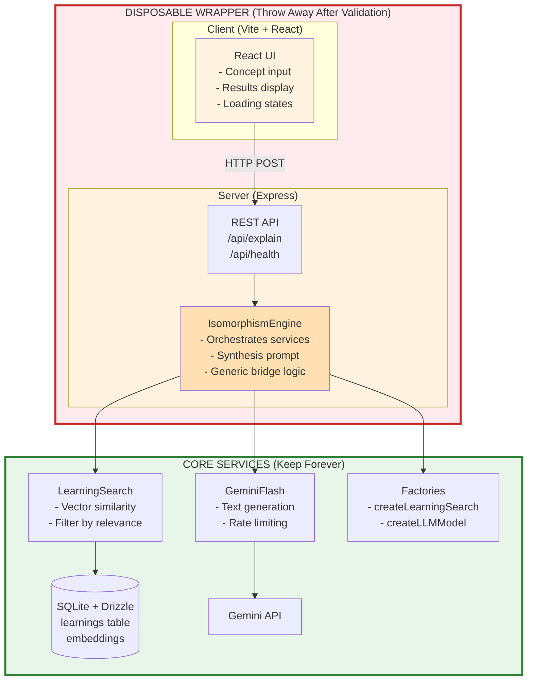
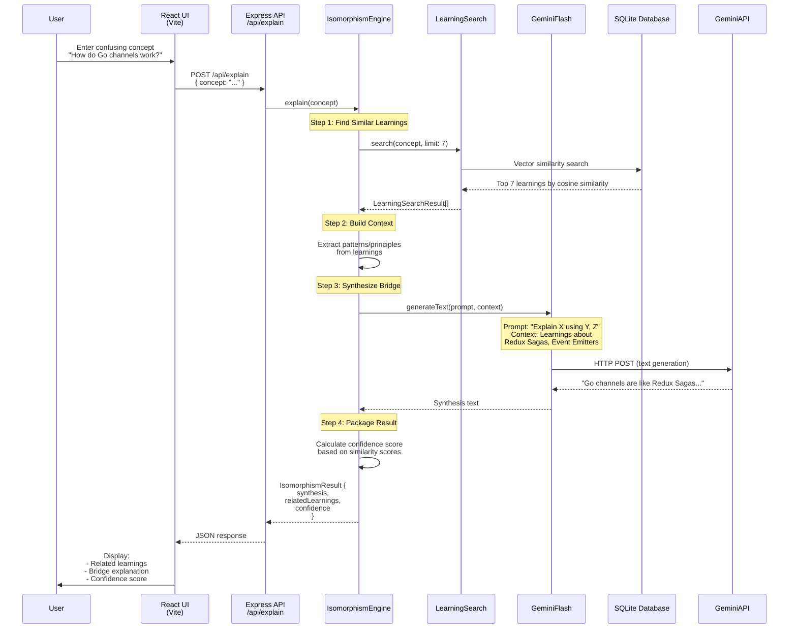

# 5. The Isomorphism Engine: Bridging Unknown Concepts with Known Learnings

## Overview

The Isomorphism Engine is a **validation prototype** that tests the hypothesis: **"If we can proactively surface past learnings based on structural similarity rather than just keyword matching, we will stop re-learning the same patterns and instead 'transfer' our existing mastery to new domains."**

This feature creates a minimal React-based chat interface that:
1. Accepts a confusing new concept as input
2. Retrieves 5-10 structurally similar learnings from the database
3. Uses an LLM to synthesize a "bridge" explanation
4. Outputs an explanation that connects the unknown to the known

**Key Design Principle:** This is a **disposable wrapper** for 3-day validation. The core logic stays in `server/` (throwaway), while existing services in `src/` remain untouched and reusable for future T3 migration.

---

## The Problem: "Chat Amnesia" & The Transfer Gap

### Current Failure Mode

We've built a high-quality Digital Garden of LLM conversations with advanced learning extraction:
- 235+ tests passing
- Type-safe Drizzle ORM
- Rich epistemic schema (abstraction ladders, metacognitive data)
- Vector similarity search

**But there's a risk:** It becomes a "write-only database" - notes we never reference.

**The Root Cause:** **The Transfer Gap**

We often encounter new problems (e.g., "How do Go Channels work?") that are **structurally identical** to problems we've already solved (e.g., "Redux Sagas"), but we fail to see the connection because:
- Different syntax/terminology
- Different domain context
- Search requires knowing what to search for

If we don't know that Go Channels ≈ Redux Sagas, we won't search for "Redux."

### The Hypothesis

**If** we can surface past learnings based on **structural similarity** (not just keywords),
**Then** we stop re-learning the same patterns and instead "transfer" mastery to new domains.

**Success Metric:** "The Aha! Moment" - how often the tool makes you say, *"Oh, this is just like [Old Concept]!"*

---

## Solution Architecture: The "Wizard of Oz" Validation

### Not Building Yet
❌ Complex dashboard
❌ Multi-modal UI
❌ Advanced features

### Building Now
✅ Minimal "lens" - a split-screen chat focused on **one interaction: Comparison**
✅ Simplest possible wrapper to validate the hypothesis in 3 days
✅ Disposable architecture - throw away UI, keep core insights

### Validation Protocol

**Timeline:** 3 days of real-world use

**Setup:**
- Keep the app open on second monitor/tab while working/studying
- Whenever you feel "cognitive friction" (confusion), paste the blocker into the Engine

**Pass Criteria:**
- Output **instantly lowers friction** by connecting to a known concept
- You experience multiple "Aha! Moments" per day
- Synthesis quality feels genuinely helpful (not generic)

**Fail Criteria:**
- Output is generic Wikipedia-style info
- No connections to existing learnings
- Doesn't reduce confusion

---

## High-Level Architecture

### The Disposable Wrapper Pattern



**Key Insight:** The wrapper (client/ + server/) is **temporary**. When migrating to T3:
- **Keep:** Core services (LearningSearch, GeminiFlash), factories, database
- **Keep:** Synthesis prompt strategy and learnings
- **Throw away:** Express server, React UI, all of client/ and server/ directories
- **Rebuild:** Next.js API routes, tRPC, Server Components

---

## Data Flow

### End-to-End Flow



---

## Core Interfaces

### IsomorphismEngine

**Location:** `server/services/isomorphism-engine.ts` (disposable)

```typescript
/**
 * Orchestrates learning search and LLM synthesis to bridge
 * unknown concepts with known learnings.
 *
 * This is a DISPOSABLE service for validation.
 * When migrating to T3, extract the prompt strategy and
 * rebuild with tRPC.
 */
interface IsomorphismEngine {
  /**
   * Explain a new concept using similar past learnings.
   *
   * @param newConcept - The confusing concept to explain
   * @param options - Search and synthesis options
   * @returns Synthesis result with related learnings
   */
  explain(
    newConcept: string,
    options?: ExplainOptions
  ): Promise<IsomorphismResult>
}

interface ExplainOptions {
  /**
   * Number of related learnings to retrieve.
   * Default: 7 (sweet spot for context without overwhelming LLM)
   */
  learningLimit?: number

  /**
   * Override LLM temperature for synthesis.
   * Lower = more focused, Higher = more creative
   * Default: 0.5 (from config)
   */
  temperature?: number
}

interface IsomorphismResult {
  /** The original concept that was queried */
  newConcept: string

  /** Related learnings retrieved from database */
  relatedLearnings: Learning[]

  /** LLM-generated bridge explanation */
  synthesis: string

  /** Patterns extracted from learnings (for display) */
  patterns: string[]

  /** Confidence score (0-1) based on similarity scores */
  confidence: number

  /** Timestamp of when this explanation was generated */
  timestamp: Date
}
```

### Reused Interfaces (No Changes)

**From `src/core/types.ts`:**

```typescript
// Already exists - reused as-is
interface LearningSearch {
  search(query: string, options?: LearningSearchOptions): Promise<LearningSearchResult[]>
}

// Already exists - reused as-is
interface LLMModel {
  generateText(prompt: string, context?: string): Promise<string>
  readonly model: string
}

// Already exists - reused as-is
interface Learning {
  learningId: string
  title: string
  context: string
  insight: string
  why: string
  implications: string
  tags: string[]
  abstraction: Abstraction
  understanding: Understanding
  // ... rest of fields
}
```

---

## Implementation

### 1. IsomorphismEngine Service

**Location:** `server/services/isomorphism-engine.ts`

```typescript
import { LearningSearch, LLMModel, Learning } from '../../src/core/types'

export class IsomorphismEngineImpl implements IsomorphismEngine {
  constructor(
    private learningSearch: LearningSearch,
    private llm: LLMModel
  ) {}

  async explain(
    newConcept: string,
    options?: ExplainOptions
  ): Promise<IsomorphismResult> {
    const limit = options?.learningLimit || 7

    // Step 1: Search for structurally similar learnings
    const searchResults = await this.learningSearch.search(newConcept, {
      limit
    })

    if (searchResults.length === 0) {
      return {
        newConcept,
        relatedLearnings: [],
        synthesis: "No related learnings found. This might be entirely new territory!",
        patterns: [],
        confidence: 0,
        timestamp: new Date()
      }
    }

    const learnings = searchResults.map(r => r.learning)
    const scores = searchResults.map(r => r.score)

    // Step 2: Build synthesis context
    const context = this.buildSynthesisContext(newConcept, learnings)

    // Step 3: Generate synthesis using LLM
    const prompt = this.buildSynthesisPrompt()
    const synthesis = await this.llm.generateText(prompt, context)

    // Step 4: Extract patterns for display
    const patterns = this.extractPatterns(learnings)

    // Step 5: Calculate confidence
    const confidence = this.calculateConfidence(scores)

    return {
      newConcept,
      relatedLearnings: learnings,
      synthesis,
      patterns,
      confidence,
      timestamp: new Date()
    }
  }

  private buildSynthesisContext(
    newConcept: string,
    learnings: Learning[]
  ): string {
    let context = `NEW CONCEPT TO EXPLAIN:\n${newConcept}\n\n`
    context += `RELATED LEARNINGS FROM YOUR PAST:\n\n`

    learnings.forEach((learning, i) => {
      context += `[Learning ${i + 1}] ${learning.title}\n`
      context += `Context: ${learning.context}\n`
      context += `Insight: ${learning.insight}\n`
      context += `Why: ${learning.why}\n`

      // Include abstraction ladder
      context += `Pattern: ${learning.abstraction.pattern}\n`
      if (learning.abstraction.principle) {
        context += `Principle: ${learning.abstraction.principle}\n`
      }

      context += `\n`
    })

    return context
  }

  private buildSynthesisPrompt(): string {
    return `
You are an Isomorphism Engine. Your goal is NOT to explain the new concept from scratch,
but to "translate" it into concepts the user already knows.

INSTRUCTIONS:
1. Analyze the NEW CONCEPT the user is confused about.
2. Scan the RELATED LEARNINGS for structural/logical similarities.
   - Look for matching PATTERNS, not just matching keywords.
   - Example: "Go Channels" (new) ≈ "Redux Sagas" (old) because both handle async streams.
3. Generate a bridge explanation:
   - Start with: "This is structurally similar to [Known Concept] which you learned about..."
   - Explain the NEW concept using the OLD concept as a metaphor/analogy.
   - Be specific about what maps to what: "X in the new concept is like Y in your past learning."
4. If multiple learnings are relevant, weave them together to build understanding.

CRITICAL GUIDELINES:
- Focus on STRUCTURE and PATTERNS, not surface-level similarities.
- Be explicit about the mapping: "A does X, which is like how B did Y."
- Avoid generic explanations - leverage the specific learnings provided.
- If truly nothing matches, admit it: "This seems genuinely new - no strong analogies found."

Return your explanation as plain text (not JSON).
`.trim()
  }

  private extractPatterns(learnings: Learning[]): string[] {
    const patterns = new Set<string>()

    for (const learning of learnings) {
      patterns.add(learning.abstraction.pattern)
      if (learning.abstraction.principle) {
        patterns.add(learning.abstraction.principle)
      }
    }

    return Array.from(patterns)
  }

  private calculateConfidence(scores: number[]): number {
    if (scores.length === 0) return 0

    // Confidence based on top match score and average of top 3
    const topScore = scores[0]
    const top3Avg = scores.slice(0, 3).reduce((a, b) => a + b, 0) / Math.min(3, scores.length)

    // Weighted: 60% top match, 40% top 3 average
    return topScore * 0.6 + top3Avg * 0.4
  }
}
```

### 2. Express API Server

**Location:** `server/index.ts`

```typescript
import express from 'express'
import cors from 'cors'
import { loadConfig } from '../src/config'
import { createLearningSearch, createLLMModel, createDatabase } from '../src/factories'
import { IsomorphismEngineImpl } from './services/isomorphism-engine'

const app = express()

// Middleware
app.use(cors({
  origin: 'http://localhost:5173' // Vite dev server
}))
app.use(express.json())

// Initialize services
const config = loadConfig()
const db = createDatabase(config.db.path)
const learningSearch = createLearningSearch(config, db)
const llm = createLLMModel(config)
const engine = new IsomorphismEngineImpl(learningSearch, llm)

// Routes
app.post('/api/explain', async (req, res) => {
  try {
    const { concept, limit } = req.body

    if (!concept || typeof concept !== 'string') {
      return res.status(400).json({
        error: 'Missing or invalid "concept" field'
      })
    }

    const result = await engine.explain(concept, {
      learningLimit: limit
    })

    res.json(result)
  } catch (error) {
    console.error('Error in /api/explain:', error)
    res.status(500).json({
      error: error.message || 'Internal server error'
    })
  }
})

app.get('/api/health', (req, res) => {
  res.json({
    status: 'ok',
    timestamp: new Date().toISOString()
  })
})

const PORT = config.server?.port || 3001
app.listen(PORT, () => {
  console.log(`🔮 Isomorphism Engine API running on http://localhost:${PORT}`)
  console.log(`📊 Database: ${config.db.path}`)
  console.log(`🤖 LLM: ${config.llm.model}`)
})
```

### 3. React Frontend

**Location:** `client/src/App.tsx`

```typescript
import { useState } from 'react'
import './App.css'

interface IsomorphismResult {
  newConcept: string
  relatedLearnings: Learning[]
  synthesis: string
  patterns: string[]
  confidence: number
  timestamp: string
}

interface Learning {
  learningId: string
  title: string
  context: string
  insight: string
  why: string
  abstraction: {
    pattern: string
    principle?: string
  }
  tags: string[]
}

function App() {
  const [concept, setConcept] = useState('')
  const [result, setResult] = useState<IsomorphismResult | null>(null)
  const [loading, setLoading] = useState(false)
  const [error, setError] = useState<string | null>(null)

  const handleExplain = async () => {
    if (!concept.trim()) return

    setLoading(true)
    setError(null)
    setResult(null)

    try {
      const response = await fetch('http://localhost:3001/api/explain', {
        method: 'POST',
        headers: { 'Content-Type': 'application/json' },
        body: JSON.stringify({ concept })
      })

      if (!response.ok) {
        throw new Error(`HTTP ${response.status}: ${response.statusText}`)
      }

      const data = await response.json()
      setResult(data)
    } catch (err) {
      setError(err instanceof Error ? err.message : 'Unknown error')
    } finally {
      setLoading(false)
    }
  }

  return (
    <div className="container">
      <header>
        <h1>🔮 The Isomorphism Engine</h1>
        <p>Explain confusing concepts using your past learnings</p>
      </header>

      <main>
        <div className="input-section">
          <textarea
            value={concept}
            onChange={(e) => setConcept(e.target.value)}
            placeholder="Enter a confusing concept... (e.g., 'How do Go channels work?')"
            rows={4}
            disabled={loading}
          />
          <button
            onClick={handleExplain}
            disabled={loading || !concept.trim()}
          >
            {loading ? 'Thinking...' : 'Explain'}
          </button>
        </div>

        {error && (
          <div className="error">
            <strong>Error:</strong> {error}
          </div>
        )}

        {result && (
          <div className="results">
            <div className="synthesis">
              <h2>Bridge Explanation</h2>
              <div className="confidence">
                Confidence: {(result.confidence * 100).toFixed(0)}%
              </div>
              <p>{result.synthesis}</p>
            </div>

            {result.patterns.length > 0 && (
              <div className="patterns">
                <h3>Patterns Found:</h3>
                <ul>
                  {result.patterns.map((pattern, i) => (
                    <li key={i}>{pattern}</li>
                  ))}
                </ul>
              </div>
            )}

            <div className="learnings">
              <h3>Related Learnings ({result.relatedLearnings.length})</h3>
              {result.relatedLearnings.map((learning) => (
                <div key={learning.learningId} className="learning-card">
                  <h4>{learning.title}</h4>
                  <div className="tags">
                    {learning.tags.map((tag) => (
                      <span key={tag} className="tag">{tag}</span>
                    ))}
                  </div>
                  <p><strong>Pattern:</strong> {learning.abstraction.pattern}</p>
                  {learning.abstraction.principle && (
                    <p><strong>Principle:</strong> {learning.abstraction.principle}</p>
                  )}
                </div>
              ))}
            </div>
          </div>
        )}
      </main>
    </div>
  )
}

export default App
```

**Location:** `client/src/App.css`

```css
* {
  box-sizing: border-box;
  margin: 0;
  padding: 0;
}

body {
  font-family: -apple-system, BlinkMacSystemFont, 'Segoe UI', 'Roboto', sans-serif;
  line-height: 1.6;
  color: #333;
  background: #f5f5f5;
}

.container {
  max-width: 900px;
  margin: 0 auto;
  padding: 2rem;
}

header {
  text-align: center;
  margin-bottom: 2rem;
}

header h1 {
  font-size: 2.5rem;
  margin-bottom: 0.5rem;
}

header p {
  color: #666;
  font-size: 1.1rem;
}

.input-section {
  background: white;
  padding: 1.5rem;
  border-radius: 8px;
  box-shadow: 0 2px 4px rgba(0,0,0,0.1);
  margin-bottom: 2rem;
}

textarea {
  width: 100%;
  padding: 0.75rem;
  border: 1px solid #ddd;
  border-radius: 4px;
  font-size: 1rem;
  resize: vertical;
  margin-bottom: 1rem;
}

button {
  background: #2563eb;
  color: white;
  border: none;
  padding: 0.75rem 2rem;
  font-size: 1rem;
  border-radius: 4px;
  cursor: pointer;
  transition: background 0.2s;
}

button:hover:not(:disabled) {
  background: #1d4ed8;
}

button:disabled {
  background: #94a3b8;
  cursor: not-allowed;
}

.error {
  background: #fee2e2;
  color: #991b1b;
  padding: 1rem;
  border-radius: 4px;
  margin-bottom: 1rem;
}

.results {
  display: flex;
  flex-direction: column;
  gap: 1.5rem;
}

.synthesis {
  background: white;
  padding: 1.5rem;
  border-radius: 8px;
  box-shadow: 0 2px 4px rgba(0,0,0,0.1);
}

.confidence {
  background: #dbeafe;
  color: #1e40af;
  padding: 0.25rem 0.75rem;
  border-radius: 4px;
  display: inline-block;
  font-size: 0.875rem;
  font-weight: 600;
  margin-bottom: 1rem;
}

.patterns {
  background: #f0fdf4;
  padding: 1rem;
  border-radius: 4px;
}

.patterns h3 {
  margin-bottom: 0.5rem;
  color: #065f46;
}

.patterns ul {
  list-style-position: inside;
  color: #047857;
}

.learnings h3 {
  margin-bottom: 1rem;
}

.learning-card {
  background: white;
  padding: 1rem;
  border-radius: 4px;
  box-shadow: 0 1px 3px rgba(0,0,0,0.1);
  margin-bottom: 1rem;
}

.learning-card h4 {
  margin-bottom: 0.5rem;
}

.tags {
  display: flex;
  gap: 0.5rem;
  margin-bottom: 0.75rem;
  flex-wrap: wrap;
}

.tag {
  background: #e0e7ff;
  color: #3730a3;
  padding: 0.25rem 0.5rem;
  border-radius: 3px;
  font-size: 0.75rem;
}

.learning-card p {
  font-size: 0.9rem;
  color: #555;
  margin-bottom: 0.25rem;
}
```

---

## Project Structure

```
llm-archive/
├── src/                          # CORE (Keep - NO CHANGES)
│   ├── core/types.ts
│   ├── services/
│   │   ├── learning-search.ts    # Reused
│   │   └── learning-extractor.ts
│   ├── llm/gemini-flash.ts       # Reused
│   ├── factories/index.ts        # Reused
│   └── ...
│
├── server/                       # DISPOSABLE WRAPPER (New)
│   ├── index.ts                  # Express server
│   ├── services/
│   │   └── isomorphism-engine.ts # Orchestration logic
│   ├── package.json              # Server dependencies
│   └── tsconfig.json             # Server TS config
│
├── client/                       # DISPOSABLE WRAPPER (New)
│   ├── src/
│   │   ├── App.tsx               # Main UI component
│   │   ├── App.css               # Basic styles
│   │   └── main.tsx              # Vite entry point
│   ├── index.html                # HTML template
│   ├── package.json              # Client dependencies
│   ├── vite.config.ts            # Vite config
│   └── tsconfig.json             # Client TS config
│
├── docs/
│   ├── 0. BASIC IMPLEMENTATION.md
│   ├── 1. LEARNINGS.md
│   ├── 2. ADVANCED LEARNINGS SCHEMA.md
│   ├── 3. CI_CD PIPELINE.md
│   ├── 4. DRIZZLE ORM MIGRATION.md
│   └── 5. ISOMORPHISM ENGINE.md  # This document
│
├── config.json                   # Add optional server section
├── package.json                  # Root - add workspaces
└── README.md
```

---

## Configuration Extension

### config.json (Optional Server Section)

```json
{
  "embedding": { ... },
  "llm": { ... },
  "db": { "path": "./data/conversations.db" },
  "server": {                // NEW - optional
    "port": 3001,
    "host": "localhost",
    "cors": {
      "origin": "http://localhost:5173"
    }
  }
}
```

**If missing, defaults used:**
- port: 3001
- host: localhost
- cors.origin: http://localhost:5173

---

## Dependencies

### Root package.json

```json
{
  "name": "llm-archive",
  "version": "1.0.0",
  "private": true,
  "workspaces": [
    "client",
    "server"
  ],
  "scripts": {
    "dev": "concurrently \"npm run dev:server\" \"npm run dev:client\"",
    "dev:server": "npm run dev --workspace=server",
    "dev:client": "npm run dev --workspace=client",
    "build": "npm run build --workspaces",
    "test": "vitest"
  },
  "devDependencies": {
    "concurrently": "^8.2.2"
  }
}
```

### server/package.json

```json
{
  "name": "server",
  "version": "1.0.0",
  "private": true,
  "scripts": {
    "dev": "tsx watch index.ts",
    "build": "tsc"
  },
  "dependencies": {
    "express": "^4.18.2",
    "cors": "^2.8.5"
  },
  "devDependencies": {
    "@types/express": "^4.17.21",
    "@types/cors": "^2.8.17",
    "tsx": "^4.7.0",
    "typescript": "^5.3.3"
  }
}
```

### client/package.json

```json
{
  "name": "client",
  "version": "1.0.0",
  "private": true,
  "scripts": {
    "dev": "vite",
    "build": "vite build",
    "preview": "vite preview"
  },
  "dependencies": {
    "react": "^18.2.0",
    "react-dom": "^18.2.0"
  },
  "devDependencies": {
    "@types/react": "^18.2.48",
    "@types/react-dom": "^18.2.18",
    "@vitejs/plugin-react": "^4.2.1",
    "typescript": "^5.3.3",
    "vite": "^5.0.12"
  }
}
```

---

## Testing Strategy

### Unit Tests for IsomorphismEngine

**Location:** `tests/unit/isomorphism-engine.test.ts`

```typescript
import { describe, it, expect, beforeEach } from 'vitest'
import { IsomorphismEngineImpl } from '../../server/services/isomorphism-engine'
import { MockLearningSearch } from '../mocks/MockLearningSearch'
import { MockLLMModel } from '../mocks/MockLLMModel'

describe('IsomorphismEngine', () => {
  let engine: IsomorphismEngineImpl
  let mockSearch: MockLearningSearch
  let mockLLM: MockLLMModel

  beforeEach(() => {
    mockSearch = new MockLearningSearch()
    mockLLM = new MockLLMModel()
    engine = new IsomorphismEngineImpl(mockSearch, mockLLM)
  })

  it('should retrieve relevant learnings and generate synthesis', async () => {
    const result = await engine.explain('How do Go channels work?')

    expect(result.newConcept).toBe('How do Go channels work?')
    expect(result.relatedLearnings.length).toBeGreaterThan(0)
    expect(result.synthesis).toBeTruthy()
    expect(result.confidence).toBeGreaterThan(0)
  })

  it('should handle no relevant learnings gracefully', async () => {
    mockSearch.setResults([])

    const result = await engine.explain('Completely novel concept')

    expect(result.relatedLearnings.length).toBe(0)
    expect(result.synthesis).toContain('No related learnings found')
    expect(result.confidence).toBe(0)
  })

  it('should extract patterns from learnings', async () => {
    const result = await engine.explain('Test concept')

    expect(result.patterns.length).toBeGreaterThan(0)
  })

  it('should calculate confidence based on similarity scores', async () => {
    const result = await engine.explain('Test concept')

    expect(result.confidence).toBeGreaterThanOrEqual(0)
    expect(result.confidence).toBeLessThanOrEqual(1)
  })
})
```

### Integration Test

**Location:** `tests/integration/isomorphism-api.test.ts`

```typescript
import { describe, it, expect, beforeAll, afterAll } from 'vitest'
import express from 'express'
import request from 'supertest'
import { createDatabase, createLearningSearch, createLLMModel } from '../../src/factories'
import { IsomorphismEngineImpl } from '../../server/services/isomorphism-engine'

describe('Isomorphism API', () => {
  let app: express.Application
  let db: any

  beforeAll(() => {
    // Create in-memory database with test data
    db = createDatabase(':memory:')

    const config = {
      llm: { provider: 'mock' as const },
      embedding: { provider: 'mock' as const },
      db: { path: ':memory:' },
      search: { defaultLimit: 20, contextWindow: 2 }
    }

    const learningSearch = createLearningSearch(config, db)
    const llm = createLLMModel(config)
    const engine = new IsomorphismEngineImpl(learningSearch, llm)

    // Set up Express app
    app = express()
    app.use(express.json())

    app.post('/api/explain', async (req, res) => {
      try {
        const { concept } = req.body
        const result = await engine.explain(concept)
        res.json(result)
      } catch (error) {
        res.status(500).json({ error: error.message })
      }
    })
  })

  it('should return 200 with valid concept', async () => {
    const response = await request(app)
      .post('/api/explain')
      .send({ concept: 'How do monads work?' })

    expect(response.status).toBe(200)
    expect(response.body.newConcept).toBe('How do monads work?')
    expect(response.body.synthesis).toBeTruthy()
  })

  it('should return 400 with missing concept', async () => {
    const response = await request(app)
      .post('/api/explain')
      .send({})

    expect(response.status).toBe(400)
    expect(response.body.error).toBeTruthy()
  })

  it('should respect learningLimit parameter', async () => {
    const response = await request(app)
      .post('/api/explain')
      .send({ concept: 'Test', limit: 3 })

    expect(response.status).toBe(200)
    expect(response.body.relatedLearnings.length).toBeLessThanOrEqual(3)
  })
})
```

---

## Implementation Checklist

### Phase 1: Project Setup (1 hour)
- [ ] Update root package.json with workspaces
- [ ] Create `server/` directory structure
- [ ] Create `client/` directory structure
- [ ] Install server dependencies (Express, CORS)
- [ ] Install client dependencies (Vite, React)
- [ ] Configure TypeScript for both server and client
- [ ] Add npm scripts for concurrent development
- [ ] Test that `npm run dev` starts both servers

### Phase 2: Server Implementation (2-3 hours)
- [ ] Create `server/services/isomorphism-engine.ts`
  - [ ] Implement `explain()` method
  - [ ] Implement `buildSynthesisContext()`
  - [ ] Implement `buildSynthesisPrompt()`
  - [ ] Implement `extractPatterns()`
  - [ ] Implement `calculateConfidence()`
- [ ] Create `server/index.ts` Express server
  - [ ] Wire up factories from `src/`
  - [ ] Implement `/api/explain` endpoint
  - [ ] Implement `/api/health` endpoint
  - [ ] Add CORS configuration
  - [ ] Add error handling
- [ ] Test server with curl/Postman

### Phase 3: Client Implementation (2-3 hours)
- [ ] Set up Vite + React in `client/`
- [ ] Create `App.tsx` with basic UI
  - [ ] Textarea for concept input
  - [ ] Submit button with loading state
  - [ ] Results display section
  - [ ] Error handling
- [ ] Create `App.css` for basic styling
- [ ] Test client locally with mock API responses
- [ ] Connect client to real API
- [ ] Test end-to-end flow

### Phase 4: Testing (1-2 hours)
- [ ] Write unit tests for IsomorphismEngine
  - [ ] Test with valid concept
  - [ ] Test with no relevant learnings
  - [ ] Test pattern extraction
  - [ ] Test confidence calculation
- [ ] Write integration test for API
  - [ ] Test POST /api/explain success
  - [ ] Test error cases
  - [ ] Test parameter handling
- [ ] Run `yarn test` and ensure all tests pass
- [ ] Manual end-to-end testing with real database

### Phase 5: Documentation & Polish (1 hour)
- [ ] Create this document (5. ISOMORPHISM ENGINE.md)
- [ ] Document API endpoints
- [ ] Document validation protocol
- [ ] Add migration notes (what to keep for T3)
- [ ] Update root README.md with new commands

---

## API Documentation

### POST /api/explain

Explain a new concept using similar past learnings.

**Request:**
```json
{
  "concept": "How do Go channels work?",
  "limit": 7  // optional, default: 7
}
```

**Response (200 OK):**
```json
{
  "newConcept": "How do Go channels work?",
  "relatedLearnings": [
    {
      "learningId": "learn-123",
      "title": "Redux Sagas for Async Flow Control",
      "context": "...",
      "insight": "...",
      "why": "...",
      "abstraction": {
        "pattern": "Channel-based async coordination",
        "principle": "Isolation via message passing"
      },
      "tags": ["async", "redux", "sagas"]
    }
  ],
  "synthesis": "Go channels are structurally similar to Redux Sagas...",
  "patterns": [
    "Channel-based async coordination",
    "Isolation via message passing"
  ],
  "confidence": 0.87,
  "timestamp": "2025-01-15T10:30:00.000Z"
}
```

**Error Responses:**

400 Bad Request:
```json
{
  "error": "Missing or invalid \"concept\" field"
}
```

500 Internal Server Error:
```json
{
  "error": "Internal server error"
}
```

### GET /api/health

Health check endpoint.

**Response (200 OK):**
```json
{
  "status": "ok",
  "timestamp": "2025-01-15T10:30:00.000Z"
}
```

---

## Development Workflow

### Starting Development Servers

```bash
# Install all dependencies
npm install

# Start both client and server concurrently
npm run dev
```

This will start:
- Client (Vite): http://localhost:5173
- Server (Express): http://localhost:3001

### Manual Testing

```bash
# Test API with curl
curl -X POST http://localhost:3001/api/explain \
  -H "Content-Type: application/json" \
  -d '{"concept": "How do Go channels work?"}'

# Health check
curl http://localhost:3001/api/health
```

---

## Validation Protocol

### 3-Day Testing Plan

**Day 1: Setup & Initial Testing**
- Complete implementation
- Test with 10-15 diverse queries
- Refine synthesis prompt based on output quality
- Note: Which queries produce "Aha! Moments"?

**Day 2: Real-World Usage**
- Keep app open while working/studying
- Use whenever encountering cognitive friction
- Track queries and perceived usefulness
- Note: Confidence scores vs. actual helpfulness

**Day 3: Evaluation & Documentation**
- Review all queries and results
- Count "Aha! Moments" vs. generic responses
- Identify patterns in successful vs. failed queries
- Document learnings for T3 migration

### Success Metrics

**Quantitative:**
- Queries per day: ≥ 5
- "Aha! Moments" per day: ≥ 2
- Confidence correlation: High confidence = helpful?

**Qualitative:**
- Did it reduce cognitive friction?
- Did it surface unexpected connections?
- Would you keep using it?

### Pass/Fail Criteria

**PASS if:**
- At least 40% of queries produce "Aha! Moments"
- Synthesis connects to specific learnings (not generic)
- At least 60% of results are perceived as helpful
- You naturally reach for it when confused

**FAIL if:**
- Most responses are generic (not leveraging learnings)
- No unexpected connections surfaced
- Faster to just Google or ask ChatGPT
- You stop using it after Day 1

---

## Migration Path to T3 (Future)

When ready for production, extract insights and rebuild:

### What to Keep from Validation

**Core Logic:**
- ✅ IsomorphismEngine service pattern (orchestration)
- ✅ Synthesis prompt strategy (refine during validation)
- ✅ LearningSearch and GeminiFlash services (already in src/)
- ✅ Confidence scoring approach
- ✅ Learnings about what queries work well

**Infrastructure:**
- ✅ Database schema (no changes)
- ✅ Factory pattern (no changes)
- ✅ Test patterns (adapt to T3)

### What to Rebuild in T3

**Throw Away:**
- ❌ Express server (server/)
- ❌ React client (client/)
- ❌ REST API architecture
- ❌ All of server/ and client/ directories

**Rebuild as:**
- Next.js API routes (replace Express)
- Server Components (replace React client)
- tRPC (replace REST API)
- Streaming responses (for better UX)

**Rebuild Strategy:**
```typescript
// Future T3 structure
app/
├── api/
│   └── explain/
│       └── route.ts        // Next.js API route (keeps IsomorphismEngine logic)
├── components/
│   ├── ConceptInput.tsx    // Server Component
│   └── SynthesisDisplay.tsx
└── page.tsx

// The core IsomorphismEngine logic moves to:
src/services/isomorphism-engine.ts  // Same logic, different wrapper
```

---

## Known Limitations & Future Enhancements

### Current Limitations (Accepted for Validation)

1. **No caching:** Every query hits LLM (slow for repeated queries)
2. **No streaming:** User waits for full LLM response
3. **No history:** Can't revisit past explanations
4. **No feedback loop:** Can't mark results as helpful/not helpful
5. **No confidence tuning:** Fixed confidence calculation

### Future Enhancements (Post-T3 Migration)

1. **Streaming synthesis:** Show LLM response as it generates
2. **Query cache:** Remember recent explanations
3. **Feedback system:** Mark helpful results, improve over time
4. **Conversation mode:** Multi-turn clarification
5. **Save favorites:** Bookmark particularly good explanations
6. **Share results:** Export as markdown/PDF

---

## Troubleshooting

### Client Can't Connect to Server

**Error:** `Failed to fetch` or CORS error

**Solution:**
1. Check server is running: `curl http://localhost:3001/api/health`
2. Verify CORS origin in `server/index.ts` matches client port
3. Check config.json has correct server settings

### No Learnings Found

**Error:** `No related learnings found`

**Solution:**
1. Verify database has learnings: `SELECT COUNT(*) FROM learnings`
2. Run learning extraction: `npm run extract-learnings`
3. Check embeddings exist: `SELECT COUNT(*) FROM learnings WHERE embedding IS NOT NULL`

### Synthesis Quality Poor

**Issue:** Generic responses, no connection to learnings

**Solution:**
1. Review synthesis prompt in `isomorphism-engine.ts`
2. Check if relevant learnings are being retrieved (test search directly)
3. Adjust LLM temperature in config (lower = more focused)
4. Refine prompt based on specific failure patterns

### Tests Failing After Changes

**Error:** Tests fail after modifying IsomorphismEngine

**Solution:**
1. Update mock implementations in `tests/mocks/`
2. Check interface changes in `src/core/types.ts`
3. Run `yarn test` frequently during development
4. Fix failures immediately, don't let them accumulate

---

## Summary

The Isomorphism Engine is a **validation prototype** designed to test the hypothesis that surfacing learnings by structural similarity (not keywords) helps transfer mastery to new domains.

**Key Design Choices:**
- Disposable wrapper (client/ + server/) for fast validation
- Reuse existing core services (LearningSearch + GeminiFlash)
- Generic bridge synthesis for simplicity
- No analytics/caching for initial validation

**Success = "Aha! Moments"**

If this validation succeeds, we rebuild properly in T3 with:
- Streaming synthesis
- Conversation mode
- Feedback loops
- Production polish

But we keep the core insight: **structural similarity beats keyword matching for knowledge transfer.**

---

## References

- Original proposal: User's detailed outline
- Existing services: `docs/1. LEARNINGS.md`, `docs/2. ADVANCED LEARNINGS SCHEMA.md`
- Core architecture: `docs/0. BASIC IMPLEMENTATION.md`
- Testing patterns: `docs/4. DRIZZLE ORM MIGRATION.md`
